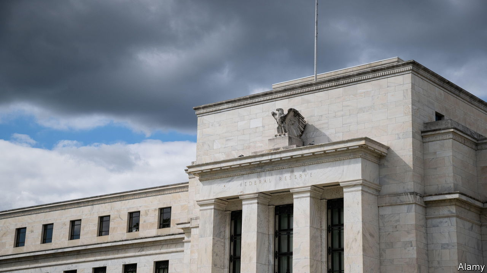

###### Rising yields

# As America raises rates, the rest of the world bears the pain 

##### The Federal Reserve’s latest lift offers little help for the global economy 

 

> Sep 21st 2022 

In recent weeks, as the Federal Reserve prepared to intensify its fight against inflation, a noose has tightened around the neck of the global economy. On September 21st the Fed announced a 0.75 percentage-point interest-rate rise, its third in a row. The Fed’s benchmark rate now stands at 3-3.25%, up three percentage points since the start of the year. While the rise was forecast, the central bank offered a surprise: new projections revealed that rates would probably rise to more than 4.5-4.75% at the end of 2023, higher than expected. The projections also suggested that unemployment would rise by at least 0.7 percentage points before the end of next year. 

Markets sagged on the news, piling additional suffering on an already difficult month. Tighter American monetary policy squeezes economic activity almost everywhere else, by stifling risk appetites and pushing up the value of the dollar. Since the end of August, when Jerome Powell, the Fed chair, gave a speech at a central-banking conference in Wyoming spelling out his determination to whip inflation, financial markets have been battered. The value of the dollar has risen by about 2.5% over the past month alone, and by 16% since the start of the year. 

The flow of capital towards America’s fast-rising interest rates is proving increasingly difficult for other economies to handle. Falling currencies mean higher import prices, exacerbating inflation problems and forcing central banks to undertake their own whopping rate-rises. On September 20th the Swedish Riksbank lifted its benchmark rate by a full percentage point; the Bank of England may mirror the Fed’s 0.75 percentage-point rise on September 22nd. 

The result of tighter financial conditions and hawkish monetary policy has been an epic rise in global bond yields. In recent days America’s ten-year yield has risen above 3.5%, back to levels last seen in the early 2010s. Over the past month alone, ten-year yields have risen by more than 0.6 percentage points in Germany and South Korea, and by nearly a full percentage point in Britain. After years in which interest rates plumbed historically low levels, falling currencies and soaring yields have come as a shock.

They also pose a threat. South Korea is furiously deploying reserves to prevent a chaotic fall in the won, and its government has expressed interest in reopening a dollar swap line with the Fed. On September 22nd Japan intervened to prop up the yen for the first time since the late 1990s. In Britain, where the government has announced a big spending programme to shield people from energy prices, soaring gilt yields and sinking sterling have observers whispering that the economy may be at risk of losing the market’s confidence. 

Even if a market panic is avoided, the steady upward march in the cost of credit will chill private investment and tie the hands of governments which might have spent more to boost their economies. Unfortunately for policymakers elsewhere, the American economy continues to look hale, and its inflation figures are holding up. Mr Powell may thus decide that the Fed has more work to do, leaving the rest of the world to bear the pain. ■


