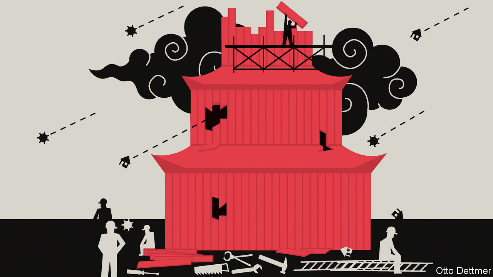

###### Free exchange

# China’s rulers seem resigned to a slowing economy 

##### Gone are the days when they led the world in recession-busting 

 

> Sep 20th 2022 

In 2011 the  published an influential article entitled “Growing like China”. Its authors, including Zheng Song of the Chinese University of Hong Kong, tried to explain the country’s distinctive pace and pattern of development. The title was as well received as the argument, echoed in a variety of papers such as “Innovating like China”, “Investing like China” and “Internationalising like China”.

This year, however, the country is not growing like China at all. Thanks to its deep  and , which entails lockdowns in response to every outbreak of the virus, the economy is now forecast to grow by less than 3% in 2022, according to banks such as Nomura, Morgan Stanley and ubs. That is far below the official target of 5.5%. 

China’s  is also weakening. On September 16th it took more than seven yuan to buy a dollar for the first time since July 2020. A gap has opened up between the gdp path envisaged for China at the start of this year and the grimmer one that now seems probable. China’s gdp in 2023 could be more than $2trn below the level forecast in January, reckons Goldman Sachs, another bank.

It is not like China to settle for such underperformance. In the past, economists have marvelled at its ability to stimulate spending when necessary, so as to meet its growth targets and adequately employ its busy workforce and workshops. Even after the global financial crisis in 2008, China’s gdp quickly caught up to where it would have been had the crisis never happened. Impressed by this result, Yi Wen of the Federal Reserve Bank of St Louis and Jing Wu of Tsinghua University wrote another “like China” paper, entitled “Withstanding the Great Recession like China”.

The country’s resilience, the authors argued, rested on the unconventional bust-busting tools that it had at its disposal. China, like other countries, eased monetary policy when the global financial crisis struck. But in other countries, companies and consumers remained reluctant to borrow even at rock-bottom interest rates. As a result, monetary easing did not translate into a big expansion of credit. In China, by contrast, state-owned enterprises and local-government financing vehicles (which invest in infrastructure and other civic projects) borrowed eagerly from China’s banks at the government’s behest. Other countries pushed on a string. China had other strings to pull. 

Why, then, is China not withstanding this year’s slowdown as it did in the past? Its fiscal deficit, broadly defined to include off-budget borrowing, will increase this year. But only by about 3% of gdp, according to Goldman Sachs. The fiscal swing was more like 4% of gdp in the two years from 2008 to 2010. And it was even larger in response to China’s property slowdown in 2015. Tax breaks for firms account for a big share of this year’s stimulus, compared with the negligible role they played in 2008-09. That could be more efficient, if companies know better than the government how to spend the money. But it may be less effective, if firms choose not to spend it at all.

Local governments and their financing vehicles, which led the stimulus efforts in 2008, are not now so bold. The property slump has hurt land sales, which accounted for about a third of their revenues last year. And the signs of financial strain are not confined to the ledger books. To plug budgetary holes, 80 out of 111 cities tracked by , a mainland newspaper, increased the amount they collected in fines last year. Yulin, a city in Shaanxi province, imposed a fine of 66,000 yuan ($9,500) on a grocer for selling 2.5kg of subpar celery. An indebted state-owned bus company in Lanzhou, the capital of Gansu province, floated an ingenious idea to pay the overdue salaries of some of its staff. Unable to apply for additional loans itself, it suggested the employees themselves take out loans, which the company pledged to repay.

The lack of avid borrowers is blunting China’s monetary policy, much as it did in other big economies after the global financial crisis. China has cut a variety of interest rates, including its first reduction in the benchmark deposit rate since 2015. Yet faster growth in the money supply has not so far translated into an equivalent acceleration of credit. 

In principle, the central government could do more itself to revive growth. It could increase spending or help bridge the financial gaps suffered by lower levels of government. It has allowed local authorities to issue another 500bn yuan of “special bonds” (which are supposed to be repaid with revenues from the infrastructure projects they finance). But that is both less than many analysts expected and less than required.

China’s leaders may be seeking to avoid the past’s mistakes, even if it means also forgoing the past’s successes. Xi Jinping, China’s president, and Li Keqiang, its prime minister, came into office in 2013, several years after the financial crash, when the unwelcome after-effects of China’s stimulus efforts were keenly felt. Torrential spending by the many arms of the state left behind excess capacity, a skewed pattern of production and heavy debts. Mr Li has repeatedly promised not to resort to “flood-like” stimulus, a veiled reference to the past. 

From hero to zero

There is a simpler explanation for the change of approach, too. Mr Xi has become deeply invested in maintaining a “zero-covid” regime, which he portrays as proof of China’s superior social model. Local governments are under pressure to keep a lid on infections; a preoccupation that would distract them from an all-out effort to boost public investment, even if the financing were available. In addition, the ever-present threat of lockdowns has crushed the confidence of consumers and entrepreneurs. Thus any additional government outlays would be less effective in stimulating private spending. Other countries may outpace the country’s economy this year. But no one fights covid-19 like China. ■


