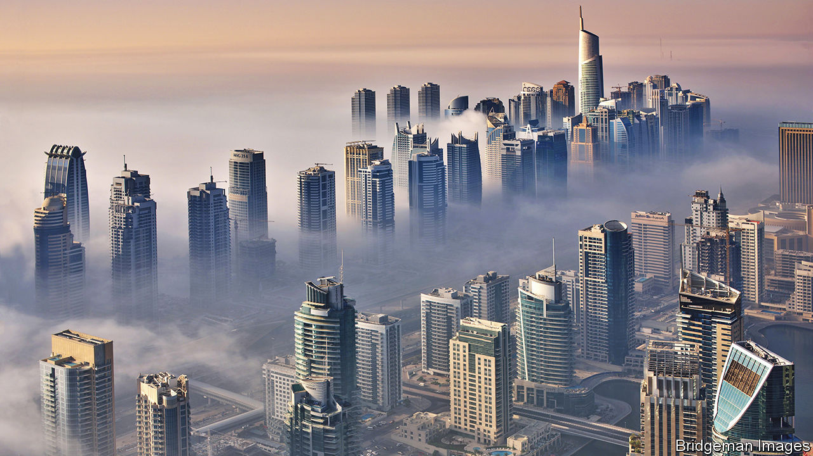

###### More money, no problems

# Dubai is the world’s resurgent entrepot 

##### An influx of Russians shows how the emirate gains by playing all sides 

 

> Sep 22nd 2022 

Summer is sleepy in Dubai, a time when locals and rich expats flee for cooler climes. For the emirate’s property brokers, though, this one was anything but languid. Viewings were a race: show up a few hours late and that sea-view apartment may already be spoken for. One spent whole afternoons camped out in the lobbies of fancy buildings, with showings every half-hour. The United Arab Emirates (uae), a seven-member federation that includes Dubai, is forecast to add 4,000 new millionaire residents this year, more than any other country. That is welcome news for a property market which contributes 8% of gdp—if not for brokers who want to be on a beach.

These are heady times for the Middle East’s energy exporters. The Saudi economy is projected to grow by 7.6%, among the world’s fastest rates. Smaller Gulf states will have windfalls to pay down debt and top up sovereign-wealth funds. Even dysfunctional countries like Iraq should run surpluses. But the uae, and Dubai in particular, does not only benefit from high energy prices. It also gains from the sanctions and geopolitical disruptions that helped send those prices soaring. The city’s stockmarket has risen by 9% this year, compared with a 2% lift in Riyadh. 

Even before Russia invaded Ukraine, Dubai was in a stronger position to grow as a financial hub with giant, established rivals struggling. Hong Kong grows less attractive as it falls further into China’s orbit. It has also suffered from covid-19 restrictions. Meanwhile, London has lost some of its shine since Brexit—and no longer welcomes Russian capital. Dubai is the last financial hub where just about anyone can do business with just about anyone else.

This is most obviously visible in the city’s property market. Russians bought more than twice as many homes in Dubai in the first half of 2022 as they did in the whole of last year. Betterhomes, a property firm, says they were the fourth-largest group of buyers, up from ninth place in 2021. Banking restrictions are no obstacle: one real-estate broker is said to have installed an atm in its office to facilitate cash transactions. Scores of Russian yachts are anchored in Emirati marinas, while oligarchs’ private jets loiter at a previously little-used airport south of Dubai.

Firms, both local and multinational, are shifting their operations. Banks like Goldman Sachs and Bank of America have moved employees from Moscow to Dubai. Commodity firms are considering a move from Switzerland, which has joined eu sanctions on Russia. In Fujairah, on the east coast of the uae, local companies are piling into the arbitrage business. They can buy Russian oil at a steep discount, refine it, then sell the finished products at market-price. All of this is made possible by the uae’s neutral stance on the war. Although a longtime Western ally, it has declined to join Western-led sanctions on Russia.

Dubai is not the only bolthole available. Some Russians have decamped to Turkey; the country’s attractiveness is limited, however, by a crashing currency and surging inflation. The uae offers no such worries. Its currency, the dirham, is pegged to the dollar and has not budged since 1997. Public debt is a manageable 32% of gdp; inflation is expected to peak at less than 4%. The banking system is trustworthy and well-capitalised. The income-tax rate is a hard-to-beat 0%. Scorching weather might be a shock, but Dubai offers all the amenities Russian émigrés would expect: designer brands in malls, renowned chefs in hotels, luxury homes with domestic help. Diners at a new restaurant in the financial district can order a baked potato stuffed with caviar for a mere 2,610 dirhams ($710).

These attractions have already lured business from elsewhere. Dubai has made itself a financial hub that serves not just the Middle East but Asian and African markets. Indian businessmen, for example, find much to like. They enjoy tax breaks and better schools and hospitals. Lawyers can fly over in just three hours for international deals, a much shorter trip than to London or Singapore. Sovereign-wealth funds are a big source of cash for private-equity and venture-capital firms. One Indian bigwig says that half his friends in south Mumbai have bought flats in Dubai.

Along with licit business there is the dodgier sort, too, from Irish mobsters to Iranian traders looking to circumvent sanctions. Establishments that cater to the rich, like a penthouse lounge on an artificial island in the Gulf, can have a bar-scene-from-Star-Wars vibe, albeit with $100 Wagyu steaks, $1,600 bottles of Cristal and less jaunty music. The illicit gold trade alone was once estimated to be worth around $4bn a year (though the government has taken some steps to clean it up).

Double-edged sword

Dubai’s freewheeling political economy can cause tension. For much of the past decade it was Abu Dhabi, the uae’s less commercial capital, which set the tone on foreign policy. The Arab spring of 2010-11, and the chaos it unleashed, put the country on a war footing. The uae joined the Saudi-led invasion of Yemen in 2015, and sent arms to an aspiring dictator in Libya. It also pushed for the embargo of Qatar in 2017, which saw four Arab states cut trade and travel ties with the irksome emirate.

Some of this was bad for business. Qataris used to buy lots of property in Dubai, either as an investment or as a second home in a more libertine city. The blockade cut them out of the property market. Earlier this year the Houthis in Yemen launched several rounds of missiles and drones at Abu Dhabi, a worrying event in a country that depends on a reputation for stability.

Since 2019, though, the uae has swung back towards the Dubai model. It withdrew troops from Yemen that summer and has cut its role in Libya. The blockade ended last year. This was pragmatism: neither war nor the blockade brought the hoped-for benefits. Thus hard-nosed foreign policy is out and economic diplomacy is in.

Take the sanctions-busting oil trade in Fujairah. Before they started importing Russian crude, firms there helped Iran sell its own oil. The commercial motive was straightforward: arbitrage is easy money. From the government’s perspective, the trade also served a political purpose. The uae was unnerved by an Iranian-sponsored attack in 2019 on Saudi oil facilities, which briefly shut down half the kingdom’s output. Acting as a middleman makes the uae useful to Iran, and perhaps reduces the risk of a similar attack.

In March the Financial Action Task Force, the world’s main anti-money-laundering body, put the uae on its “grey list” of problem countries. The listing has no formal consequences, and bankers say it has not changed the uae’s reputation: anyone doing business there is already aware of the risks. But Emirati officials were upset by their inclusion (and hope to be removed from the list by the end of 2023).

Financial institutions are investigating their newest clients. The government has told them not to deal with Russians who are under Western sanctions. “Banks want to future-proof their compliance,” says one Dubai-based financial analyst. But there are still choices to be made. A Russian with $1m in assets is probably not worth the headache. One with $10m? Maybe.

A more serious worry is running afoul of American sanctions, which would be dreadful for a country with a big financial sector and dollar-linked currency. Yet America does not seem to want to look closely at the uae. Every few months a group from the Treasury department flies out to chide the Emiratis. In June Wally Adeyemo, the deputy secretary, told bankers to be careful with Russian customers. Aside from a few token sanctions on small firms—mostly for dealings with Iran—America has done little more than talk, however. The uae has convinced many Americans that it is an indispensable partner in the region. Forging diplomatic ties with Israel in 2020 was a masterstroke.

This leaves Dubai in an enviable position. Whether or not America and Iran reach a nuclear deal, it can serve as an economic lifeline for Iran, as it has for years. However the war in Ukraine progresses, it can now play much the same role for Russia. Sitting on the sidelines is making Dubai the world’s resurgent entrepot. ■


