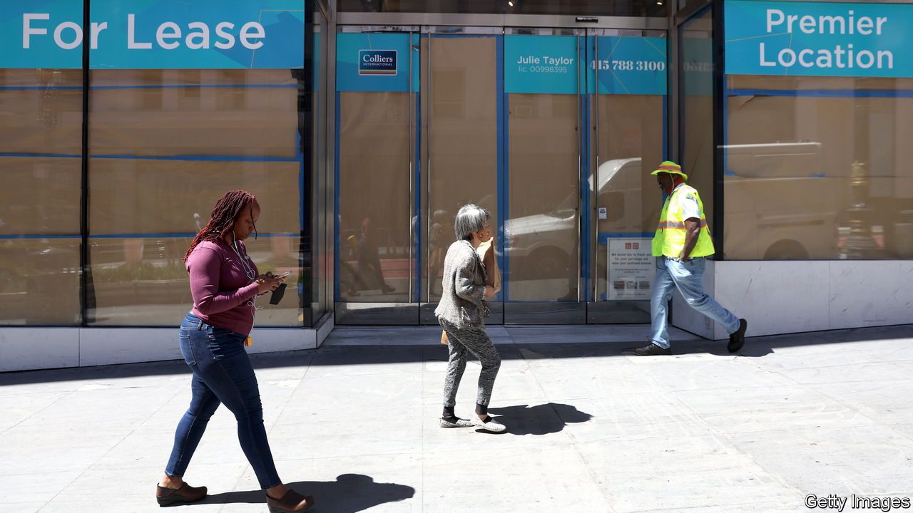
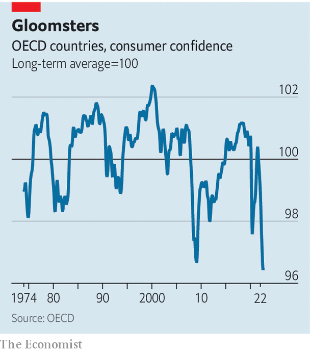

###### Miserable consumers

# Households across the rich world have never been so gloomy 

##### They seem to be suffering from a covid-19 comedown 

 

> Sep 22nd 2022 

Last summer people felt good. Unemployment was falling, wages were growing, and everyone could eat indoors and travel again. Little surprise, then, that consumer confidence across the rich world was above its long-term average. This summer has been very different. People are astonishingly downbeat—more so even than during the global financial crisis of 2007-09 or the first lockdowns of 2020 (see chart).

What has changed? The obvious explanation is a once-in-a-generation surge in inflation. Across the oecd club of mostly rich countries, prices are rising by about 10% a year. Economists dislike inflation; the general public despises it. Many people think that price-gouging firms are taking them for fools. 

 


Yet high inflation is not a sufficient explanation for the gloominess. Our analysis finds that American consumer sentiment is about a third lower than you would expect given the rate of inflation. Behavioural economics offers three other potential explanations. 

The first is to do with expectations. In 2020 many pundits speculated that, once covid-19 was beaten, the world would enter the “roaring twenties”. So far, that hasn’t happened. Productivity growth remains low; no one owns a flying car. How could you not be disappointed? 

The second relates to the comedown from the stimulus bonanza. In 2020-21 rich-world governments doled out trillions of dollars to households, boosting disposable incomes by an unusually large amount. This year governments have largely stopped the handouts. Average disposable incomes are now falling, even without accounting for inflation. Nobody likes that. 

The third relates to the stimulus bonanza itself. A new working paper by Ania Jaroszewicz of Harvard University, and colleagues, finds tentative evidence that people who get modest cash payments of up to $2,000—the sort of amounts given out during the pandemic—actually become unhappier. These payments are not big enough to be life-changing, and may simply highlight what recipients are unable to afford. The fiscal response to covid, it seems, has a sting in its tail. ■


