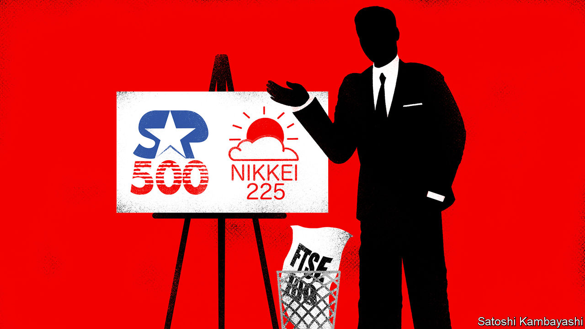

###### Buttonwood

# How to rebrand stockmarket indices 

##### An adman’s pitch to an asset manager 

 

> Sep 22nd 2022 

Good morning, and thank you for the invitation to Hieroglyph Capital Partners. You asked us to demonstrate our marketing skills by choosing an aspect of your branding to review. Now, this may be eccentric, but we’ve picked your tracker funds. Hieroglyph’s green-investment programme, its philanthropic work or its industry-leading quantitative analysts are all more obvious candidates for our attention. Tracker funds are dull, and deliberately so: they’re just algorithms that let your investors replicate the performance of stockmarket indices as cheaply as possible. 

Except for the choice of index, any one is just like all the others. But a nondescript product doesn’t preclude a strong brand—it demands one. Think of airlines. Or perfume. Or lager. More importantly, the boring reasons for preferring passive funds to actively managed ones are getting harder to sell. Investors are happy to buy a low-cost fund that indiscriminately tracks the market’s return when everything is heading in the right direction. But even if they know that virtually no active manager beats the market over the long-term, it gets harder to remember this when they’re losing money. This year, a lot of them have lost a lot. They’re starting to wonder if a good stockpicker could have sheltered them from the worst of it.

Convince investors to associate a fund with a compelling brand, rather than just its fact sheet and Key Investor Document, and you stand a better chance of retaining them. A successful brand has three components. It is distinct from its peers, and it is relevant to your clients and their investment goals. Crucially, it also has “proof points”, or evidence that it delivers on its promises. Which brings us to our three case studies: Hieroglyph’s s&amp;p 500 fund, tracking the index of large American stocks; the Nikkei 225 fund, tracking Japanese firms; and the ftse 100 fund, tracking the largest hundred companies listed in London.

The s&amp;p 500 fund already stands out. Investors know that it is weighted heavily towards tech firms, and that in Apple, Amazon and Alphabet it contains the biggest corporate victors of the past few decades. That lets them think of it as both a safe play—betting on established winners—and as a punt on the future. But its relevance and proof points are looking shaky. Investors like the idea of risk-taking, innovative firms, but only when their share prices are going up. So far this year the s&amp;p 500 is down 20%. That’s not in line with anyone’s investment goals.

The key is to play down the exciting, tech-driven, disruptive side of the s&amp;p 500. Call it the “All American Fund” instead. The index captures four-fifths of America’s stockmarket value, after all. That makes it a proxy for the world’s biggest economy, one which is well-placed to weather a recession. Investors will be looking for reassurance if the market keeps falling. Give it to them.

There is another fund that would benefit from a similar approach. Investors still associate Japanese stocks with deflation, weak corporate governance and the bubble of the 1980s. But today, inflation of just 3% makes Japan a safer bet than most economies. A weak yen ought to be good for its exporters, too. You could do worse than dusting off your Nikkei 225 fund and naming it the “Safe Haven Fund”. 

The ftse 100 fund is a thornier problem. Again, it stands out. The absence of tech firms and preponderance of “old economy” stocks—energy, mining and banks—is firmly lodged in investors’ minds. At the start of this year, this seemed like a good thing. Tech looked frothy; soaring commodity prices and rising interest rates were going to help the dinosaurs roar. If Britain’s economy and currency were shaky, no matter: most of the ftse’s earnings come from countries outside Britain.

It hasn’t worked out. Measured in dollars the ftse 100 has fallen by 20% this year. To have dropped by the same as the s&amp;p 500, after a decade of radically underperforming it, makes investors question whether London’s flagship index is good for anything at all. One answer is supposed to be its dividend yield, but at 3.7% that’s barely any better than Treasuries these days.

Rather than rebranding, we’d advise taking this fund out of the spotlight. A brand can’t deliver unless the product can. As for relevance, the value of the entire index is less than that of Apple. Stop marketing it to your clients and you send them a message about Hieroglyph’s own brand: that you don’t try to sell investors things they don’t need.■


 (Sep 8th)


