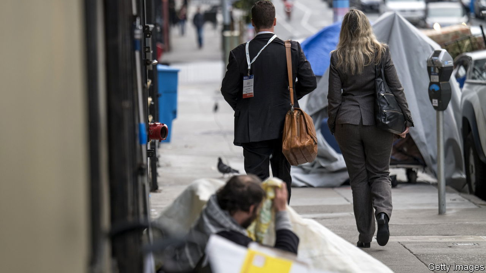
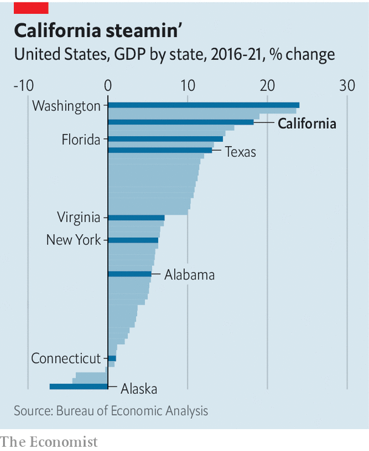

###### The Golden State’s golden egg

# Peter Thiel says California suffers from a “tech curse”. Is he right? 

##### The state is fabulously rich and fabulously dysfunctional 

 

> Sep 22nd 2022 

Speaking recently at the National Conservatism Conference in Miami, Peter Thiel, an investor and intellectual, made a provocative argument. He suggested that California suffers from a “tech curse”: a play on the “resource curse”, the notion that countries with abundant natural resources often have weak economies and corrupt political systems. If data is the new oil, then California is the new Saudi Arabia—even, he said, if things aren’t quite “as bad as Equatorial Guinea”. 

Mr Thiel made the Equatorial Guinea comparison with tongue firmly in cheek, but he was deadly serious about the tech-curse theory. At first glance it seems plausible. California’s tech industry has in recent years produced astonishing wealth. The state is also in many ways dysfunctional. Parts of downtown San Francisco resemble an open-air drug den. Many of the state’s public schools seem keener on talking about social justice than teaching children. Each year, one in every 100 Californians, on net, leaves for another state. 

Mr Thiel thinks that California’s poverty and prosperity are two sides of the same coin, with state and local governments providing the link. Public-sector employees draw on tech’s enormous tax revenues to overpay themselves and do no work, he says. The state’s tech moguls in effect buy off politicians, ensuring, for example, that they enact super-restrictive planning regulations to keep house prices high. 

It is in vogue to criticise both California and tech: doing both at the same time left the audience in raptures. There is also a grain of truth to what Mr Thiel says. But there are two big problems with his theory. 

 


Take the benefits offered by California’s tech industry first. Tech has, in fact, turned the state into a growth superstar, not a laggard. In the past five years, California’s state-level gdp has grown by 18%, the fourth-fastest rate in the country and a better performance than either Florida or Texas (see chart). Even subtracting tech, California’s growth was above average, according to our calculations. Less fashionable industries such as chemicals manufacturing have also done well in recent years. 

Many of the proceeds of this growth have gone on enormous mansions in Atherton and Los Altos, but they have also trickled down to a greater extent than Mr Thiel appreciates. Just over a decade ago the median Californian household had an income 7% higher than the median American one. Now their income is 15% higher. The unemployment rate, relative to the national average, has fallen. So has poverty. And there is little to suggest that the decline in joblessness or poverty is caused by poor people leaving the state.

Mr Thiel also overstates tech’s costs. It is true that some of California’s politicians behave with nearly as much impunity as the Saudi elite. Yet anyone with a passing knowledge of Californian history knows that dirty dealing in politics long predates tech. San Francisco’s politics today is tame in comparison with the 1970s. 

It is similarly hard to blame tech for California’s housing market. The ratio of California’s average house price to America’s is much lower than in the mid-2000s. Meanwhile, California’s anti-building rules, the cause of sky-high prices, emerged with the environmentalist movement of the 1970s, not Mark Zuckerberg and Elon Musk. There is a lot to dislike about Big Tech, but it is not as malign as Mr Thiel believes. ■


