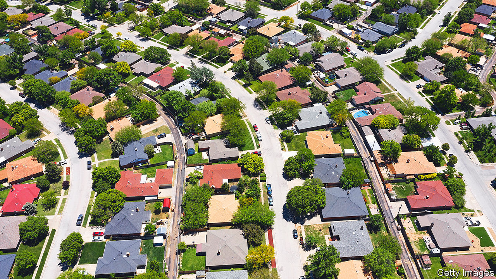

###### Hot property

# Why Wall Street is snapping up family homes 

##### The opportunity is unprecedented, but comes with risks 

 

> Sep 22nd 2022 

Housing is the world’s biggest asset class. But until recently renting out family homes was a mom-and-pop cottage business, seen as uninvestable by Wall Street. When Blackstone, a private-equity giant, floated the idea of creating vast portfolios of homes after the global financial crisis of 2007-09, banks refused to lend to it. The firm ran the idea by Sam Zell, a property mogul who sold Blackstone his $39bn office empire before the financial crisis. “No way,” he retorted. For an investor routinely splurging on hotel chains and swanky office towers, the buy-to-let business seemed like small fry by comparison. 

Blackstone went ahead despite Mr Zell’s advice. A decade on from the first purchase in Phoenix, Arizona—an outlay worth $100,000—the experiment has morphed into an institutional-grade asset class. Last year interest in the sector reached fever pitch. According to John Burns Real Estate Consulting, a research firm, big investors committed at least $45bn to buying single-family homes in America, up from $3bn the year before. Even as housing markets cool, investment is pouring in, with firms including Goldman Sachs and kkr following in Blackstone’s footsteps.

It is easy to see why. Between 2016 and 2021, annual returns from family rentals (of 21%) have outperformed those of housing for old folk (7%), offices (5%), shopping malls (-1%) and even apartments (12%), according to Green Street, another research firm. In the past decade, the value of homes owned by institutions has doubled to $4.7trn, a figure that towers over the estimated value of America’s offices, at $1.9trn.

Unlike mom-and-pop investors, who tend to own no more than a handful of homes, the biggest institutions hold tens of thousands, which are offered renovated and have around-the-clock maintenance. Invitation Homes, America’s largest family landlord, says it spends an average of $39,000 fixing up each one, kitting them out with new flooring, upgraded plumbing and the latest tech, such as video doorbells and smart locks.

These goodies are attracting richer tenants. Between 2010 and 2018, those with incomes of above $75,000 accounted for three-quarters of the growth in renters. Covid-19 accelerated this, as bidding wars forced high-earners to rent. Invitation Homes says its residents now have an annual household income of above $131,000, nearly twice the country’s median.

There is plenty of room for further expansion. In America, real-estate investment trusts (reits) own just 1% of single-family rentals, compared with 5-10% of offices and warehouses, 15% of housing for old people and 50% of shopping malls. Big investors are also starting to build more, rather than just buying up existing stock. Last year, they built a record 7,705 family units, up from an average of 5,500 in 2015-20. By 2030, MetLife Investment Management, an asset manager, expects institutions to have amassed 7.6m homes, more than two-fifths of all family rentals.

The trend has also spread to Europe. Investors such as Aviva and Legal &amp; General are building thousands of rental homes across Britain, which now has more than 73,000 “build to rent” properties. Institutional investors are also gobbling up property in Germany, Ireland, the Netherlands and the Nordic markets, which have higher shares of renters than other rich countries.

What’s behind the explosive growth? One explanation is that ageing millennials offer a growing market. As they approach their late 30s and early 40s—a sweet spot for landlords—many want better schools for their children or space for pets, or finally have enough money to dump their housemates. In America, population growth in this age category will nearly double over the next five years. Ageing baby-boomers are also renting in higher numbers. In England, the proportion of those aged 55 to 64 who are renting has almost doubled since 2011.

Declining housing affordability helps. Those unable to buy homes have little choice but to rent, meaning landlords are confident of their ability to find and keep new tenants, especially for entry-level homes. In America, at least 420,000 starter homes were built each year in the 1970s. Last year, just 93,000 were. Thus rents continue to climb. Across the country, those for family homes rose by more than 13% in June compared with a year earlier. In Orlando, they were up by 23%. In Miami, by more than a third. 

Despite rising rents, Wall Street landlords are not immune to economic uncertainty. Inflation means the cost of renovating and maintaining homes is rising. Invitation Homes says the amount it spent on these things rose by nearly 8% in the second quarter of this year. Construction costs have also risen, posing risk for investors building from scratch. Prices for building materials, including concrete, lumber and steel, have surged by 38% since the start of 2020. Interest-rate rises are another worry; as the market softens, investors are taking a more cautious approach. Home Partners of America, owned by Blackstone, announced in August that it would pause home purchases in 38 cities, markets that represent 5% of its activity. 

Economic cycles are inevitable. Rents are unlikely to continue to climb at a record pace. Yet history suggests that residential rents are more resilient than those from other property types, especially in periods when supply is tight. From 1974 to 1985, another period of high inflation, rents actually increased by 7-12% a year, notes Jay Parsons, an economist at RealPage, a data firm. Even as homebuyer demand crashed during the global financial crisis, demand from residential tenants did not waver. Although the housing splurge of institutional investors may calm a bit, it is unlikely to cease. ■


