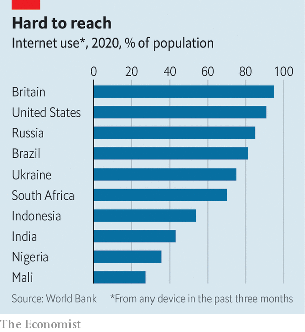
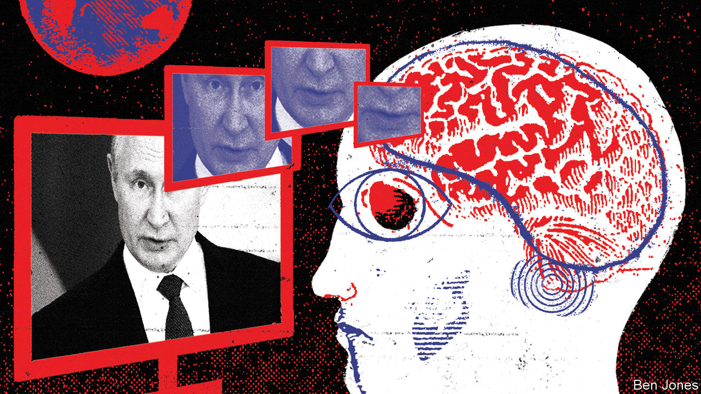

###### Peddling Putin’s piffle

# How Russia is trying to win over the global south 

##### Its propaganda is deceptive, multilingual and well-funded. But does it work? 

 

> Sep 22nd 2022 

On september 21st Vladimir Putin, Russia’s president, announced the calling-up of perhaps 300,000 military reservists to fight in his . The 18m followers of the rt (formerly known as Russia Today) Spanish-language Facebook page were left in no doubt as to why. Framing his invasion of Ukraine as a war for national survival, Mr Putin, rt reported, had declared that the goal of the West was to “divide and destroy” Russia.

Other recent developments seem to have been curiously underplayed. News of Russia’s retreat in north-eastern Ukraine earlier this month, in which Ukrainian forces have retaken thousands of square miles of territory, was hard to find. Headlines that dominated Western news outlets, about Russian soldiers abandoning their weapons and fleeing, were absent. Besides the mobilisation announcement itself, the only hint that Russia’s invasion might not be going entirely according to plan was a few clips parroting the Russian defence ministry’s announcement of a “regrouping” of Russian forces.

Instead, the Spanish-language edition of Russia’s main overseas propaganda network focused on alternative angles to the fighting. Videos showed what were supposedly Ukrainian attacks on civilian targets in Russian-occupied territories. Others featured residents of those territories praising Russia’s humanitarian aid. Articles detailed the Ukrainian government’s alleged attacks on the nuclear plant in Zaporizhia and the American government’s supposed efforts to encourage its citizens to send their own guns to Ukraine.

Russia’s efforts to shape narratives and influence politics in Europe and America are well-known. But Mr Putin’s propaganda machine has long targeted the developing world, too. rt launched first in English in 2005, then in Arabic channel in 2007. A Spanish-language channel followed in 2009, a full five years before the network opened in Britain or set up its German- and French-language editions. Sputnik, another Russian state media network that targets foreign audiences, is currently available in 30 languages, including Portuguese, Turkish and Vietnamese.

The official propaganda apparatus, along with shadowier covert disinformation campaigns, are the modern-day versions of tools that the Soviet intelligence services dubbed “active measures”. The Kremlin is now actively using those tools to try to persuade the global south to see the war in Ukraine its way. The narratives share several common themes across all regions: Russia blames nato expansion for causing the conflict, casts Ukraine as an American puppet, highlights Western failings, and spreads wild conspiracy theories, such as that America used Ukraine as a base to develop biological weapons. 

Spinning a tale

Russia’s propaganda is not monolithic. Instead, as it does in the West, it seeks to exploit existing divisions and tensions. To do so, it can draw on decades of experience, going back to the cold war, of running influence operations in the developing world. “Russia is very effective at building on sentiments that already exist,” argues Jessica Brandt of the Brookings Institution, an American think-tank. “It’s fertile ground and they’re well-practised.”

In Africa, Russian propaganda networks have pushed the line that Western sanctions, rather than Russia’s blockade of the Black Sea, caused food prices to spike—part of a long pattern of Western disregard for the developing world. Russian outlets also highlighted reports of the mistreatment of African students trying to flee Ukraine immediately after the invasion. In Latin America, Russian media tap into existing anti-imperialist and anti-American sentiment. In the Middle East, America’s failed interventions in Iraq and Libya are held up as proof of Western hypocrisy. Europe’s warm welcome of Ukrainian refugees is contrasted with the frostier welcome given to Syrians. 

Ukraine and its Western backers fret that Russia is making inroads. “Russian propaganda today has an edge in the global south,” argues Timothy Snyder of Yale University in an essay for . “In much of Africa, Russia is a known quantity, whereas Ukraine is not.” A group of American senators raised alarm in July over the spread of Russia’s Spanish-language disinformation on social media. European officials have ramped up outreach to Africa, fearful that Russia’s perspective is taking hold. “This is part of a battle of narratives,” Edgars Rinkevics, the Latvian foreign minister, told the  ahead of a rare visit to Egypt in June.

There are good reasons to worry. Fighting online disinformation is hard at the best of times. Big tech firms, most of which are based in America and serve their English-language users first, find it even trickier in other languages, reckons Tessa Knight, who studies disinformation in Africa at the Atlantic Council, an American think-tank. Academic research on disinformation is likewise mostly skewed towards the rich world, where governments have complained most loudly about the problem. “We’re doing a lot of research on what’s happening in English on Twitter,” laments Ms Brandt.

Russia’s early investments in building propaganda networks across the developing world appear to have paid off, at least in terms of engagement. Russian narratives are ubiquitous across social media in Latin America, says Andrew Gonzalez of Omelas, a digital-analysis firm. rt en Espanol’s 18m followers are more than twice the original rt English version’s (7.5m), and even outpace cnn’s Spanish edition (14.6m). rt’s Arabic edition is “really a powerhouse” on Facebook, says Joseph Bodnar of Alliance for Securing Democracy at the German Marshall Fund. 

Russia’s narrative is “out there” in Africa, Macky Sall, Senegal’s president and the chair of the African Union, told European leaders in May. rt plans to open a bureau in South Africa. Russian propaganda has found fertile ground in parts of Francophone Africa, including the Sahel, where resentment of French military interventions and the effects of nato’s mission in Libya linger. In a poll of six African countries commissioned by  earlier this year, support for Russia’s invasion was strongest in Mali and Ivory Coast. 

Yet much as on the physical front lines, Russia has faced setbacks in the information war too. Following Mr Putin’s invasion on February 24th, Western tech firms such as Google, Meta (the parent company of Facebook and Instagram) and Twitter cracked down on Russian state media accounts, blocking them or limiting the extent to which their content is shown to users. While such measures have been implemented more patchily in poorer countries than in the West, “platform restrictions have really nailed [the Russians],” says Mr Bodnar. Omelas reckons that, where Russian media outlets once garnered the most social-media engagement on Ukraine-related content in Spanish, now coverage from cnn, an American firm, does. 

Tuning out

The resonance of Russia’s messages also seems to be fading, argues Mr Gonzalez, whose firm employs artificial intelligence to try to analyse the emotional content of online posts. “Russia had more influence prior to the invasion than it does now.” The invasion has even turned away some of Russia’s own stars: Inna Afinogenova, the host of “Ahi Les Va”, an rt en Espanol offering, quit the network in the spring. She announced on her own YouTube channel that “I don’t agree with this war.”

Russia’s propagandists are trying to work around the new restrictions. State media channels have activated dormant social-media accounts and guided followers to less hostile platforms such as vk, a Russian Facebook clone, and Telegram, a messaging app. Sputnik’s homepage now includes instructions on how to use vpns to access its content in countries where its website is blocked. Researchers report the sudden appearance of large numbers of new Facebook pages and Twitter handles not transparently linked to the Russian government. In one such Vietnamese group, called “It’s all within Vladimir Putin’s calculus”, the 90,000-odd members are treated to high-definition videos from rt, with added Vietnamese subtitles.

Russian diplomats have also ramped up their outreach online, taking advantage of the fact that tech firms have been more hesitant to impose sanctions on government officials than state media. “They’re really stepping in to fill the void in the global south,” Mr Bodnar says. Russia’s diplomatic staff dwarfs Ukraine’s. “We must understand that the number of people working for the Russian Federation is ten times bigger than the number in the Ukraine embassy,” says Liubov Abravitova, Ukraine’s ambassador to South Africa. “We do not have equal forces, not only in Ukraine on the ground, but in our premises.”

Local cutouts can spread messages cheaply and in ways that are hard to trace. Groups linked to Yevgeny Prigozhin, whose mercenary army, Wagner, has been used in the Central African Republic, Mozambique and Sudan, have in the past hired marketing firms and influencers to produce content. “They’ve figured out that the more local you can go the better,” says Shelby Grossman of Stanford University’s Internet Observatory. “Local people are going to be better able to create content that resonates than a random Russian dude who took a few years of Arabic.” The sort of people that Lenin once called “useful idiots” abound. Duduzile Zuma, the daughter of former South African president Jacob Zuma, posted a tweet asking Mr Putin to send planes full of soldiers to Stellenbosch, a town synonymous with old, white money, to seize residents’ wealth. 

Russia’s friends have helped too. “The Russian narrative can sweep far and wide, often because they have allies willing to promulgate those narratives,” Mr Gonzalez says. TeleSur, Venezuela’s state-owned channel, is full of pro-Russian propaganda. It broadcasts not only in Venezuela but also in Argentina, where it has been added to the basic national television service that reaches 83% of the population. Those in the Middle East who follow Iranian media “get a very different perspective” from those who get their news from elsewhere in the region, says Marc Owen Jones of Hamad Bin Khalifa University in Qatar. The state-run newspaper in Laos handed its op-ed pages over to the Russian ambassador, who rehashed Kremlin talking points about plans for the “denazification and demilitarisation of the Ukraine regime”.

China’s global propaganda network often pitches in to help, too. Co-operation between the two countries’ spin doctors is less a formal process than “a game of shared improv”, reckons Ms Brandt. Though China has been reluctant to repeat Mr Putin’s claim that Ukraine should not exist as a state, it has been happy to riff off lines that place blame for the war on America and nato. 

Wild Russian theories about sinister Western “biolabs” in Ukraine have also been echoed widely. Independent Media, a South African group part-owned by two Chinese state firms, often engages in “information laundering” designed to make sentiment appear homegrown, says Herman Wasserman at the University of Cape Town. For instance, it will run a Chinese news-agency story on the biolab conspiracy, then get a left-wing student leader to write an article expressing concern about the supposed biolabs. Chinese news agencies will use that to write about how South Africans are worried, thus manufacturing a “story” out of nothing at all. 

Russia’s intent is clear enough. What is less clear is whether those efforts have much impact. “There’s all the shouting and noise but is anyone listening?” asks Mr Jones. Isolating the influence of information campaigns is tricky, especially as the campaigns are designed to exploit pre-existing divisions. Russian propaganda outlets’ engagement figures seem to suggest a measure of influence. Shadowy online campaigns can help create the “illusion of grassroots support” which helps stories make the jump from social media into the mainstream sort, says Mr Jones.

 


Yet there are also plenty of reasons to be sceptical. For one thing, uneven internet penetration limits the reach of social media campaigns in many poor countries (see chart). And while eyeballs may be a “necessary precondition” for effectiveness, “high engagement doesn’t necessarily translate into effectiveness,” notes Ms Grossman. In Argentina, where rt en Espanol is beamed to most of the country, public opinion remains staunchly against the war: almost 80% of Argentines disagree with Russia’s invasion. Even a majority of Iranians now have unfavourable views of Russia, a reversal from just a year ago. In South Africa there is little evidence that the governing party’s sympathy for Russia is replicated among the general population.

Social media numbers often reflect mere virality rather than an ability to shape minds. Two of Russia’s most popular Twitter accounts in recent months have been those of its embassies in Britain and Japan, according to the Alliance for Securing Democracy. Both have been willing to amplify wild conspiracy theories. Their posts and memes play well with Twitter’s users, notes Mr Bodnar. But social media is not real life, and neither seems to have had much success shaping their target country’s views or policies. Britain has emerged as one of Ukraine’s most committed backers; Japan has imposed sanctions on Russia. Less than 10% of the population in either country trust Mr Putin, according to the Pew Research Centre. 

Full of sound and fury

Russia’s propagandists, like the country’s generals, also have a history of inflating their performance, which helps justify the gusher of roubles that flows to their organisations. An investigation by the Russian opposition leader Alexei Navalny’s Anti-Corruption Foundation in 2020 found suspicious patterns on rt’s YouTube channel suggesting that it had been buying fake views, rather than earning real ones. (rt denied the allegations and took Mr Navalny to court for reputational damage. “Law and decorum won’t allow us to spit in Navalny’s face, so we’re left to sue,” an rt spokesperson told rbk, a Russian news agency.)Researchers from the Stanford Internet Observatory discovered a suspicious and unnatural-looking pattern of “simultaneous spikes and plateaus in “likes” across clusters of inauthentic pages” on Facebook and Instagram that were linked to Russian activity in Africa in 2019.

 


A better explanation for the stances of people in the global south, and their governments, may be their perceptions of what is in their national interest. Governments in Latin America, Africa and South-East Asia have avoided condemning Russia not because they buy tales of Ukrainian neo-Nazis, but because they want Russia’s guns, oil and grain. Traditions of nonalignment and resentment towards the West exist independently of Russian propaganda. 

Local news coverage in Latin America, Africa and Asia already tends to focus on the war’s economic ripples, rather than human suffering in Ukraine itself. William Bird of Media Monitoring Africa, an ngo, argues that: “For the most part the war is framed through our politics.” In much of the world, interest in the war has also fallen off more steeply than in the West. According to the Computational Story Lab at the University of Vermont, mentions of “Ukraine” in Arabic on Twitter have dropped nearly 100 times since their peak in late February; by contrast, English-language mentions have dipped only 15 times.

And of course Russia is not alone in trying to push its perspective around the world. Earlier this summer both Twitter and Meta Platforms, Facebook and Instagram’s parent company, blocked a suite of accounts for “co-ordinated inauthentic behaviour”. Such bans have become relatively routine. What was unusual came after: researchers at the Stanford Internet Observatory determined that the web of accounts—on Twitter, Facebook, Instagram, and five other social-media platforms—had been promoting pro-Western narratives, posting in Russian, Arabic and Farsi. The researchers characterise it as “the most extensive case of covert Western influence operations…analysed by open-source researchers to date.”

Much of the content looks like a mirror of the stuff Mr Prigozhin’s troll factories put out. Accounts are created with fake but convincing-looking faces generated with artificial-intelligence algorithms. They post memes and funny videos, try to get hashtags trending and push online polls. “I’m not surprised it’s happening, but I am surprised by how banal the whole operation was,” Ms Grossman says. Stanford’s research suggests that, as with the Russian sort, the appeal of this sort of pro-Western propaganda is often limited. Most posts and tweets sparked few interactions, say the researchers; only about a fifth of the accounts had more than 1,000 followers. Ironically, two of the most-followed accounts were those that openly declared an association with America’s armed forces. 

All this suggests that any Western governments tempted to fight half-baked Russian propaganda with half-baked propaganda of their own may be on to a losing strategy. For Russia, meanwhile, it reinforces the point that changing people’s minds is hard—especially when you are trying to persuade them to believe things that are manifestly untrue. ■

