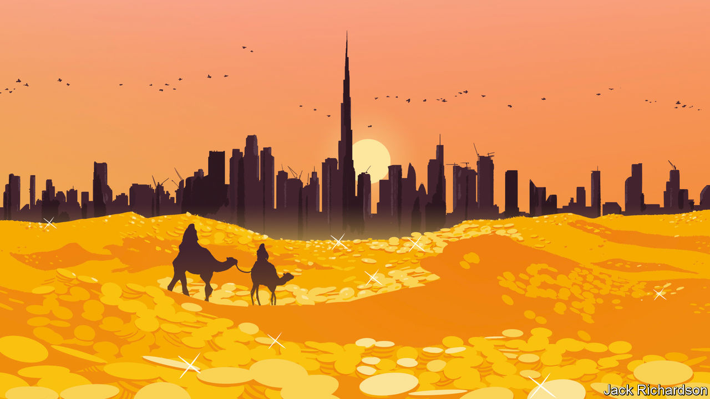

###### The Middle East

# An energy crisis and geopolitics are creating a new-look Gulf 

##### It will be richer, more powerful—and more volatile 

 

> Sep 22nd 2022 

In eight weeks roughly 1m football fans will descend on Qatar for the World Cup, many of them travelling via neighbouring cities such as Dubai and Abu Dhabi. They will find a Gulf in the midst of a $3.5trn energy bonanza, courtesy of . Western politicians facing a cost-of-living crisis are once again paying homage to the royalty of the fossil-fuel economy. Olaf Scholz, Germany’s chancellor, is due to visit this week; in July President Joe Biden fist-bumped Muhammad bin Salman (mbs), the de facto ruler of Saudi Arabia, a country he had branded a pariah for its human-rights abuses.

As we explain this week, the latest  is taking place alongside deeper trends: a re-engineering of global energy flows in response to Western sanctions and climate change, and the remaking of geopolitical alliances in the Middle East as it adapts to a multipolar world in which America is no longer a reliable guarantor of security. The result is a new-look Gulf that is destined to remain pivotal for decades to come. Whether it will be a source of stability, though, is far from clear. 

The Gulf states belong to a region that has had a dreadful two decades. Amid wars and uprisings, a million people have died violently in the Middle East and its share of world gdp has dropped from 4% in 2012 to 3%. America has cut its military presence following the debacles in Iraq and Afghanistan, leaving old allies, including the Gulf states, fearful of a security vacuum filled by Iran and its proxies. The three Gulf energy powerhouses of Qatar, Saudi Arabia and the United Arab Emirates (uae) are autocracies facing a long-run decline in world demand for fossil fuels, even as they suffer from lower rainfall and higher temperatures because of climate change.

It is a daunting starting-point, but two new forces are in play. One is changes in energy markets. At current prices, the six Gulf states—the others are Bahrain, Kuwait and Oman—could earn $3.5trn over the next five years.  are redirecting how energy is traded around the world. As Russian output flows to the east, the Gulf stands to become a bigger supplier to the West. 

In response to tight energy markets, Saudi Arabia and the uae are ramping up capital investment in oil with the long-run goal of being the last men standing in the industry, enjoying the lowest costs and least-dirty extraction. Together, they aim to raise output from 13m barrels per day last year to 16m in the medium term. Their market share will rise as governments worldwide clamp down on emissions and global demand for oil falls. As Qatar expands its North Field project in the next few years, it will become to liquefied natural gas (lng) what Taiwan is to advanced semiconductors: its annual target output is equivalent to 33% of all lng traded worldwide in 2021. From its point of view, the timing, amid a global gas squeeze, could not be better. 

Even as energy enriches the Gulf—and adds to the heavy burden of stabilising the world’s climate—the second force at work is a new alignment of power in the Middle East. Over the past decade Iran has established a sphere of influence across a northern belt including Iraq, Lebanon and Syria. A reaction is in full swing as most Gulf states, Egypt, Israel and others grow closer. This is reflected in the , signed by Israel and two Arab states in 2020, which are helping normalise relations in the region. 

This nascent bloc is partly about developing common defences against Iranian drones and missiles, probably using Israeli technology. But it is also a bet that trade can make these countries richer in a region with puny cross-border links. Already, Israelis have made over half a million trips to the uae, while the Gulf states have invested $22bn in Egypt this year. Saudi Arabia and Jordan may one day join the Abraham accords, especially if Israel includes the Palestinians, creating a contiguous trading zone. This bloc will also hope to increase its links with the rest of the world. In February the uae signed a trade deal with India. As London and Hong Kong stall as financial centres,  is seeking to become the world’s last entrepot, where you can do business with anyone.

An obvious implication is that the Gulf is likely to remain as important in world affairs in the coming decades as it was in the 20th century, despite the hopes of some American strategists that its significance would fade. In oil and gas its share of Europe’s imports could rise from under 10% today to over 20%. The Gulf states’ economic heft within the Middle East is at its highest since 1981, at 60% of regional gdp, and will rise more. In finance the Gulf’s $3trn of reserve and sovereign assets will grow, leading to more investments abroad, such as ’s offering next week. In diplomacy expect it to flex its muscles more beyond its immediate region: the uae is already a force in the Horn of Africa.

Yet the one thing the new era may not bring is stability, because the very forces behind these opportunities also create volatility. The quest for a security arrangement that relies less on America could backfire. Iran’s aggression could lead to a regional arms race fuelled by energy rents, just as the oil booms of the 1970s saw military spending explode. If Iran gains a nuclear weapon, countries such as Saudi Arabia and Turkey may want a bomb of their own. The last chapter of the fossil-fuel age could yet draw China and India deeper into the region. 

However, the greatest potential source of instability lies at home. The Gulf states are now trying to follow a mind-bending economic trajectory. They plan to expand fossil-fuel production for 20 or so years and then slash it after 2045. It is possible to see how this would work in theory: the huge rents would need to be quickly reinvested in a high-tech economy based on renewable power, hydrogen and desalination systems, which has enough dynamism to create millions of jobs for a bulge of young people. In practice the task is monumental. Even if it worked, it would put the Paris-agreement climate targets far beyond reach. 

The Gulf’s autocrats believe they have the long-term perspective to manage this shift. But they are prone to oppression, cronyism and vanity projects. A new Gulf is emerging, but some things remain the same. It is still going to be volatile—and impossible for the world to ignore. ■


