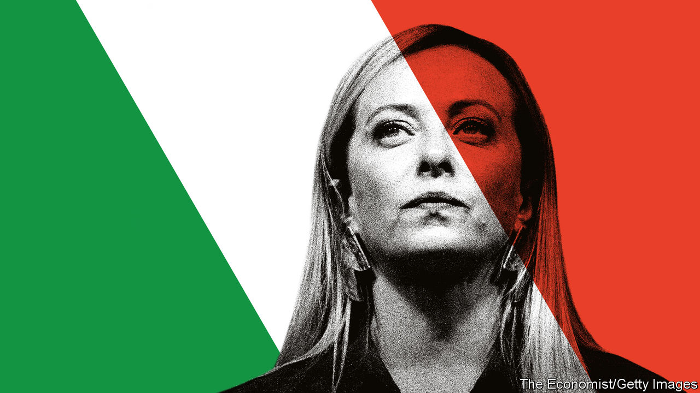

###### Should Europe worry?

# How afraid should Europe be of Giorgia Meloni? 

##### Italy’s next leader will be constrained by politics, markets and money 

 

> Sep 22nd 2022 

Unless the polls are dramatically mistaken, on September 25th Italians will elect the most right-wing government in their country’s post-war history. A three-party alliance is expected to win more than 60% of the seats in parliament; the Brothers of Italy (fdi) looks set to dominate the trio, and its leader, Giorgia Meloni, to take over as prime minister. 

Liberals shudder. . In speeches Ms Meloni hammers away at illegal immigrants and “woke ideology”. She told American conservatives earlier this year that “our whole identity is under attack”, and has accused the European Union of being complicit in ethnic “replacement”. She defends and admires Viktor Orban, Hungary’s populist prime minister. Ms Meloni’s elevation would follow the Sweden Democrats’ success last week in becoming that country’s second-largest party, with a probable say in the next government. Marine Le Pen in France took 41% of the vote in her race against Emmanuel Macron in April. All these are signs of a powerful shift in the European balance towards the nationalist hard right. Fed up with the failures of the established parties, voters are plumping for the untried and untested.

And liberals are not the only ones to worry. Flinty bankers fret that Ms Meloni will tangle with the eu, go soft on reform and lose control of Italy’s mountainous debt stock ($2.7trn, or over 150% of gdp). The fdi has no experience of government (it was founded in 2012, and took just 4% of the votes in the election of 2018), and its expected coalition will include the parties led by Silvio Berlusconi and Matteo Salvini, two untrustworthy men with a record of tricky relations with Brussels. Both have plenty of reasons to clash with Ms Meloni, who will have stolen a crown each thinks should be his. In a country that has had 30 prime ministers and more than twice that many governments since 1946, this is not a recipe for stability.

How anxious should these very different camps be? The risks are obvious. But there are also reasons to be cool-headed. First, consider social policy. fdi members are strongly committed to Catholic values, and many would like to turn the clock back. But Ms Meloni has clearly stated that she has no plans to strike down the law that permits abortion, which has been in place since 1978 and enjoys solid support; an attempt to repeal it was rejected in a referendum in 1981 by nearly 70% of those voting. Much the same is true for gay rights. Gay civil unions have been permitted since 2016 and, although there is no consensus favouring gay marriage, there is also no urge to scrap the partnerships. A crackdown on illegal migration is surely to be expected, but when Mr Salvini was last in government, between 2018 and 2019, he promised the same, only to find that the obligations of international law and eu rules imposed limits on what he could do. 

The reality is that Italy is constrained in many ways, not least through the roles played by its indirectly elected president and the head of its constitutional court, a pair of impeccable centrists. Similar constraints will limit the amount of damage to the eu that Ms Meloni could cause, even if she wanted to. It is true that, like Mr Salvini, she has in the past talked about scrapping the euro or even leaving the bloc itself. But both of them have grasped that membership of the eu is popular in Italy, where 71% of people support the euro. Ms Meloni has already committed herself to follow the reform plan drawn up by her predecessors and approved by the European Commission, which comes with a handy €200bn ($198bn) or so of pandemic-recovery money. She does say she will seek some changes to it, but in agreement with the commission; good luck with that.

A bust-up would turn off the supply of money. It would also mean that Italy would become ineligible for support under the European Central Bank’s new bond-buying instrument. It would cause a crisis in the markets, and Ms Meloni knows it. Insiders say she is trying to find a reassuring banker to serve as her new finance minister and a respected pro-European to be her foreign minister. Reassurance is Ms Meloni’s mission, and in this she is different from Mr Salvini, an unreliable firebrand. The fact that she is the one who has risen to the top of the rightists’ pile is the best bit of news in a disquieting situation.

There is one more indubitable plus to Italy’s probable new prime minister. Unlike Mr Salvini and Mr Berlusconi, or indeed Ms Le Pen and Mr Orban, Ms Meloni is no fan of Vladimir Putin. Since the invasion of Ukraine, she has been a steadfast and strong voice of support for Ukraine and nato. 

Nonetheless, Ms Meloni faces daunting odds. Italy’s economy is unproductive and hampered by structural, cultural and demographic problems. Since 2000, gdp per person has not grown—as it must if Italy is to deal with its stock of debt. Almost a quarter of young Italians are not in employment, education or training, by far the worst level in the eu. The eu-backed reform plan is meant to help correct this, but the turnaround will be long and slow, if it happens at all. It will need to be pushed for a decade or more, not the 17 months managed by Mario Draghi, the outgoing prime minister.

Is Ms Meloni the right person to do the pushing? Nothing in her speeches suggests that she understands the need for competitiveness. In fact, she favours sweeping nationalisation and protectionism, though she will be unable to achieve either.

Hope, but plan

What happens if the economy goes wrong? After years of interest rates being set at or below zero, the ecb raised them by 0.75 percentage points this month. Further increases are forecast for this year. If the going gets really tough, will Ms Meloni work calmly with the eu and the ecb, or flip to full populist mode, as Greece did a decade ago? An embattled leader, with Mr Salvini snapping at her heels, who tried to shore up her popularity by blaming the eu for Italy’s problems would be a very different prospect from the Ms Meloni on offer now. Yet here, too, is a sliver of comfort. Ms Meloni needs the eu because Italy cannot shoulder its debt without help from Brussels. Europe must calmly accept Italy’s democratic decision to elect Ms Meloni and help her succeed, while privately warning her how damaging to both Italy and the eu a falling-out would be. ■


