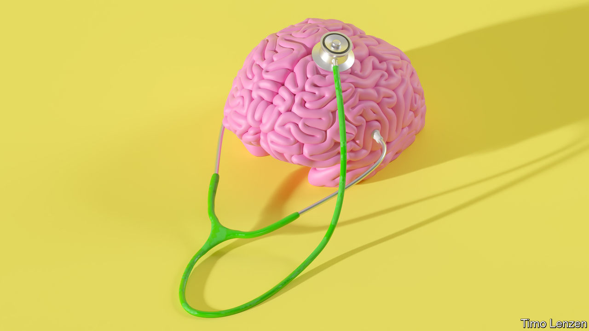

###### Thinking outside the box

# How to keep the brain healthy 

##### Neuroscience is experiencing a renaissance. Not before time 

 

> Sep 21st 2022 

Disorders of the brain are a growing worry. Twelve mental-health conditions affect about 970m people around the world according to the Global Burden of Disease Project: more than one in ten of the population. Patchy data mean that this figure could well be an underestimate. On top of that, neurological problems, such as stroke, dementia, migraine, Parkinson’s, epilepsy and brain injury are collectively the leading global source of disability. Ageing populations with unhealthy ways of life are likely to make this problem much worse everywhere.

In an ideal world science would be coming to the rescue. But the brain is a complex organ—sometimes described as the most complex structure in the known universe. Through good fortune and subsequent diligence, 20th-century science provided some pharmacological tools with which to treat some of the things that go wrong with it. But its fundamental mysteries have proved difficult to unravel. As a result, progress has been much slower than in treatments for the heart or cancer. 

Indeed, it has sometimes been hard to discern much progress at all. The private sector spent an estimated $43bn on research into therapies for Alzheimer’s disease between 1998 and 2017 and came up empty-handed. That epic failure is perhaps the biggest reason why, in the 2010s, many drug firms abandoned or cut back on neuroscience research.

Happily, there are signs of a change afoot. In our Technology Quarterly this week we report on a renaissance in neuroscience, with many drug companies, some of them big ones, showing renewed interest in the field. This fresh energy is coming from a variety of techniques and ideas. Optogenetics, which uses genetic manipulation to get animal brains to reveal their workings—and open them up to change—through the use of light, is transforming brain science in the laboratory, as is the growth of tiny brain-like “organoids”. More precise diagnosis and well-validated biomarkers, which reveal the course of disease, are improving clinical trials. A growing openness to the investigation of previously recreational and stigmatised drugs is widening the range of possible medicines. New kinds of treatment, such as gene therapy, are expanding the range of diseases that can be tackled. Other advances are spurring progress in dealing with 

At the same time a growing mound of “cohort” data is proving critical to understanding the biological roots of brain dysfunction. Projects like the uk Biobank track tens or even hundreds of thousands of individuals over a generation or more. They should help answer questions about the roots of brain disorders such as dementia that may take decades to emerge. 

As hopes rise for tackling this final frontier of biomedicine, it is worth remembering that the secrets to a healthy brain are not only going to come from a pill or psychotherapist’s couch. The health of the brain is influenced by what goes on outside it, such as nutrition, exercise, the abuse of alcohol, education, social connections and pollution. Of particular relevance these days is air pollution—which could have a negative influence on brain health at both the beginning and the end of life. None of this should be surprising: the health of the brain is tied to the health and the well-being of the body that it sits in. Efforts to ensure better brain health are an investment that will keep paying dividends for individuals, and for societies, for decades to come. ■

