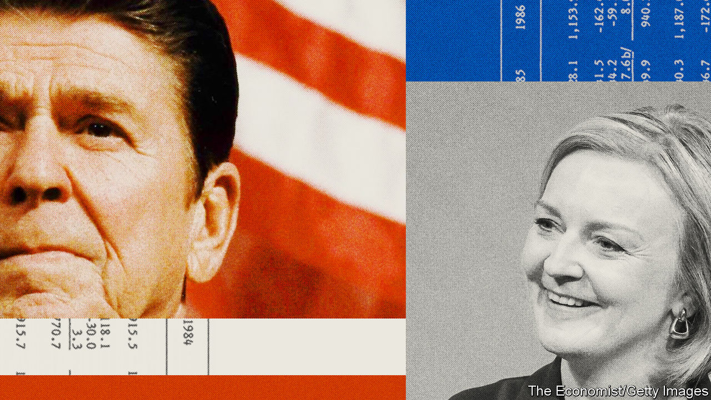

###### Truss’s rusty Reaganism

# Liz Truss’s selective Reaganomics won’t work 

##### After cutting taxes, the Gipper reversed course 

 

> Sep 22nd 2022 

In july 1981 President Ronald Reagan took to the airwaves promising to “reduce the enormous burden of federal taxation on you and your family”. Inflation was much too high and tight monetary policy had taken interest rates to over 19%—problems Reagan attributed in part to rising government debt. But the president brushed aside the contradiction and argued that tax cuts and deregulation would unleash productivity growth. By August he had signed into law America’s biggest tax cut since the first world war, worth nearly 3% of annual gdp.

Liz Truss, Britain’s new prime minister, is now implementing Reaganomics in Britain, again creating dissonance in economic policy. The Bank of England (boe) is fighting annual inflation of 9.9%. On September 22nd the bank raised interest rates by 0.5 percentage points. Yet the next day Ms Truss’s government was scheduled to lay out details of an enormous fiscal stimulus, comprising tax cuts worth perhaps £30bn ($34bn) per year (1.2% of gdp) and subsidies for energy bills whose total cost across two years could reach £150bn.

The fuel that fiscal stimulus will inject into the economy will almost certainly lead the boe to raise interest rates faster than it otherwise would (despite the fact that price caps on energy will bring down measured inflation). No matter, say Ms Truss’s backers, because tax cuts will boost productivity. Didn’t inflation fall and growth surge under Reagan?

Sadly, Ms Truss’s attempt to emulate the Gipper’s success is doomed. To see why, consider the currency markets. Reaganomics was accompanied by a strengthening dollar. So were Donald Trump’s tax cuts in 2018, which also happened alongside monetary tightening. The greenback is the world’s reserve currency, into which investors flock when the appetite for risk falls, as it often does when the Federal Reserve raises rates. A strong currency makes imports cheaper and helps contain inflation.

In Britain, though, the pound has slumped by 16% against the dollar in 2022. That is only a little more than the euro’s fall against the greenback, and less than the yen’s, but these comparisons flatter sterling. Whereas monetary policy is expected to stay looser in the euro zone and Japan than it is in America, the boe is expected to raise rates to over 4.5% in 2023, roughly keeping pace with the Fed. The pound has fallen anyway because it is perceived as a riskier asset than those currencies and investors are worried about global growth.

As a result, the boe will get no help from currency markets as it offsets Ms Truss’s fiscal stimulus with tighter monetary policy. Instead more expensive imports are boosting inflation. That is a big headache for an economy that depends on trade as much as Britain’s does.

A second problem is the stagnating supply potential of Britain’s economy. It is admirable to try to boost long-term growth by pruning regulations and taxes. But the high growth of the Reagan era was partly the result of women entering the workforce. Britain is ageing and its economy is still adjusting to Brexit. These factors are hurting the supply side of the economy by more than reforms are likely to help.

Ms Truss’s cheerleaders seem to have read only the first chapter of the history of Reaganomics. The programme’s early record was mixed. The tax cuts did not stop a deep recession, yet by March 1984 annual inflation had risen back to 4.8% and America’s ten-year bond yield was over 12%, reflecting fears of another upward spiral in prices. Inflation was anchored only after Congress had raised taxes. By 1987 America’s budget, excluding interest payments, was nearly balanced. By 1993 Congress had raised taxes by almost as much as it had cut them in 1981. If Britain’s government does not correct its course in the same way, the result will be more conflict between monetary and fiscal policies—and a risk that inflation becomes entrenched. ■

