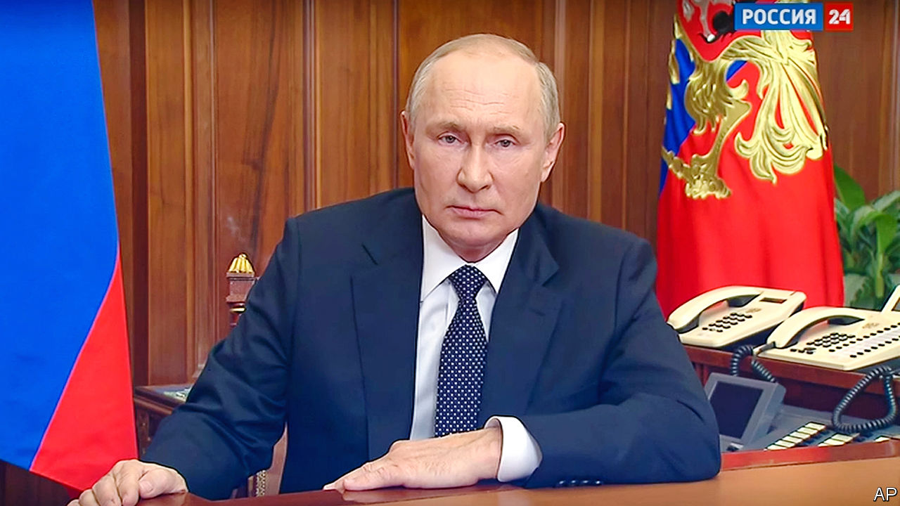

###### Doubling down

# Vladimir Putin vows to send more invaders. The West should arm Ukraine faster 

##### It has a window of opportunity to push Russian forces back 

 

> Sep 21st 2022 

To understand Vladimir Putin, hear what he says about his enemies. On September 21st the man who invaded Ukraine said Western powers “aggressively impose their will...on other countries”. They desire the “plunder” of Russia, said the man with a billion-dollar palace. “They have even resorted to nuclear blackmail,” he said, and threatened a nuclear response if Ukraine tries to take back the territory he stole from it.

After , Russia’s despot is trying to signal strength. Besides the nuclear threat, which Ukrainians dismissed as a bluff, he ordered a partial mobilisation, vowing to send soldiers to beef up his invasion force, and pledged support to puppet “republics” in Ukraine, which plan to hold referendums this weekend on whether to be annexed by Russia. These sham votes, called at three days’ notice, will give Mr Putin a rhetorical excuse to treat Ukrainian attacks in Donbas as attacks on Russia itself, which could in theory invite nuclear retaliation. Mr Putin is .

However, the stridency of his oratory suggests panic instead of power. Mr Putin’s blundering on the battlefield has caused the first cracks in his aura of undisputed command in Russia. Although tv broadcasts constantly lie about the war and alternative voices are muzzled, the reality in Ukraine is now so different from the fantasy beamed into Russian living rooms that it is hard for Mr Putin to keep his story straight. That may be why his  is weakening abroad, too.

To Russians, he says that the war is not a war, just a “special military operation” that they can cheer without personal sacrifice. To his Ukrainian foes and their nato backers, he says he will commit lots of extra troops—his defence minister suggests that 300,000 will go. To paper over the gulf between these messages, he stresses the mobilisation is limited to military reserves (only the other side, he insists, uses men as “cannon fodder”). In truth, Mr Putin cannot order mass conscription as it would threaten his regime. Even a partial mobilisation is leading to widespread protests and a rush to the border to escape being called up. 

Time is not on Mr Putin’s side. Reservists do not need to be taught to shoot straight, but they still require training to deal with new kit and local conditions. If deployed too soon, they will die in droves. They could be slotted into existing, depleted units. That would make it easier for Russia to defend its lines, though probably not to mount new offensives. It does not have enough weapons for a larger invasion force, not least because so many of its soldiers abandoned their guns and tanks when they fled recent Ukrainian advances. It will be months before Mr Putin’s “partial mobilisation” makes a big difference in the field.

That gives Ukraine a . Its Western backers should step up the supply of arms, including longer-range missiles. The best nato weapons must not be used to attack Russia itself, but the parts of Ukraine that Russia is about to annex illegally should not be off-limits. The West should also train more Ukrainian soldiers. The country has plenty of highly motivated would-be defenders, but so far only Britain is offering basic training to large numbers. Other nato members should immediately pitch in, perhaps dividing the labour so that one ally focuses on air defence, another on artillery and so forth. The more of its land Ukraine can claw back before Russian reinforcements arrive, the stronger its position will be.

When Mr Putin invaded Ukraine, he thought it would fold. It did not. Now he hopes that its Western backers, lacking the heart for a long struggle, will cut arms shipments and press Ukraine to sue for peace. They must not. Mr Putin is trying to show strength because he is weakened and the Russian people are beginning to sense it. Ukraine must maintain the momentum on the battlefield. Peace will come when Russian citizens grasp that Mr Putin is losing and cannot win. ■


