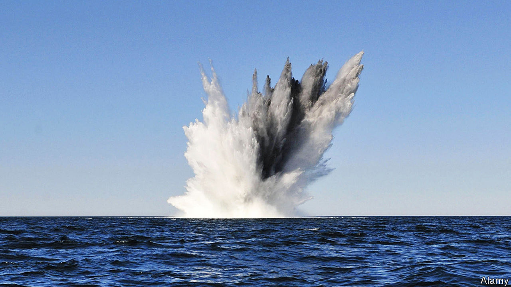
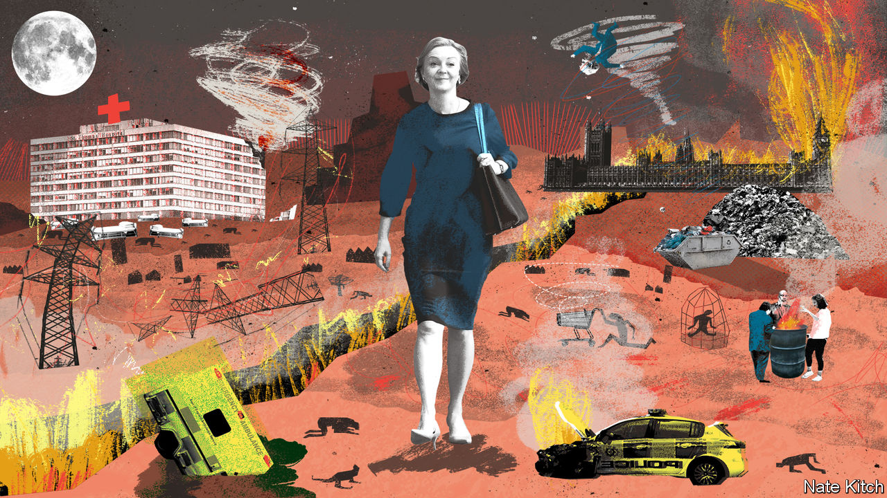

###### On America, hospital food, sea mines, autocrats, quiet quitting, Britain

# Letters to the editor 

##### A selection of correspondence 

 

> Sep 22nd 2022 

Blue v red

There are two other aspects fuelling American political disunity that were not mentioned in your briefing (“”, September 3rd). The first is that the red Republican states are over-represented in Congress. This has led to a quasi-political stasis on many key issues for 20 or more years, thereby increasing the anger and frustration of many in the blue Democratic states. 

The second is that it is a great oversimplification to classify individual states as red or blue. Very often cities in the red states lean Democratic, if they are not dominated by that party. If Americans ever did start shooting at each other in a new civil war that intrastate heterogeneity, combined with 400m guns, would make the first civil war, with its neat geographical boundaries, look like a civilised affair. 

adam wilkins


There is a simpler electoral reform that could solve America’s political polarisation than the ranked-choice voting method you put forward. Approval voting, a vote for all the candidates you support, is easier to implement than ranked choice and captures something vital that ranked choice doesn’t: a clear measure of every candidate’s true support. Approval voting has recently been implemented by two cities, Fargo and St Louis, with overwhelming support from their electorates.

michael ruvinsky

Vice-chair

Centre for Election Science


For a historical perspective, I point you to the pillarisation, or , of the Netherlands, which dominated Dutch society from 1900 into the 1960s. Started by politicians, this cultural segregation became entrenched through religion, media, unions, schools and sports clubs. Voters were shielded from diverging opinions in all aspects of life, not just politics. The long road out of this quagmire required increased overall wealth and education, a new political party that challenged the status quo, declining church attendance, and youngsters breaking with their parents’ traditions. America’s culture wars will not disappear in one generation.

edwin meulensteen


 


Not eating well

It was encouraging to read that some American hospitals are trying to serve healthy food to their patients (“,” September 10th). There is a long way to go. Past studies have found hospitals serving food that left about a third of their patients nutritionally worse off. One recent study found that hospitals in the Veterans Health Administration, America’s largest publicly funded health-care system, use vending machines that sell sugar-laden snacks and soda that conflict with government guidelines on nutrition.

Nearly 30 hospitals are also home to fast-food restaurants, which peddle the very products that contribute to heart disease and diabetes. Inside one of the country’s most respected medical facilities, the M.D. Anderson Cancer Centre in Houston, is a Chick-fil-A fast-food franchise. And the room-service menu for M.D. Anderson patients features a variety of processed meats, including bacon, ham, pork sausage and pepperoni. 

matthew rees

Food and Health Facts


More than 30% of patients in the United States experience malnutrition. The Academy of Nutrition and Dietetics is involved in a comprehensive series of initiatives to address this, from local hospitals to shaping federal government policy. At the heart of our work is the Malnutrition Quality Improvement Initiative, a collaborative work, which is improving care and outcomes for hospitalised adults aged 65 and older by providing a series of nutrition-focused resources. All patients in hospitals and medical centres, and all members of their health care teams, rely daily on the thousands of registered dietician nutritionists who provide life-saving nutrition-related care, and who should be acknowledged for their significant contributions to America’s health.

ellen shanley

President

Academy of Nutrition and Dietetics


 


What lies beneath

Your description of the technologies of sea mines and the measures that can be taken against them was exemplary (“”, September 3rd). The campaign against Japanese shipping using air-dropped mines towards the end of the second world war is little known but was highly effective. However, mines often achieve their effects through disruption rather than destruction. Two good examples were the closure of the Suez canal in the late 1960s, in part because of sea mines deployed amid the Six Day war, and the British Baltic campaign of 1944-45, when air-laid mines derailed the German roll-out of advanced submarines that would otherwise have been very effective against Allied shipping. 

jock gardner


 


Autocratic traits

Placing Jair Bolsonaro’s tendency to boast about his wife’s looks (“”, September 10th) alongside his violent provocations and contempt for democracy calls to mind the similarly unflattering minutiae found in the works of Suetonius and Dio on ancient Rome. 

Tiberius’s acne was noted by Suetonius, as was Augustus’s fear of thunderstorms. Reportedly Claudius was a compulsive gambler who had his carriage modified to permit dice-rolling on the move. His predecessor, Caligula, appointed his horse as a senior priest. 

Paradoxically, men with autocratic urges often exhibit their power in the most trivial of ways. We should count our blessings that Messrs Trump and Bolsonaro are yet to discover the behaviour of their classical counterparts. 

noah lee


Work to rule

wrote about quiet quitting (September 10th). This is not a new phenomenon. I worked in industry for 50 years and encountered many of what would today be described as quiet-quitting employees. Actually they were proficient at what they did, loyal, responsible and productive. They did not aspire to be ceo and left precisely at 5pm, but that in no way detracted from their contribution to their employer. In fact they led happier lives than those of us with an itch to climb the corporate ladder.

david scott


 


Negative forecast

The title of your leader “” (September 10th) reminded me of a journalistic adage known as Betteridge’s Law. It states that any headline that ends in a question mark can be answered by the word no. 

nathanael smith


You said that Ms Truss “maintains the fiction that Brexit is an unalloyed good.” Coming from a publication that in every article for the past three years has portrayed Brexit as an unalloyed disaster, I find that a bit rich. Pot, meet kettle.

peter spurging


