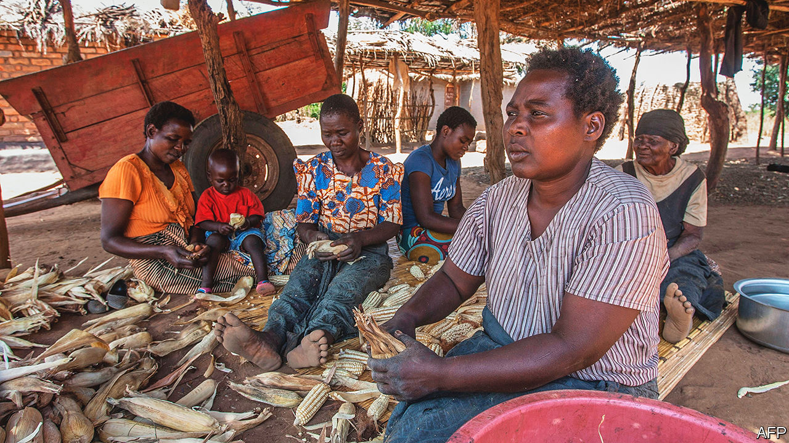
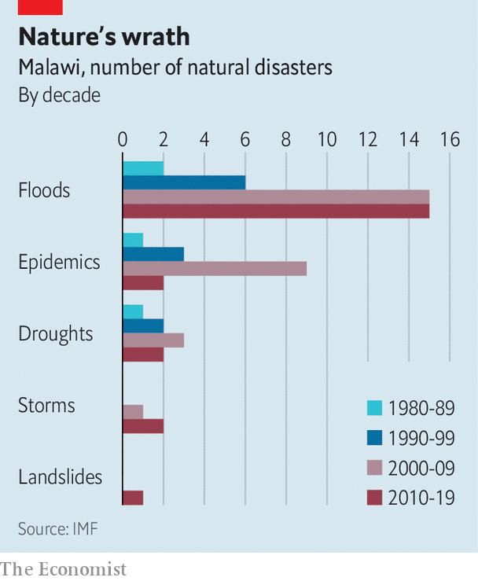

###### The dead hand of dictatorship

# Malawi has saved its democracy but not its economy 

##### It remains the world’s poorest peaceful country 

 

> Sep 22nd 2022 

In many parts of the world democracy can feel abstract and immutable, like mountains in the distance; voting is not a triumph but a chore. But not in Msundwe, a thin strip of road lined by stalls selling beans, maize and cabbages about 40 minutes drive from Lilongwe, Malawi’s capital. Here democracy feels as fresh and real as the scars people still bear from beatings, shootings and mass rapes three years ago. 

“The people in this area rose up against the previous government,” says Kondwani Mangani, a wiry 25-year-old motorcycle-taxi driver. “Then the police came and brutalised people.” Shops were ransacked and at least 18 women were gang-raped by policemen viciously trying to put down protests against the theft of a presidential election by Peter Mutharika, then the incumbent, according to an official report. 

In 2020 Malawi’s Constitutional Court annulled the election and ordered another vote. It was won by Lazarus Chakwera, a theologian and reformist determined to end corruption and boost growth. Malawi’s robust defence of its democracy was widely hailed as a victory for the rule of law in a region cursed by autocrats. It also kindled hope of renewal in this land of roughly 20m people that has stubbornly remained the poorest peaceful country in the world. 

Yet the first two years of Mr Chakwera’s term offer discouraging insights into just how difficult it is for even a well-intentioned leader to root out entrenched graft and invigorate a sclerotic farming economy in the face of a changing climate.

 


Mr Chakwera, who bursts with natural charisma and speaks with the intonation of an American evangelical preacher, admits he has made no progress on his three main priorities of providing jobs, creating wealth or improving food security. The main reason, he says, has been a “consortium of crises”. First the covid-19 pandemic slammed the economy, driving growth down from 5.4% in 2019 to 0.9% the following year. Then came Ana, one of the increasingly frequent tropical storms lashing the country (see chart). It washed away crops, harming food production, as well as hydropower stations that provided 30% of Malawi’s electricity, leading to blackouts. Third was the war in Ukraine, which pushed up the price of fertiliser and fuel, two of Malawi’s biggest imports, straining its foreign-currency reserves. Now fuel and fertiliser are running out. “My dream has not really happened as it should have,” Mr Chakwera says ruefully.

Exogenous shocks and natural disasters largely explain why Malawi has struggled of late. But these do not explain almost six decades of sluggish growth since its independence in 1964 that have left Malawi with a gdp per person of just $545. 

Part of Malawi’s problem is that it is small, landlocked, resource-poor and dependent on neighbours that have often fallen into conflict. Paul Collier, a development economist, has argued that Malawi would struggle to grow rich even if it had the best governance and policies. With little of either it has posted growth per capita of just 1.5% a year over almost seven decades, reckons Stefan Dercon, another development economist. “It takes effort of a particular kind to achieve such poor performance,” Mr Dercon wryly noted in his recent book, “Gambling on Development”. 

That effort was made by a small elite that is in equal parts rapacious and addicted to the statist policies of Hastings Banda, Malawi’s former dictator. Banda liked to control every detail, from the lengths of women’s skirts to the prices of farm produce. Although Malawi shook off Banda’s dictatorship in 1994, it is not yet free of the dead hand of his interventionist state. 

Roughly 80% of Malawians still scrape a living from the soil. Instead of encouraging farmers to choose freely what to grow and sell, the government meddles by setting prices (which people ignore), banning exports from time to time, and giving sacks of fertiliser and seeds to the poor, whether they want them or not, at a cost equal to 1.5% of gdp. Researchers at the International Food Policy Research Institute reckon it would be five times cheaper to import a bag of maize than to import the fertiliser needed to grow that bag. 

One reason the subsidies continue against all common sense is ideology. Lobin Lowe, the agriculture minister, says they are to ensure that Malawi is self-sufficient in food “not only at the national level, but also at the household level”. Another reason must surely be the juicy profits that can be made on fertiliser contracts.

Mr Chakwera has made a start at curbing graft, backing a new head of the anti-corruption bureau who is doggedly trying to pursue a case that allegedly implicates politicians, judges and journalists. Yet even if corruption is reduced, that will not be enough. Agricultural markets need to be freed; regulations that make it hard to do business or create jobs need to be slashed. “Malawi’s biggest problem,” says a veteran Western diplomat, “is that its government won’t stop meddling.” ■

