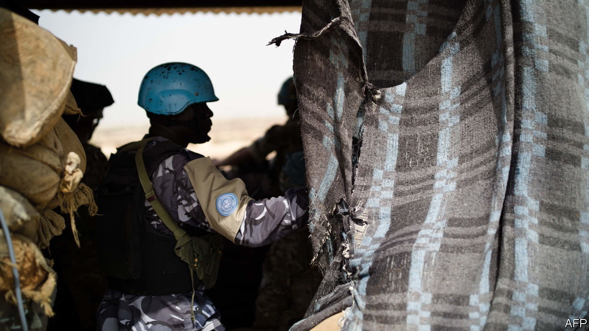
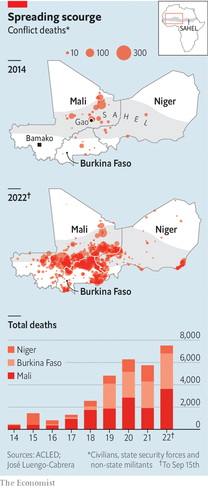

###### With friends like these...

# Mali’s junta takes friendly soldiers hostage 

##### The incident places the UN peacekeeping mission in further doubt 

 

> Sep 22nd 2022 

When 49 ivorian soldiers landed at the airport in Bamako, Mali’s capital, on July 10th they did not expect trouble. For several years hundreds of Ivorians have patrolled their northern neighbour as un peacekeepers. Yet the Malian junta, in charge after coups in 2020 and 2021, arrested the soldiers and called them mercenaries with a “dark purpose”. Ivory Coast said the soldiers were fulfilling a long-standing un security contract—and demanded their release. More than two months later 46 of them are still detained. 

The saga marks another step in Mali’s descent. Jihadists loosely affiliated with al-Qaeda and Islamic State are ravaging the country and the broader Sahel region (see map). The junta had promised to hold elections in February but seven months on, no votes have been cast. Constant spats with France, which once had more than 5,000 troops fighting jihadists at Mali’s request, prompted the former colonial power to withdraw completely this year. 

 


Another reason why the French left was that the junta hired Russian mercenaries from Wagner Group. Since their arrival, the mercenaries and Malian army have massacred hundred of civilians, yet failed to improve security. By mid-September more than 3,600 people had been killed this year, almost double the number for all of last year. Amid the chaos, a 15,000-strong un mission made up largely of west African and European soldiers struggles on. Yet the arrest of the Ivorians and a spate of other incidents are casting doubt over its future.

To free troops for peacekeeping, the un mission is helped by “national support elements”, which provide security and logistics but are not formally peacekeepers. The detained Ivorians were meant to guard the base in Bamako of a contractor working for the German contingent of un peacekeepers. The detained soldiers “are not mercenaries”, said António Guterres, the un secretary-general. “It’s obvious.” Some of their paperwork was sent at the last minute or was not quite in order. Mali might fairly expect greater respect for the rules, but such issues are usually quickly resolved. 

Instead Mali’s junta chose to pick a fight, though why is still unclear. A Western diplomat thinks it reflects “a high degree of paranoia within the government”. Some of the junta’s delusions may have been fed by their unproven suspicions that Ivorians were behind a failed attempt last year to assassinate Assimi Goïta, the coup leader and self-proclaimed president.

Other observers argue that if the junta truly believed that Ivory Coast was trying to topple it, then surely it would have expelled hundreds of Ivorian peacekeepers. Some think the junta is simply looking for a new scapegoat to blame for its failings, now that the French have left. 

Like a kidnapping kingpin, Mr Goïta wants “compensation” to release the Ivorians. The junta has also suggested trading them for Malian political exiles in Ivory Coast, some of whom the colonels want to arrest. “Our soldiers are not mercenaries but hostages,” says Amadou Coulibaly, the Ivorian government spokesperson. Ivory Coast has called an emergency summit of regional leaders. 

The hostage saga is one of many disputes hampering the un’s operations. Shortly after Mali arrested the Ivorians it halted all un troop rotations for a month. Germany, which has more than 1,000 soldiers in Mali, has repeatedly had to suspend its operations because the junta has withheld flight authorisations to rotate soldiers, provide reconnaissance or, if needed, conduct medical evacuations.

More recently Mali has, in effect, banned aircraft from almost everywhere north of Bamako. That air space is being reserved for Mali’s new Russian strike aircraft, which seem to be piloted either by Wagner mercenaries or the Russian air force, says a Western diplomat. 

Given the presence of mercenaries and increased risks of patrolling without air support, some countries are withdrawing their contingents. Sweden has said it will pull out its troops next June, a year earlier than planned. Egypt has also suspended its operations and Benin is pulling out entirely. Germany may be next.

When asked earlier this month about the future of German troops in Mali, Chancellor Olaf Scholz said his government was considering whether it still makes sense for them to be there. “The safety of soldiers must be guaranteed,” he said. Germany would not want to be in a situation where it “would depend on the good co-operation of the Russian forces”, Mr Scholz added.

If Germany left, others would, too. At a minimum the mission would be sharply reduced in size, says Andrew Lebovich, a researcher on the Sahel. The un is conducting its own review. Some un officials believe that their mission will not be able to continue if relations with the Malian government do not improve, says the diplomat. A withdrawal would leave the junta without anyone else to blame for its failings, notes Denis Tull of the German Institute for International and Security Affairs, a think-tank in Berlin. “We will see whether the emperor has any clothes,” he adds. 

A weakened un might suit the junta, which flatly opposes some of the peacekeepers’ work, especially their investigations into human-rights abuses. But the colonels are still divided over whether to kick it out entirely, since it also brings in much-needed aid and the Malian army sometimes relies on the un to evacuate its own wounded.

The un has struggled to slow the bloodshed in Mali largely because it is too small to secure such a large country. It is also somewhat hobbled by its peacekeeping mandate when there is no peace to keep. Even so, its troops, especially those provided by European countries, are well armed and mobile. Their long-range patrols offer at least transient security to the places they visit, allowing aid to flow in to neglected villages. Without the un, life would be even more miserable for many Malians. ■

