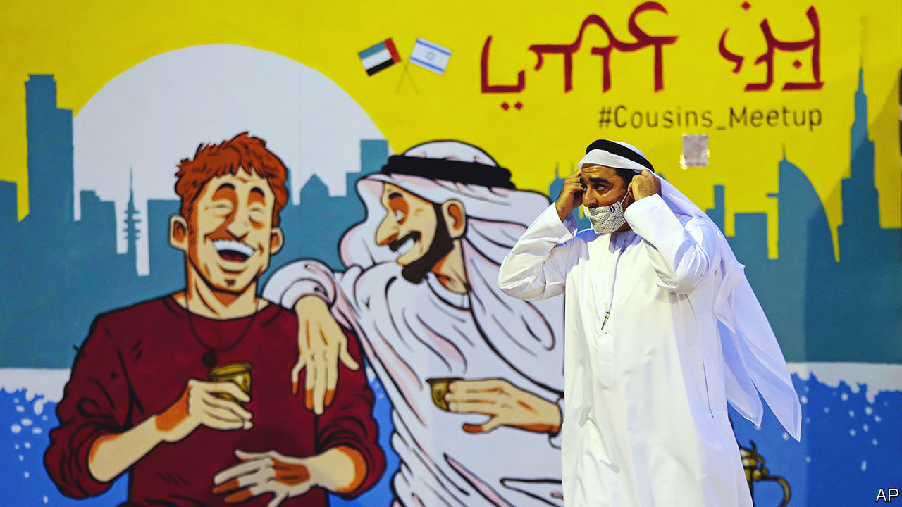

###### The Abraham economy

# Trade and security ties are knitting Israel into its region 

##### Former enemies drawing closer, offering hope of a more stable and prosperous Middle East 

 

> Sep 22nd 2022 

“We’re passing over Saudi Arabia, then crossing over Jordan to arrive in Ben Gurion airport in about 40 minutes,” intones the pilot of a low-cost flight from Abu Dhabi to Tel Aviv. The plane is packed. A smattering of Emiratis keen to do business in Israel occupy the front seats. More raucous Israeli Jews and Palestinians returning from holiday weekends in the Gulf sit farther back. “!” (Hebrew for “bloody brilliant”), exclaims an Israeli student, describing her trip. In the two years since the United Arab Emirates (uae) and Israel signed the Abraham accords, more than half a million Israelis have made the journey. After a century of Jewish and Arab conflict, the trip already feels normal. Soon there will be 20 flights a day between the two countries.

A Jewish community had taken seed in Dubai, the glitziest of the Emirates’ seven statelets, even before the accords were signed. But since then it has sprung into the open, growing from hundreds to thousands of Jewish residents, many of them Israeli. A Jewish school is doubling its intake every six months. There are kosher restaurants like Café Bibi, named after Binyamin Netanyahu, the former Israeli prime minister who signed the accords.

For the first time since its creation in 1948, Israel has a warm peace with an Arab country, not just the formal, often frosty ones with Egypt and Jordan, its immediate neighbours. The uae is “the first to bring Israeli and Arab people together”, says Ebtesam al-Ketbi, who heads an Emirati think-tank. The accords are underpinning a realignment of trade, diplomacy and security arrangements in the Gulf. They are largely economic, built on the hope that trade can bring peace and restore the Middle East to its historic role as the crossroads of the world’s trade, linking Asia and Europe through the Silk Road and Africa through the Incense Road. But they also have a hard edge and are aimed at countering Iran, whose proxy forces have fired rockets or used drones to attack Saudi Arabia, the Emirates and Israel, and whose nuclear programme could soon give it the ability to build a nuclear bomb. 

“People-to-people can dissolve tensions,” says Peng Xiao, the ceo of g42, an Emirati company working on artificial intelligence and surveillance (with ties to the president’s brother and national security adviser, Sheikh Tahnoon bin Zayed). His firm has opened two offices in Israel and already has 50 employees there. Within five years a third of his 5,000 workers will be Israeli, he reckons. Rapyd, an Israeli payments company, sees itself as a trailblazer with a new office in Dubai. “For Israel it’s like going into space,” says Arik Shtilman, its boss. 

On the Israeli right, politicians who once routinely lambasted Arab leaders are boasting of their connections in the Gulf. Ron Dermer, a prominent foreign-policy adviser to Mr Netanyahu, is a partner in Exigent Capital Group, a firm that is eagerly investing there. Ben Volkow, the ceo of Otonomo, a tech company in Tel Aviv, says he is scouting to hire more Arab Israelis now that a Saudi firm has bought almost a quarter of his stock. From the floor of Tel Aviv’s stock exchange the atmosphere is no less hopeful. “Not even the sky is the limit,” said Muhammad al-Khaja, the Emirati ambassador to Israel, before ringing the opening bell. Mr Khaja insists that within a decade the uae will be one of Israel’s five biggest trading partners.

 


It has made a good start. Bilateral trade has exploded from $11.2m in 2019 to $1.2bn in 2021. At only about 0.2% of Israeli gdp, trade with the uae is far behind Israel’s biggest partners, the EU and Turkey. But it is already a lot more than Israel’s trade with Egypt and Jordan, even after decades of peace and diplomatic relations (see chart). 

From the uae’s point of view, the Abraham accords with Israel are part of a broader trade strategy that is bypassing the six-country Gulf Co-operation Council, which has yet to fulfil its aims of creating a common market and shared currency. The Emirates have signed trade agreements with Indonesia and India, and are negotiating with Colombia and Kenya. The goal, says Thani al-Zeyoudi, the uae’s trade minister, is to move from being a gateway to the region to a “gateway to the world”. 

Down the yellow brick road

It is a reasonable ambition. Arab countries trade little with the world besides energy. Excluding oil and gas, the 22-strong League of Arab States accounts for only 2.7% of the world’s flow, despite having 5.6% of its population. Trade within the group is particularly sluggish. Just 18% of it is conducted within the region, compared with 34% in East Asia and 69% in Europe. This stifles development and keeps many Arab countries dependent on fossil fuels. 

One reason is that there is no effective rules-based common market along the lines of the eu. Although the pan-Arab Free Trade Area (pafta), signed in 1997, lowered tariffs on goods within the region, it still has some of the world’s highest trading costs. By contrast, many exports from the eu into the region face fewer non-tariff barriers, according to a un study. Many of the region’s economies are natural competitors, seeking greater market share for their energy exports, rather than producing different goods and services that can be traded between them. Israel, with its tech-focused, service-based economy and large defence manufacturers, offers new products and markets.

“Israel is a tech supermarket,” says Amir Hayek, Israel’s ambassador to the uae. The movement of ideas offers the greatest promise, he reckons. Israel’s expertise in agricultural technology, especially irrigation and hydroponics, could prove particularly helpful. 

Cyber-security and defence is another sphere of co-operation, especially as Gulf governments think America may be withdrawing from the region. Israel has been pushing a plan to link radar stations and missile defences to shield the uae from Iran and give Israel early warning of any Iranian missiles launched in its direction. Exports of Israeli arms to the Abrahamic quartet rose to $800m in 2021, 7% of the country’s total military sales.

Under President Donald Trump, the Pentagon shifted overall responsibility for Israel from eucom, its European command, to centcom, the one that covers the Middle East and Iran. Since that change Israel has been taking part in joint military exercises with its new friends, as well as with countries that don’t recognise it, such as Tunisia and Saudi Arabia. It now has military people stationed in Bahrain. “We’re the region’s new America,” says a senior official. Naftali Bennett, Israel’s prime minister until June, championed a plan to build a regional defence system that would use lasers to blast missiles. 

Since the uae signed the accord in September 2020, three other Arab countries—Bahrain, Morocco and Sudan—have formally followed suit. Relations with Egypt are starting to thaw. Other Gulf states have eased entry procedures for Israelis, while stopping short of official recognition. But the big Abrahamic question is whether Saudi Arabia, the Arabian peninsula’s biggest economy and a potential land bridge between Israel’s Mediterranean coast and the uae, could join the club. “We’re becoming this incredible conduit for Israel,” says the ceo of G42, flagging up other Arab countries that could follow suit. He says his company’s investment of $300m in Israel will open markets for Israeli telecoms in Saudi Arabia, among others. Bahrain, already a member of the club, serves as a banking hub for financial transactions between Israel and Saudi Arabia. Even Iranians in Dubai, Iran’s favourite escape-hatch from Western sanctions, say they are eyeing deals with Israeli tech firms.

Muhammad bin Salman, Saudi Arabia’s crown prince and de facto ruler, is said to have allocated $2bn to invest in Israeli startups. This year one of the kingdom’s wealthiest families, the al-Rajhi, bought stakes in two Israeli companies. The kingdom already has a self-proclaimed ultra-Orthodox chief rabbi who commutes from Jerusalem, as well as a new kosher restaurant. “Veterans from Unit 8200 are trying to replicate Silicon Valley in Riyadh,” says a well-connected Saudi watcher, referring to the Israeli army’s cyber-arm, whose former members often end up founding or working in tech startups, and are said to be setting up shop in the Saudi capital. Few expect formal relations to improve so long as King Salman bin Abdulaziz lives. Although ailing, he has long supported the Palestinian cause. Even so, “most things are possible short of recognition,” says another Saudi official, “including tourism.”

Yet these new friendships remain fragile. After the peace accord was signed between Israel and the Palestinians in Oslo in 1993, Israel took part in regional economic conferences heralding “a new Middle East”. Morocco, Oman, Qatar and Tunisia opened liaison offices. But when bloody conflict erupted between Israel and the Palestinians a few years later, all such talk of harmony evaporated. 

Bigwigs on both sides now hope to insulate the accords from Israel’s conflict with the Palestinians. “Let’s not mix this [the Abraham accords] with that [the Palestinians],” says an Emirati official. Few say it openly, but the accords mark a tacit acceptance by many Arab rulers that Israel, for the time being, has won. Some even suggest they offer a way of ending this enmity. Mr Bennett, in whose office lobby lies a coffee-table book titled “Dubai Wonder”, calls his pact with Raam, the first Arab party to join an Israeli government, an “internalised” version of the Abraham accords.

Yet many expect the accords will be severely tested if there is flare-up in Jerusalem or a resumption of fighting between Israel and Hamas, a Palestinian militant group that controls Gaza, or Hizbullah, a militia-cum-political-party in Lebanon. Both groups are building rocket arsenals aimed at Israel. The strain would be particularly intense if the fighting leads to large numbers of Palestinian or Lebanese civilian casualties, something Israel’s military planners argue they would struggle to minimise since both Hamas and Hizbullah hide their rockets in homes and schools.

Moreover, politicians, diplomats and businessfolk on both sides of the accords have moved faster than the general population has. A survey by the Washington Institute, an American think-tank, shows public support for the Abraham accords in the uae and Saudi Arabia has fallen sharply since they were signed. The Arab Barometer, a pollster, found that only 5% of people in Jordan and Egypt were keen on having much friendlier relations with Israel (though responses in Morocco and Sudan were more enthusiastic).

Such views are mirrored in Israel, where many still distrust Arab countries. “Israelis are happy with normalisation as long as it stops at the Jordan river,” says Liel Maghen, an Israeli analyst. Many Israelis, brought up for generations in the belief that Israel is a beacon of democracy in a desert of backward-looking tyranny, are nervous about venturing out. Israeli left-wingers, too, shy from what they see as a right-wing and anti-Palestinian deal. “I’ll never go to Dubai,” says Noam Shuster-Eliassi, an Israeli comedian, mocking her fellow citizens for stopping Palestinians at checkpoints but then flying to the uae. 

And the economic benefits of the accords to both sides may still be too nascent to make the new peace-and-business process irreversible. This is partly because red tape, possibly born of mistrust, keeps getting in the way of deals. Dubai’s al-Tadawi Hospital is still waiting for approvals to hire Israeli doctors. Rapyd, the Israeli financial-software provider, has yet to receive its Emirati operating licence. Sudan, which signed the accords in January 2021, has since stalled on implementing them. 

On the Israeli side, bureaucracy stands in the way of Emirati plans for mega-projects. dp World, a giant port operator based in Dubai, withdrew its bid to develop Israel’s Mediterranean port at Haifa after Israel changed the ownership rules. Israeli officials have blocked Emirati plans to reactivate an energy pipeline stretching from the Red Sea to the Mediterranean. Even an Emirati-funded project to provide Israel with solar power produced in Jordan, in exchange for Israel sending water to its parched neighbour, has been stalled. Israel has been slow to approve the building of a desalination plant on its shores. 

 


Meanwhile, the Abrahamic idea of a railway from the Gulf to Haifa, Israel’s port on the Mediterranean, is still blocked by Jordan (see map). Israel and Saudi Arabia have built their lines right up to the Jordanian border. But mindful of its own Palestinian majority, Jordan won’t link them up until Israel also extends its network to the Palestinian West Bank. If these tracks were all connected, the volume of container traffic would double “almost immediately”, says Yisrael Gal, an Israeli economist.

Also galling for pioneers of the Abrahamic club is the prospect that Iran, its great rival, may yet steal a march on it by reopening the old east-west Silk Road. For the first time since Cyrus the Great ruled Persia 2,500 years ago, Iran now has a land-bridge stretching from Central Asia through Iraq, Syria and Lebanon to the ports of the Mediterranean. Members of the accord need not fret. Their club links together dynamic, growing economies. Iran’s road connects failing states and seems mainly used to carry weapons. 

The Abraham accords promise much, yet are in their infancy in a region that dashes even the worthiest of dreams. But they also offer a rare chance for economic renewal and for the Jewish state to be accepted by its neighbours as something other than an enemy—perhaps even, as the Koran calls Abraham, a friend. ■

