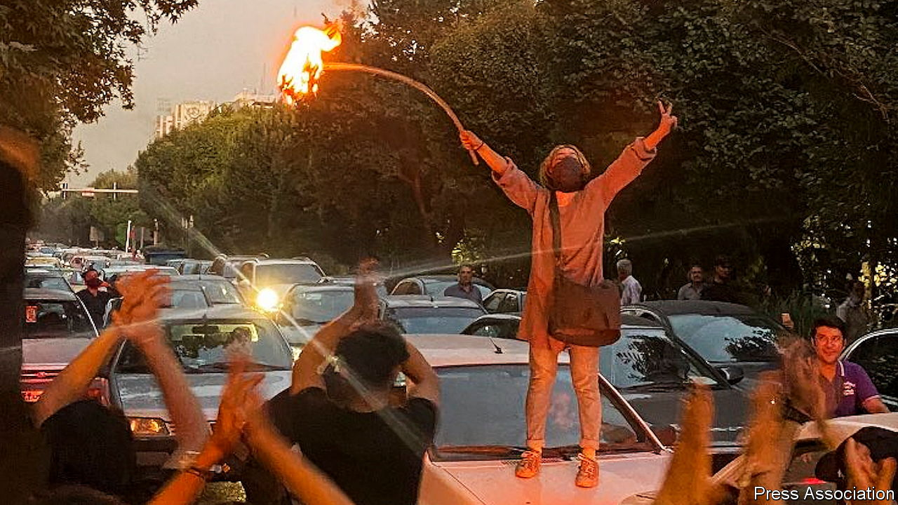

###### Women v morality police

# Why Iranian women are burning their hijabs 

##### Protests by the oppressed sex are rocking the Islamic Republic 

 

> Sep 22nd 2022 

From far-flung villages to the steps of Tehran University in the capital, women are leading men. They are at the front of protests and rally the crowds by burning their mandatory hijabs (headscarves), cutting their hair and dancing in public. Their immediate cause is Mahsa Amini, a 22-year-old student, who died on September 16th after morality police beat her, apparently for wearing a loose hijab. But their grievances are fed by four decades of religious strictures that have fallen heaviest on women. After a week of gunfire and killing, their protests are spreading.

The social curbs are the latest in a wave of measures designed to shore up the Islamic Republic as a successor is found for the octogenarian Supreme Leader, Ayatollah Ali Khamenei. In recent years the Ayatollah has purged his regime of reformers and consolidated all branches of government under trusted zealots such as Ebrahim Raisi, his hardline president.

Trying to tighten control, Mr Raisi issued a “hijab and chastity” decree that has emboldened the morality squads. These have removed posters of unveiled women in cafes and ordered proprietors to replace songs with instrumental music. Their men, dressed in black and armed with batons, have put hundreds of women in morality centres for “re-education”, according to a human-rights group. 

The battle over morality has become more technological since the revolution of 1979, when Islamist thugs shouted “ ” (“cover or suffer”). These days the authorities are planning to use facial-recognition software to detect the underdressed on the metro and an icon was recently added to the taxi app, Snapp!, to report female passengers who are improperly attired. (Rebellious women have their own app, Gershad, to report and track the location of morality squads.)

Fearing reprisals, some protesters are deleting their social-media profiles. Others are turning violent. State media have reported a series of lynchings of clerics. Eight worshippers were stabbed on September 17th in a mosque in the southern city of Shiraz. 

The regime is rattled, not just by anti-religious protests but also by the prospect of economic unrest. Since 2012, gdp per head has fallen from more than $8,000 to under $3,000. Even as incomes plummet, prices are soaring. The regime blames American sanctions for the economic suffering but Mr Raisi’s policies are exacerbating the collapse. He has tightened restrictions on the internet. The controls may make it harder for people to get the news, but they are also suffocating businesses. 

Still, the government shows no signs of backing down. A former apparatchik reckons it needs only half a million loyalists to control Iran’s 84m people. “They’ve learnt from the Shah’s downfall to take an offensive posture no matter what,” says Yaser Mirdamadi, an exiled cleric and relative of the Supreme Leader. Many expect that after a few more days of killing a curtain of fear will again descend over Iran. As a father in Tehran puts it: “Parents will shrink-wrap their girls before letting them out.” ■

