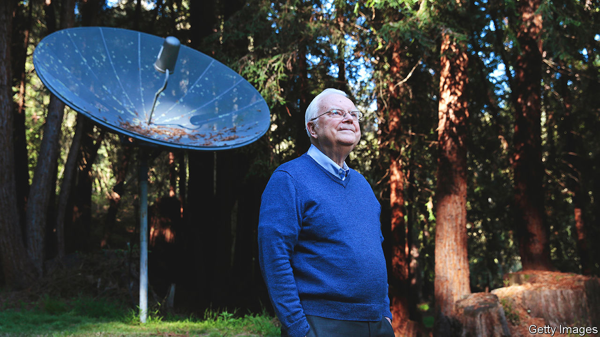

###### The “Are we alone?” equation

# Frank Drake believed that the universe had to contain other intelligent beings 

##### The intrepid radio astronomer died on September 2nd, aged 92 

 

> Sep 21st 2022 

It was not something Frank Drake set out to do, but it seemed pretty useful. In 1961 he was drawing up a list of topics for a conference he had convened at the National Radio Astronomy Observatory at Green Bank, West Virginia. This would gather in every scientist in the world who cared about intelligent life elsewhere in the universe; about 12 people, by his reckoning. One of them was researching what dolphins said to each other. His own question went somewhat further: whether there were civilisations beyond our solar system, and what they might be trying to say.

He had done his first search for extraterrestrial intelligence (later called seti) the year before. That enterprise was still widely ridiculed as a hunt for little green men, Martian canal-builders and ufos, and not reputable research. (Perhaps unwisely, he called it Project Ozma, after the daughter of the King of Oz.) So he kept it secret, and the conference informal, to avoid public mockery. But seti for him was an expression of serious scientific intent. 

He was excellently placed to embark on it. As a radio astronomer, he spent his days controlling the 26-metre telescope at Green Bank, observing and recording in pen and ink (no computers then) the data that reached Earth from the radio part of the electromagnetic spectrum. That finer, sharper tool allowed him to find the radiation belts of Jupiter, to analyse the atmosphere of Venus and to map the centre of the Milky Way, obscured to visible light by clouds of dust. From time to time he also pointed the telescope at two stars, Tau Ceti and Epsilon Eridani, which he thought most likely to be habitable and sending radio signals. 

He felt no need to justify that fascination. Ever since Sunday school, to which he was sent by his strict Baptist parents, he had been struck by how naturally people assumed that their own civilisation was the only one worth knowing. He resolved then, at eight, not to think that way. At the Chicago Museum of Science and Industry, a favourite haunt, he learned that the Sun was merely an average star among billions. He felt then, and every time he gazed at a clear night sky, that intelligent life could not be a fluke that had appeared only on Earth. Since it had happened at all, why not elsewhere?

 It would do no harm, he thought, to give his researches the dignity of an equation, and that day in 1961 one came quite naturally:

N= R* x f x n x f x f x f x L 

As he opened the meeting, he wrote it on the blackboard. N was the number of detectable, intelligent civilisations in the Milky Way galaxy; to get that figure, you just multiplied the factors together. R* was the average rate of formation of stars in our galaxy: between one and ten a year, he thought. After that, f was the fraction of stars that had planets, and most stars had them. Next, n was the average number of those planets that could potentially support life (Earth, Mars and Venus in his estimation); f the fraction of those on which life had actually developed; f the fraction of those on which that life was intelligent; and f the fraction of those that had produced a technology detectable from space, like the radio-wave transmitters he was using himself. 

This was not really an equation, but a thinking tool. People called it pure speculation, but each phenomenon had taken place in the universe at least once. It became so famous that it featured on t-shirts, right next to Einstein’s e=mc. Of course, most of the terms had no known values. But the truly troublesome one was the last, L, which was the average length of time a civilisation might be detectable. That was quite impossible to say. The figure he usually threw out was 10,000 years. 

Despite the imponderables, he and his colleagues started searching. On the very first day of the experiment a regular pulse, eight times a second, was detected from Epsilon Eridani—but it turned out to be rogue radar from a passing aircraft. More than 100 other initially intriguing signals were seen, but all were probably artefacts. NASA had set up some funds for SETI from the 1970s, but no proper programme until the 1990s, by which time Congress was losing patience. In 1993 it turned off the tap. When Dr Drake was asked why nothing had been found, he replied: “We haven’t tried hard enough.” They had observed only a few thousand stars, when they should have observed 10m, and they needed two antennae on opposite sides of the Earth to look in all directions all the time. It could be done, but only with a pile of money. 

If faraway intelligences did not get in touch, they might perhaps be nudged to respond to messages. In 1974 he sent the first interstellar message from the Arecibo Observatory in Puerto Rico towards m13, a globular star cluster 25,000 light-years away. In simple binary coding, it described where the message was from and what humans were like. He also collaborated with Carl Sagan, then America’s best-known astronomer, to attach plaques to the Pioneer spacecraft and images and audio recordings to the Voyager craft, describing Earth and earthlings. Photographs of Earth-life sent on Voyager included one of him, or someone very like him, eating a sandwich in a manic fashion. He was never that keen, however, on sending things. Earth had been lit up like a beacon with radio transmitters for decades. If other civilisations wanted to make contact, they knew where to direct their signals. 

Other scientists might have been depressed by the lack of progress. It did not speed up even when new telescopes could produce reams of data in seconds, rather than months. But he was not cast down. His work had become part of an entirely new field of interdisciplinary research, astrobiology. Besides, his star-gazing on Tau Ceti and Epsilon Eridani was like buying two tickets for the lottery. To discover intelligent life beyond the solar system would alter humankind’s perception of itself profoundly, and not only by curbing its arrogance. It would potentially teach earthlings new technologies, new ways of seeing and—he especially liked this thought—new sources of joy. It would be the biggest jackpot imaginable. And someone, somewhere, had to win it. ■

