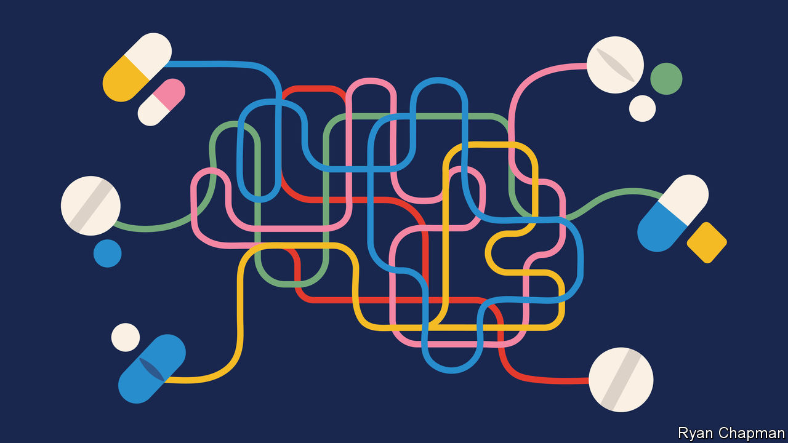
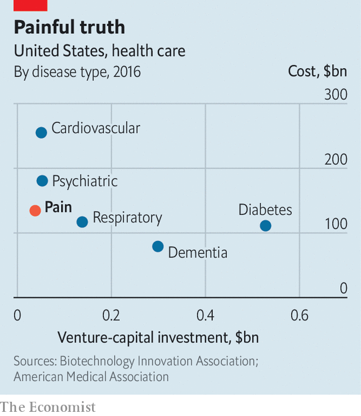

###### Pain, pain, go away

# Better medicines are needed to relieve pain 

##### Most analgesics are either opioids or anti-inflammatories. Neither is good enough 

 

> Sep 21st 2022 

The moment you pick up the red-hot saucepan, nerve endings in your skin will register the sudden, potentially traumatic spike in temperature. Heat-sensitive proteins on those nerve endings will respond by changing their shape, allowing sodium and calcium ions to flood into the skin’s nerve cells. Once enough charge has accumulated, electrical signals will fire along a relay of nerve fibres until they reach the spinal cord and, eventually, the brain. There, different regions will be notified: the sensory cortex, for example, will locate the injury; the limbic system will assess its severity. This entire sequence will take a split second (or less); its subjective sensation—sharp, searing pain.

The immune system, meanwhile, will kick off inflammation in the skin that is in contact with the hot saucepan. This not only reddens the affected area and makes it sensitive to touch, but also amplifies the pain signals travelling to the brain. Once the brain has registered the pain and worked out a defence—in this case to immediately drop the hot saucepan onto the floor—it will then send its own signals back to the fingertips, attempting to damp down the unpleasant feelings of pain and allow the healing process to start.

Pills, thrills and bellyaches

After the initial shock is over, you might consider taking some painkillers to deal with your throbbing hand. These drugs do one of two things: reduce the pain signal heading up to the brain, or increase the calming signals coming the other way.

Suppressing inflammation is a good way to achieve the first of these—painkillers such as aspirin, ibuprofen and celecoxib all belong to a family of non-steroidal anti-inflammatory drugs (nsaids). Boosting the brain’s attempts to reduce the sensation of pain, meanwhile, is the domain of drugs known as opioids. These mimic the effects of molecules such as beta-endorphin, normally produced by the body in response to any of a number of sensations from pain to exercise. Opioid drugs can be naturally occurring, such as morphine or codeine, or synthetic, such as fentanyl or methadone.

Both anti-inflammatory drugs and opioids are effective. They also come with significant drawbacks. Anti-inflammatory drugs can cause ulcers. Opioids can cause breathing difficulties that can become fatal. They can also become addictive and the body can build up tolerance to them, thus requiring ever higher doses to achieve the same analgesic effects. (In America, the over-prescription of opioids has led to a public-health crisis, with more than 68,000 fatal overdoses in 2020 alone.)

Both classes of drugs are well established (the oldest recorded use of opioids dates to 2100bc), and newcomers struggle to enter the field—only 2% of painkillers are thought to make the journey from preliminary trials to approval, compared with 10% for other compounds. “The field has really been stagnant in terms of development,” says Karim Ladha, an anaesthetist at the University of Toronto.

New types of painkillers are needed and the Food and Drug Administration (fda), America’s pharmaceutical regulator, is keen to shake things up. In February, it released draft guidance to encourage the development of non-opioid analgesics, including the suggestion that such products could be eligible for expedited review.

If at first you don’t succeed...

The research field is littered with the bodies of former challengers. One direction long thought promising involved the suppression of nerve growth factor (ngf). This is produced throughout the body at times of inflammation and makes the body more sensitive to pain by, among other things, increasing the conductivity of nerve fibres.

One candidate drug aiming to suppress ngf was a monoclonal antibody called tanezumab, owned by Pfizer, an American pharmaceutical firm. The drug went through multiple clinical trials and patients with osteoarthritis experienced greater reduction in pain after injection with the drug than for a placebo, nsaids and opioids. Nevertheless, the fda rejected tanezumab in March 2021, owing to risks that its use might desensitise the patients to joint damage and thereby accelerate the spread of their disease.

A further potential avenue for pain relief has been the suppression of reactive oxygen species (ros) in the blood. These are highly reactive molecules, such as hydrogen peroxide, that contain oxygen and which can disrupt the normal functioning of cells. Also produced during inflammation, they can increase the nervous system’s sensitivity to pain and reduce the thresholds required for pain receptors to become active. High levels of ros are thought to be responsible for the persistence of pain, making them a good target for drugs in this area. One such drug is acp-044, made by Acadia Pharmaceuticals, based in California. It failed to achieve satisfactory results in a phase-2 clinical trial, however, for acute pain for patients who had just undergone a bunionectomy, a procedure that involves the removal of enlarged bone regions in the foot. It has therefore been scrapped.

A more promising pain-relief candidate from Vertex Pharmaceuticals, a firm based in Boston, Massachusetts, works by limiting the flow of sodium ions into nerve cells. It thereby suppresses the signals of pain that these cells can send on to the brain. There are nine sodium channels known to exist in nerve cells in various parts of the body and three of them—Na1.7, Na1.8 and Na1.9—are thought to play the most significant roles in the transmission of pain. Blocking sodium ion channels is not a new idea but the similarities between the various channels has made the strategy impractical. Lidocaine, for example, targets them all indiscriminately, frequently leaving patients dizzy. Even worse side effects are possible.

Vertex claims to have got around this limitation with a product called vx-548 that, it says, targets only the Na1.8 channel. This small-molecule drug completed its phase-2 clinical trials in March. The trials involved offering a regimen of pills to about 300 patients experiencing pain after undergoing one of two surgical operations—either a bunionectomy or an abdominoplasty (more commonly known as a tummy tuck).

The results were promising. On the 11-point scale the researchers used to quantify pain, vx-548 achieved an improvement of between one and three points—a level the company describes as clinically meaningful. In July Vertex received the green light from the fda to proceed with phase-3 trials with their drug, in which more patients will be given vx-548, and for a wider range of pain causes. Results could emerge within the next two years. 

Vertex’s success, and indeed the existing fda guidance, is primarily geared at limiting acute pain, which is defined as a response to damage that lasts less than six months. If it goes on for longer, then it is referred to as chronic. This form of pain is the iceberg below the waterline, affecting 20% of adults and causing hundreds of millions around the world to suffer until the end of their lives. Because opioid use is particularly addictive over the long term, solutions for those with chronic pain are especially thin on the ground. Vertex hopes its offerings will also work on chronic pain and even Acadia hopes to re-focus its candidate drugs for pain in the same direction. 

 


The challenge both companies face, however, is that the physiological mechanisms for long-term pain remain elusive. Most acute pain is nociceptive, which is to say nerves transmit information from the site of injury to the brain. Chronic pain, by contrast, is more often either neuropathic—the result of nerve damage causing the pain-transmitting mechanisms to misfire, as in the case of carpal tunnel syndrome or a prolapsed disc; or it can be nociplastic—when the nervous system, for reasons unknown, augments the signals that it transmits to the brain. When it comes to fully understanding these forms of pain, says Andreas Goebel at the Pain Research Institute at the University of Liverpool, modern medicine is still in the stone age.

More effective, perhaps, might be to stop prioritising the search for a causal understanding, and favour empirical results. Shane Cronin, a biologist at Harvard Medical School, is part of a team of researchers that has spent more than a decade identifying a correlation between chronic pain and levels of a naturally occurring molecule in the body known as tetrahydrobiopterin. This is found throughout the body, is involved in the production of hormones such as adrenalin and dopamine, and appears to boost the immune system’s responses. Though the precise connection between tetrahydrobiopterin and pain is still unclear, Dr Cronin and colleagues are nonetheless looking for ways to reduce its levels in the body. In work published last month in , they trawled through a list of 1,000 existing fda-approved drugs, in order to identify those that might do so. After testing the impact of these drugs on mouse neurons, they identified one candidate—fluphenazine, previously prescribed for schizophrenia—that successfully inhibited not only tetrahydrobiopterin but pain too. 

…try, try again

Other approaches seek to improve existing classes of pain medication. Researchers at Wake Forest School of Medicine in North Carolina, for example, have carried out preliminary trials of a drug called at-121, which has been called an opioid stripped of its addictive properties. It works by targeting opioid receptors in the body that do not seem to have the reinforcing effects in the brain’s reward circuitry that are the usual causes of addiction. 

Tests in monkeys showed that primates could be distracted from the discomfort of a tail dipped in hot water by a dose of at-121 that was 100 times smaller than that amount of morphine required for the same analgesic effect. The monkeys were also in no rush to give themselves more of the drug, suggesting that its addictive properties could be low.

“To feel pain is a good thing,” says Dr Cronin. “We need it to survive.” Therein lies the needle that all novel forms of analgesia must thread—shutting down enough of the body’s alarm system to prevent it from overreacting (or reacting without cause in the case of some chronic pain), but without snipping the wires that, among other things, keep people safe from dangerous, red-hot saucepans. ■


