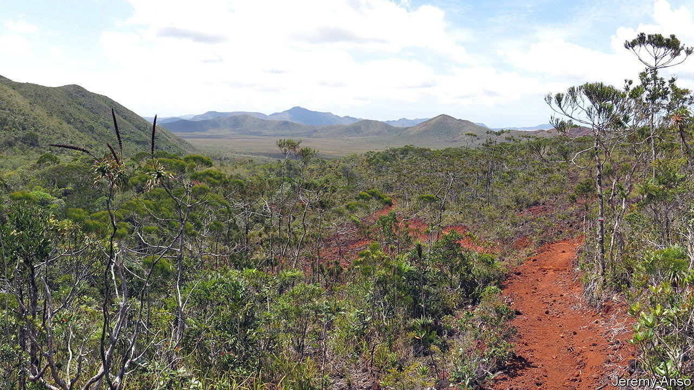
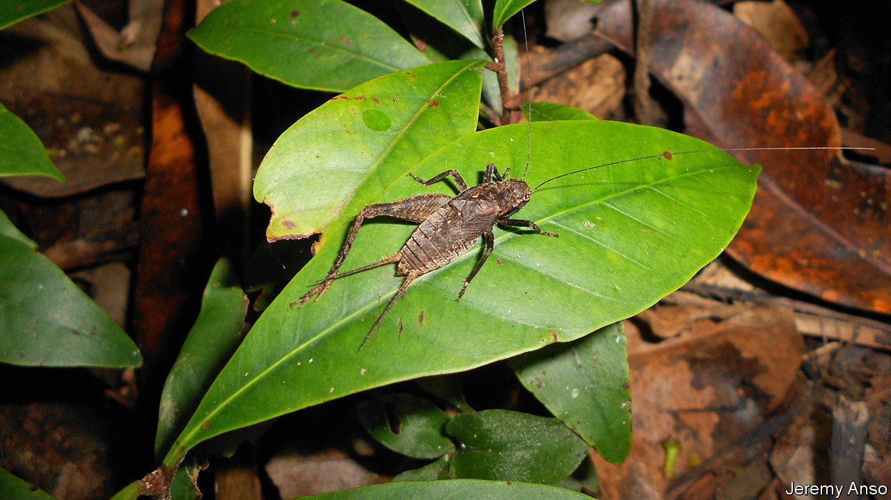

###### Environment

# Crickets are an indicator of ecosystem health 

##### The chirps of insects tell an important story 

 

> Sep 21st 2022 

Canaries are more sensitive to carbon monoxide than people are. Thus they were routinely taken into mines as men went about their work of extracting coal. Odourless and deadly, carbon monoxide could quickly poison many miners before they even knew what was happening. The canary resolved this problem. If it stopped singing and dropped dead from its perch, this was an indicator that carbon monoxide levels were rising and that evacuation was in order. Now ecologists think they have found a “canary” that could function as a similar indicator of impending disaster for tropical ecosystems—the cricket.

As the planet warms, it is becoming ever more important to know which ecosystems are facing radical change and which ones are not. One technique involves finding species that are sensitive to ecosystem change in a given area, but this is tough work. Many of the best indicator species are small and hard to find. Spotting when their populations are just starting to change requires highly skilled specialists to spend a lot of time and resources conducting monitoring operations.

Amandine Gasc, an ecologist at the French Research Institute for Development in New Caledonia, located in the south-west Pacific Ocean, hypothesised that crickets might be able to help. Crickets are tiny, present in large numbers and, most importantly, noisy. The chirps of individual species are identifiably different and researchers had previously wondered if ecosystems might be monitored by listening to how the sounds of their crickets change over time. But could crickets actually serve as an indicator species?

 


Dr Gasc and her colleagues investigated cricket populations on the island of Grand Terre in New Caledonia (pictured), where multiple ecosystems often exist in close proximity. They collected crickets at 12 sampling sites. Four were healthy forest sites, four were shrubland areas, of the sort that are often created when people chop down forests, and four were shrubland areas that were turning into forest again. They listened for insects in square zones that were ten metres on each side and ran ten 30-minute collection sessions (five in the day and five at night) at each site.

Writing in , Dr Gasc described how each ecosystem had, in effect, a distinct “cricket fingerprint”. Species richness varied considerably between the different environments, with healthy forest typically having 20 cricket species present, transitioning forest having 15 species, on average, and shrubland having just 7 species. Each type of environment also harboured its own unique mix of species. Of the 20 cricket species found in the healthy forest, 12 were unique to that habitat alone, 2 of the 15 species found in transitioning forest were unique to this habitat and 3 of the 7 shrubland species were unique to it.

In essence, just by looking at the crickets found in a given location and without any examination of the other surrounding flora and fauna, the team found that it was possible to determine whether they were looking at shrubland, forest or shrubland that was transitioning into forest.

To work out whether these cricket fingerprints would translate into a unique collective soundscape, Dr Gasc’s team narrowed its analysis to look only at species of crickets that made iconic chirps. Each habitat, they found, contained cricket species that generated their own identifiable chirps. This suggests that setting up audio recorders in forests that pick up cricket calls ought to be an easy, cheap and accurate way to detect early stages of change in tropical ecosystems.

While such a system would not be of much use in tropical forests that are abruptly, and obviously, destroyed by human logging activity, audio recording systems could listen for changes in the symphony of cricket calls in forests that are starting to be fragmented by roads or becoming infiltrated by invasive species. Indeed, just as coalminers once knew that trouble was brewing if they heard a canary’s song abruptly stop, ecologists could eventually tell that ecosystem change is beginning to take place in a forest when they hear the chirps of key cricket species suddenly go silent. ■


