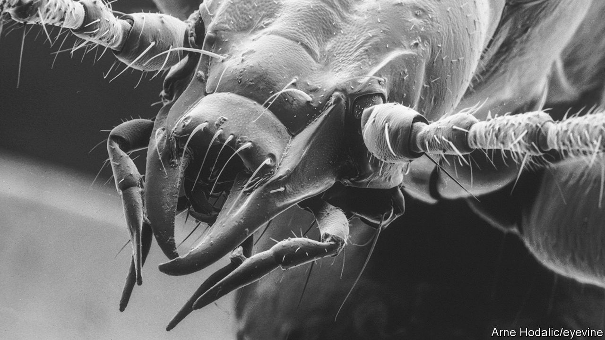

###### Taxonomy

# On the troubles of naming species 

##### What do you do when a name becomes problematic? 

 

> Sep 21st 2022 

Beige, blind and distinctly underwhelming, Hitler cowers in the remote caves of Slovenia. This is not the Führer, but a tiny carabid beetle, named , or “eyeless hitler”, by Oskar Scheibel, a German entomologist, in 1937. The translucent bug (pictured) has little to fear in its natural habitat, except Nazi memorabilia enthusiasts who collect it illegally. The beetle fetches over £1,000 on the black market. Even in death the bug is pillaged—the Bavarian State Collection of Zoology had almost all of its specimens stolen. “It’s an innocent insect,” says Mirjana Roksandic, an anthropologist at the University of Winnipeg in Canada. “Why not end this illegal trade by changing its name?”

Scientists have, for decades, called for  to be renamed something less offensive. But zoological nomenclature abides by a code of priority to the first taxonomist to describe a species. Whether it’s  (Taylor Swift’s millipede) or  (Lenin’s six-metre ichthyosaur), once a name is given it must stick.

As the statues of history’s antagonists fall and their portraits and names are removed from the world’s great buildings, researchers are wondering whether or not the names should nevertheless live on in the world of taxonomy. Academics such as Dr Roksandic are calling to erase names that honour colonial figures, and in some cases to restore indigenous ones.

Species have a precise two-part scientific name (often Latin, but they can be any language) that is understandable across the world. or , in which the “sapiens” and “lupus” are the species epithets and “Homo” and “Canis” the genus, are recorded throughout history in a way that is fixed and easy to follow. These rules were formalised by Carl Linnaeus, a Swedish botanist, in 1753. The International Commission on Zoological Nomenclature (iczn) enforces the rules today. Thomas Pape, iczn’s president, says his organisation serves the “stability and universality” of nomenclature, which involves “mandating scientific naming rules but not ethical arguments”. On the  beetle, Dr Pape says: “It was not offensive when it was proposed, and it may not be offensive 100 years from now.” 

This rigid stance also applies to naming humans. In 2021 Dr Roksandic suggested renaming an ancient human species found in Zambia, , to . Writing in Dr Roksandic has urged taxonomists to drop the “rhodesiensis” that was associated with the colonial state of Rhodesia and its human-rights abuses. 

“One option would be to informally change its vernacular name,” says Patrice Bouchard, vice-president of the iczn. There is precedent for this—the Entomological Society of America decided in recent years that it would no longer use the common name for , “gypsy moth”, because it was deemed derogatory to the Romani people.

There is another wrinkle to the problem—the iczn’s code, which was last updated in 1999, requires new species names to be published in scientific literature, but not necessarily peer-reviewed journals. Though this increases access to the field for amateur taxonomists who can find and name new species, it also has a dark side—a type of scientific misbehaviour known as “taxonomic vandalism”. By scouring preprints and other publications, vandals take evidence collected by others and publish their own names for hitherto-untitled species.

Sergei Mosyakin, director of the Institute of Botany at the National Academy of Sciences of Ukraine, suggests taxonomic histories “cannot be undone” and “shall not be erased”. Many problems could be avoided, he thinks, if researchers stopped naming species after people “quite unconnected with natural science”. This perhaps goes too far, since the thrill of having a new species named after famous people probably generates some interest in what might otherwise be ignored by the public. But perhaps taxonomists could think again about names that are political, out of touch or just plain offensive. ■


