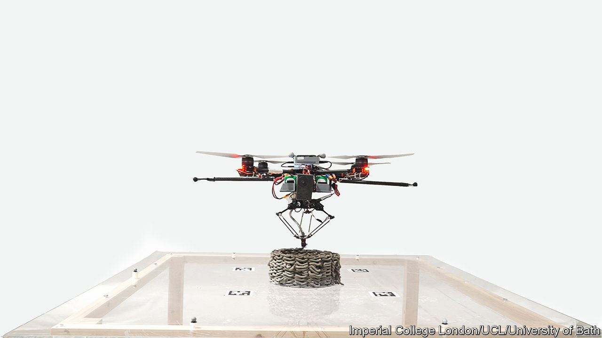

###### Flying construction robots

# Teams of drones can print in 3D 

##### They could build and repair where humans cannot reach 

 

> Sep 21st 2022 

Certain creatures—namely, wasps and bees—have evolved to be adept flying builders. To assemble a hive or nest, worker insects team up to deposit wax, raw wood pulp or their own saliva to the specification of a complex design that ends up being many times their size. This process takes months, many times longer than the average lifespan of all but the queen. The insects must adjust as they go—building plans can change, imperfect materials can deform or break, workers can die.

It is these insect building teams that inspired Mirko Kovac, a roboticist at Imperial College London, to develop a way to improve the flexibility of 3d printing. A typical 3d printer is limited by the range of its nozzle, and can only make objects smaller than itself. Dr Kovac’s team has removed these constraints by giving the printer nozzle wings.

Writing in the latest edition of , Dr Kovac describes a system of flying robots that is composed of two types of multi-rotor drones: builders and scanners. The builders carry the 3d-printing nozzle. The scanners are robots equipped with cameras that are responsible for monitoring the progress of the builders. 

The building process alternates between builders and scanners, layer by layer, printing and adjusting, until a structure is complete. First, a builder hovers over its area of operation and begins to release a jet of the building material as it manoeuvres along its flight path. The choice of material is important—it must be lightweight enough for the drones to carry but sturdy enough to hold the subsequent layers that will be built on top. Dr Kovac’s team experimented with two materials. One was a low-density polyurethane foam, which can expand up to 25 times as it dries and can be used as insulation in buildings. The other material they tested, which was sturdier and more precise, was a mixture made from cement. 

Once the builder robot has sprayed a layer of material, the scanner robot flies over and inspects the progress. The system then computes the next layer that the builder should make, while also correcting for any errors that might have been discovered in what has already been built. These could be errors made by the builder-drones or imperfections in the expansion of the building material. At this point, people can also intervene in the process, supervising and correcting course where necessary.

The researchers tested the system’s capabilities by building both a large cylinder made of foam (72 layers and 2 metres tall) and a small cylinder made of the cement mixture (28 layers, 18cm). The tasks were not simple. Making circles on top of other circles would not have worked, because the perfect alignment required would have been impractical to achieve. Instead, the builder robot deposited squiggly circles that interleaved with the layers above and below, to ensure maximum stability.

Dr Kovac’s robots passed the test with flying colours—the cylinders were built to within 5mm of the width and height of the planned structures, which is up to snuff as far as British building codes are concerned. While these robots have been shown to be capable of manufacturing, Dr Kovac says their bread and butter will probably be, initially, in repair. 

Because the flying robots can, in theory, operate anywhere, they could fix things in dangerous or otherwise inaccessible places. Dr Kovac says that his robots could be used to spot and seal leaks in oil or gas pipelines, repair leaky insulation or fix cracks on tall buildings. These robots could be deployed more quickly, cheaply and with less risk to humans. Thinking more long term, Dr Kovac even sees a potential future for his construction robots, building on the surfaces of the Moon or Mars.


