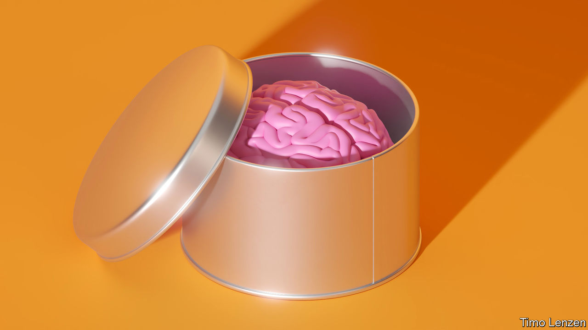

###### Fixing the brain

# After fallow decades, neuroscience is undergoing a renaissance 

##### The toolkit for tackling brain dysfunction is expanding rapidly, says Natasha Loder 

 

> Sep 21st 2022 

From your reading of the words on this page, to your memory of breakfast, to the tickle of hair against your skin, your experiences are the work of nerve cells. So are your feelings, chains of reasoning, good and less good habits. So are your anxieties, moods, and the tremblings and lapses of memory which, if they do not afflict you yet, are likely to do so eventually. The whole panoply of human experience can be found in electrochemical pulses passed along and between the 90bn nerve cells, also known as neurons, that make up a person’s brain. 

When minds change, so do brains—and the opposite is also true. Things which change brains and central nervous systems, or the behaviour of specific types of neurons and supporting cells within those structures, can also change minds, for better or worse. When brains age, or are damaged, or are diverted with recreational drugs, minds alter, too. Sometimes entire personalities shift. This means that drugs and other treatments that target neurons can be used to address both physical diseases—neural degeneration, for example—and mental ones. 

One hundred years ago, a single discipline of neuropsychiatry dominated the study and care of brain dysfunction. A schism emerged, starting in the 1930s. Today the neurology departments that deal with organic dysfunction of the nervous system, and the psychiatry departments which treat human minds, remain apart. Many people believe that a merger of the two is long overdue. This becomes more important as the biological ties to mental disorders such as depression and anxiety become apparent. As thoughts and feelings, and thus the way the brain has been wired, have a role to play within the brain, they too play a role in disease. 

The science informing both fields is at the same time advanced and also quite primitive. The brain is so complex that scientific understanding of it can seem decades behind that of other organs. As well as its billions of neurons the brain boasts similar numbers of non-neuronal cells known as glia, which provide the insulation to keep neural currents separate, as well as the nutrients needed for neurons to generate those currents and the immune responses and waste-disposal services the brain needs to stay healthy. Glial cells even help prune away the unwanted connections in the brain during development. The story of the role these cells play in the health of the brain is only just starting to be told. 

Neurons talk to each other across gaps called synapses, places where a signal that has been transmitted electronically along the body of one cell is translated into a chemical message for transmission into the next one. More than 100 of these neurotransmitters have been discovered so far. But although some, such as serotonin and dopamine, have become household names, there is still much work to be done to understand how they and their more obscure classmates operate. 

In the second half of the 20th century doctors discovered a range of psychiatric drugs. But each of the three major classes of psychiatric drugs—antidepressants, antipsychotics and anxiolytics—were discovered by chance. Scientific accounts of how they worked were absent, sketchy or wrong. A decade ago no mechanistically novel drug had reached the market in more than three decades. There was talk of psychopharmacology being in crisis. 

But new insights in neuroscience are now arriving with impressive speed. Much of it is underpinned by genetics and a growing knowledge of molecular circuitry. Other drivers of progress include tools such as optogenetics, organoids and new forms of imaging, as well as a broadening interest in the underlying workings of the brain. One of the most exciting recent insights is the extent to which the brain is plastic, giving birth to new neurons throughout the human lifespan, something that points to great potential for treating and even curing many diseases of the brain. 

These advances are bringing innovative approaches to targeting diseases of the brain. Optimism is also coming from successful new treatments for disorders such as depression, epilepsy, migraine, postnatal depression and spinal muscular atrophy (sma).

Time to change your mind

New approaches include neuroimmunology, which targets the immune cells of the brain; gene therapy, which delivers working genes for those that are broken; and a revived interest in psychedelics, neuromodulation and precision medicines based around genetic or molecular pathways. Other novel approaches such as gene editing, stem-cell transplants and rna therapies could also lead to new treatments, as could studies of recreational drugs which try to gain insight and therapeutic approaches from their manifestly mind-altering power. Psychiatry is undergoing a rethink, with efforts to improve classification and diagnosis of disease, and through closer ties to neurobiology. Investors, biotech firms and forward-thinking pharma companies are showing renewed interest in neuroscience. Drug pipelines are filling up. 

 


Just as well. According to the Global Burden of Disease project 12 mental-health disorders affect about 970m people. Their prevalence has increased by 48% since 1990 as the population has grown. With more than one in ten people on the planet affected, it is a global problem, although what data are available suggest it is more marked in Western countries (see map). 

Neurological problems exact their own toll. Stroke, dementia, migraine, Parkinson’s, epilepsy and traumatic brain injuries are collectively the leading global source of disability. Ageing populations mean the number of deaths due to neurological diseases is rising rapidly, particularly in low- and middle-income countries. 

The brain is often described as the most complex structure in the known universe. It is unsurprising, perhaps, that medicine has struggled to remedy its many and varied disorders. Yet with novel approaches to the science and innovative treatments, there is new energy and enthusiasm in the sector. The discoveries ahead will change brains, minds—and lives. ■

