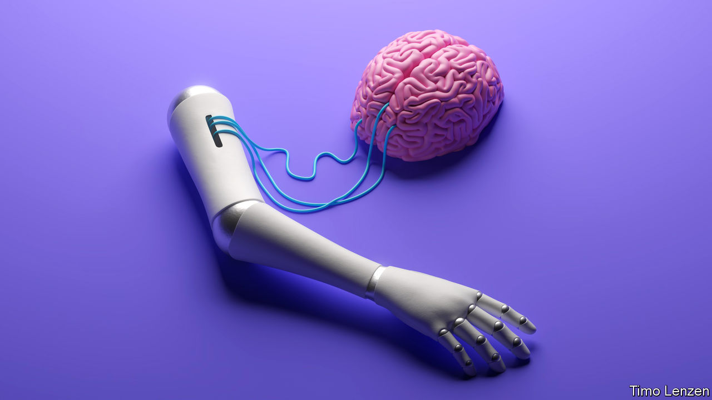

###### Getting wired up

# Crossing the brain’s electrical frontier 

##### New ways of getting inside patients’ heads 

 

> Sep 21st 2022 

The stent is a commonplace miracle. Every year millions of people around the world have their coronary arteries enlarged and reinforced by these life-saving little expandable tubes of mesh. The elect club of those who have had their whole worlds enlarged by “stentrodes”, on the other hand, numbers just three. 

The stentrode is a routine stent, made from a flexible alloy called nitinol, to which an array of 16 laser-cut platinum electrodes has been added. It is inserted into the jugular vein in the neck and guided up into the brain, where surgeons guided by real-time x-rays snuggle it into a blood vessel running past the part of the cortex responsible for movement. A short lead runs back down the vein to a small powerpack and communications unit implanted in the chest. That base unit uses infrared light to send data to a receiver stuck on the skin, from which it passes to a computer. 

The stentrode is not inside the grey matter of the brain, interacting directly with neurons: it remains in the blood vessel. But its electrodes pick up the electrical goings-on around them, and over time the patients can learn how to think thoughts that the computer takes as commands. Used in concert with systems that track eye movements the  allows them to interact with the world using only eyes and thoughts. 

Systems that can read brain waves are old hat. But if fitted non-invasively to the outside of the cranium they are cumbersome and relatively low in resolution; and sticking them into the brain proper requires surgeons to drill holes in the skull. The stentrode provides a skull-sparing way to get high-quality signals out of specific bits of the brain. 

The appeal is obvious. In an increasingly computerised world, a brain-computer interface (bci, also sometimes called a brain-machine interface) that lets the paralysed think words onto screens and tell apps, machines or eventually prosthetic limbs what to do could be of huge benefit. The stentrode is not the only device in the field; Neuralink, a company founded by Elon Musk, is looking at a system that would be inserted using cunningly automated surgery. 

As readers of science fiction will be aware, the ultimate—if currently far-off—potential of such technologies could go well beyond medicine. There are a number of situations where being able to control things at a distance by mind alone might be a useful capacity for the currently able-bodied, too. The stentrode work, mostly carried out by researchers in Australia and commercially developed by Synchron, a company in America, has been partially funded by the Pentagon’s far-out-ideas factory, darpa. 

bcis are part of an emerging field of neural technology. The idea of stimulating the nerves for medical benefit can be traced back to antiquity, when Scribonius Largus, physician to the emperor Claudius, noted that electric fish could be beneficial to people in constant pain. In the modern era electroconvulsive therapy, first used in 1938, became a treatment for some serious forms of depression in the post-war decades. It fell out of favour after “One Flew Over the Cuckoo’s Nest”, a book that was made into a film, showed it in a darker light, and there are divergent opinions as to its efficacy. But it is still administered to around 1m patients a year, mostly for severe depression.

In the early 1960s deep brain stimulation (dbs) arrived. It uses electrical stimuli which vary by pulse width, voltage and frequency to treat Parkinson’s, obsessive-compulsive disorder and epilepsy. As confidence in the therapy has grown it has been investigated as a treatment for other things, including cluster headaches, chronic pain, eating disorders, Tourette’s syndrome and treatment-resistant depression. It has advanced, recently, by offering “closed loop” forms that need no manual adjustment but are programmed to respond on the basis of electrophysiological biomarkers. Its appeal is limited, though, by the cost and difficulty of neurosurgery. Many Americans suffering from obsessive-compulsive disorder who might benefit from dbs cannot access it because of restrictions imposed by their insurers.

That dbs can get results has been clearly demonstrated. How it does so is less well understood. There is thus an emphasis on finding just the right place to stimulate. Scientists have rough ideas of where brain circuits for various functions are to be found and increasingly sophisticated imagining tools are adding ever more detail, which helps the technique. But the circuits differ greatly from person to person; searching for the sweet spot for the electrodes can take a lot of time and effort.

In some cases another option for targeting a troublesome bit of the brain can be simply to destroy–surgeons like to say ablate–it. Removing the bit of tissue where an epileptic person’s seizures originate is a routine surgical approach in some severe cases of the disease. Here the exciting new twist is to make use of ultrasound. It can be focused powerfully enough on millimetre-sized targets deep in the brain to ablate them, and this can be done on a patient in an mri, thus allowing surgeons to see what they are doing with their sound scalpel in the dark depths beneath a completely intact skull. The technique has already been used to treat some types of brain tumour. It is being investigated for anxiety, depression, epilepsy, intracerebral haemorrhage, movement disorders and pain. 

Another promising neuropsychiatric use of ultrasound is in tackling the blood-brain barrier. The body keeps this demarcation line tight, stopping almost all the things found in the blood stream, including a lot of drugs, from getting in among the neurons. Sometimes this is a good thing. Loperamide (Imodium), widely used to control diarrhoea, has stronger effects on the brain’s opioid receptors than its relative morphine does, but it is much less good at crossing the blood-brain barrier. But the barrier also means there are drugs that might do a lot of good in the brain but cannot get there. It appears that ultrasound may be a practical way of disrupting the blood-brain barrier for limited periods and in specific places. It might thus offer a way to open portals into realms to which drugs would not otherwise have access. 

Part of the charm of ultrasound is that it does not require making holes in the skull. Transcranial magnetic stimulation (tms) has the same advantage. An electromagnetic coil is placed against the scalp to generate magnetic fields to which nerve cells are sensitive. High-frequency stimulation increases the cortical excitability, while low-frequency stimulation depresses it.

At present tms is mostly being used against depression, which is thought to stem in part from poor neural connections in the prefrontal cortex. A particularly precise version of the therapy uses mri scans to allow the therapy to be used on the part of the prefrontal cortex which should have connectivity to the subgenual cingulate—a part of the brain that plays a role in processing emotions, and is a target aimed at by dbs approaches to depression. 

Beyond this, though, tms is also being studied for application in the usual suspects, such as anxiety, pain, ocd, ptsd, Tourette’s and other movement disorders. It may have other applications, too. Frances Jensen, a professor of neurology at the University of Pennsylvania says that when a stroke victim is trying to regain speech, adding tms to normal speech therapy can “supercharge” the circuits they are trying to get back.

Mind meets brain

The idea of therapy acting through the conscious mind being improved by magnets stimulating the brain below brings home one of the things that is remarkable about the current era of neuroscience and medicine. The workings of the mind and the subvening brain are still suffused by mystery; but science is offering new ways to intervene in them which can be used, and combined, to good effect. Drugs and neuromodulation are not alternatives; therapy and psychedelics can work in tandem. Just as neuroscience now learns from optogenetics, organoids and ai as well as its older techniques, precision neuromedicine will be a calling that uses not just many tools but many different types of tool. 

Too much of the 20th-century history of psychiatry was a history of either/or; some proponents of talking cures have derided drugs as chemical coshes, some pharmaceutical devotees have struggled to see any sense in explanations that go beyond the workings of synapses. The drive towards specificity documented in this report look like showing this is a false dichotomy. The bottom-up approaches which target the molecular, genetic and electrical fundamentals of the brain can assist top-down approaches to brain disorder such as talking therapies. Understanding the roots of neurodegenerative diseases before they begin to produce symptoms—roots which may reach back decades into young adulthood or earlier—should lead not just to better drugs, but to insights into how to lead lives in which those roots never get to sprout and bear their morbid fruit. 

The ancient dictum that “healthy bodies produce healthy minds” is not universally true. The fact that bodily health can underpin mental health, though, is undoubted. Brains are influenced by nutrition, physical exercise, use of alcohol and other drugs, social connections and pollution (particularly, these days, air pollution). Pre-natal exposure to pollution, for example, is likely to play a role in some early developmental disorders. Exposure later in life could play a role in dementias. A new trial shows that taking a common multivitamin over three years leads to an improvement in memory and cognition, underlining the role of nutrition. Human brains are the key to the wealth of any society, as well as its future. Doing a better job of taking care of them deserves a little more headspace.

And the effort to do so through deeper understanding deserves celebration. The human brain is an organ of truly remarkable complexity, and there is perhaps no measure of that complexity more impressive than the fact that the human minds which those brains produce are making real progress in understanding it. Human brains have begun an epic journey of self-discovery. ■

