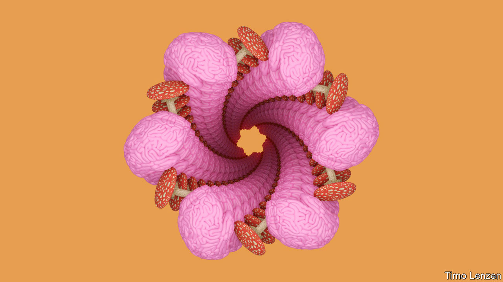
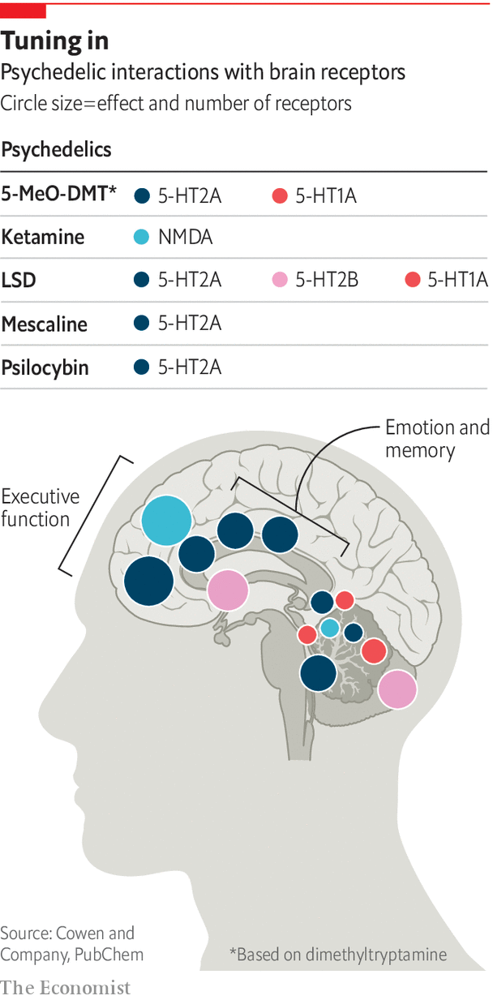

###### The new psychedelia

# Ketamine, psilocybin and ecstasy are coming to the medicine cabinet 

##### From expanding minds to healing brains 

 

> Sep 21st 2022 

The formal lawns and topiary of the garden in which Amanda Feilding, Countess of Wemyss and March, is sitting embody a perfect English orderliness; beyond its edge lies a wilderness of Anglo-Saxon moats, sun-dappled woodland and magical stepping-stone trails. This promise of untamed hinterlands puts the grounds of Beckley Park in perfect sync with their mistress. Lady Wemyss is the queen of psychedelics. 

Psychedelics have a history which is probably longer than that of civilisation. They have powerful effects on the brain and their lore is rich in anecdotes about effects on mental health, some for better and some for worse. As pharmaceutical companies tried to find new approaches to the brain, the potential of psychedelics might have seemed an obvious road to go down. But law and stigma blocked it. Until five years ago corporate investment in psychedelics as medicines was more or less unthinkable. 

Work by Lady Wemyss’s Beckley Foundation, the Multidisciplinary Association for Psychedelic Studies (maps) in San Jose, California, and other such groups have helped to change that. So has the broadening acceptance of marijuana as a medicine and the softening or repeal of laws limiting its use. A change in the attitude of regulators and researchers towards running proper trials of the drugs has also contributed. Applying modern scientific techniques to the question of how psychedelics and other drugs affect the brain and mind is now seen as opening up possibilities for insight, treatment and profit. 

The pioneer in this re-evaluation has been ketamine, an anaesthetic that is also used recreationally. About 20 years ago anecdotal evidence that the drug had an effect on depression led to academic trials; the work piqued the interest of j&amp;j, a big drug company. The ketamine sold generically is a mixture of two compounds with the same chemical formula; j&amp;j won a patent on a nasal spray called Spravato which contained just one of those compounds, s-ketamine. America’s Food and Drug Administration (fda) approved it as a treatment for major depression in 2019.

Barefoot in the cross-head

Spravato demonstrated the potential of innovation based on recreational drugs: it was the first drug for depression based on a novel biological mechanism to have been approved in 30 years. But it has not been a big commercial success. It is expensive and has to be taken under medical supervision, which adds to costs and faff. 

Despite that, all manner of drugs that were mooted as being psychiatrically beneficial in the 1960s are finally being put through their paces in rigorous clinical trials under the eyes of strict regulators like the fda. Dimethyltryptamine, ibogaine, lsd, mdma and psilocybin are being tried. These drugs are targeting the treatment of addiction, anxiety, depression, eating disorders and post-traumatic stress disorder (ptsd). 


The non-profit group maps is looking at mdma-assisted therapy for ptsd. mdma, widely known as ecstasy, is a small, amphetamine-like molecule prized for creating feelings of empathy. The maps trial put participants through three preparatory sessions, three sessions in which either mdma or a placebo was administered and nine post-treatment therapy sessions. At the end, 67% of participants in the mdma group no longer met the diagnostic criteria for ptsd, compared with 32% in the placebo group. 

Psilocybin is a focus for compass Pathways, a London-based startup. Last year it published the results of a trial comparing different doses of psilocybin, all paired with therapy, in cases of treatment-resistant depression (trd). Three weeks after treatment 29% of those who got the highest dose were in remission. 

Given what the tr in trd stands for, a response rate of almost 30% was exciting to scientists. But it was a disappointment to many who had been listening only to the media hype about the potential of psychedelics. The remission seen by fewer than one in three did not always last; only one in four were still in remission three months on. And three of the patients in the high-dose group displayed suicidal behaviour, compared with none in the other cohorts. Suicidality is common in trd and in trials of anti-depressants, but it is nonetheless a cause for concern. 

One of the two underlying capabilities of psychedelics that interests researchers is that they seem to be able rapidly to induce neural plasticity—physical changes in the growth of neurons and of the connections between them. A recent study by scientists at the Yale University School of Medicine showed that, within 24 hours of a single dose of psilocybin, neurons in the prefrontal cortex of a mouse brain changed; their dendrites—the bits which receive inputs from their neighbours—grew longer and denser. There was a 10% increase in the number of neuronal connections and evidence that some of those connections were stronger. 

Think of the neurons as close-packed trees flourishing in the lush gardens of the prefrontal cortex, which organises thoughts and actions. Dendrites are their tangled branches. A healthy brain has a rich canopy. Withered branches can lead to losses in connectivity and less communication between the context and areas associated with motivation and reward. 

In the study, the connections between neurons in the mice’s brains became both more numerous and stronger, suggesting connectivity was improved. Not all the changes lasted; but a month later some were still visible. And they were correlated with changes in the animals’ stress-related behaviour. 

 


The drugs trigger this sort of change in the neurons by activating various combinations of a specific set of receptor proteins which includes three types of serotonin receptor (5-ht1b, 5-ht2a and 5-ht2b) and nmda, a glutamate receptor. Different drugs favour different receptors (see diagram) which is why they have different effects. mdma, which produces psychedelic-like effects but without hallucinations, works on the 5-ht2 receptors, inducing a rapid release of serotonin and dopamine. Ketamine and ibogaine, which is extracted from an African shrub, both work on nmda as well as other receptors—including, in the case of ketamine, opioid receptors. The biochemistry of this is also linked to anatomy. Activation of 5-ht2a—in which the visual cortex is comparatively rich—seems to be necessary (although not sufficient on its own) to generate hallucinations. 

If plasticity is one interesting aspect of psychedelics, the other is that by firing up receptors they also disrupt activity within the brain’s neural networks. Srinivas Rao, the chief scientific officer of atai Life Sciences, a German company that specialises in psychiatric drugs, says the psychedelics and their kin are “loosening” connections in the brain and then altering network functions. Atai is pursuing ketamine for trd and ibogaine for opioid addiction. 

Dr Rao warns that psychedelics are not going to be cures for most people with chronic conditions like depression. The loosening of connections in a network-disrupting trip might shift some of them out of a rut; it will not stop them returning to it. But many think the drugs open the door for talking therapies to work better and for patients themselves to initiate new approaches to life. A few patients will be lucky enough to have durable responses. Guy Goodwin of compass Pathways sees psychedelic treatment as a way for some patients to achieve a step change. “It may be for a minority,” he admits. “How we increase that minority is a question we are going to have to work on in the future.”

There are other factors which could limit the uptake of these medicines. Like Spravato they will probably be approved for use only in certified health-care settings and with strict protocols; a patient given a dose of psilocybin, or mdma, requires many hours of supervision. That makes these drugs very unlikely to be the first line of therapy offered to people who roll up at their doctor’s office with depression or anxiety. They are also likely to be approved for use only in the context of psychotherapy. 

Such requirements may mean that more people seek the benefits more cheaply. The approval of Spravato coincided with an uptick in the use of generic ketamine, given by intravenous infusion, in clinics across America and Europe. And the drugs in question are all, more or less by definition, available informally. 

Who’s for a short, unstrange trip?

One alternative would be to develop second-generation drugs based on the same principles but more easily administered. Delix Therapeutics, based in Boston, Massachusetts, is heading full tilt to the creation of psychedelic substances with the hallucinatory effects eliminated, which would mean they could be used by patients without supervision. David Olson, chief innovation officer at Delix, says the drugs work because they encourage neuroplasticity; if that is the case, then the trippiness may not be necessary. He points to studies showing that dental patients anaesthetised with ketamine wake up with an enhanced mood; having some kind of conscious “experience” is not integral to the drug’s effects.

There will be potential patients who hope he is right. Some proponents of psychedelics think the mystical experience is integral to the clinical outcome, revealing insights into the psyche that are impossible to obtain any other way. This means they find it hard to bend their minds around the idea that some of the mentally unwell do not want to “change” their consciousness. They just want to get better. Rory, a hairdresser from Lancashire, had suffered from depression all his life; he had tried everything and was keen to find something that worked. Yet his first experience with a ketamine infusion was so horrendous he did not want to come back.

Delix, for its part, is not saying that the world does not need hallucinogens to treat mental-health disorders, nor that the network effects they offer are not useful. It is just saying that drugs that do only part of what psychedelics do could be useful in and of themselves. Dr Rao says, “being empiric I view the hallucinations as a manifestation of network disruption.” 

Psychedelics are obviously not the be all and end all of new approaches to clinical neuroscience, let alone the one true path to raised consciousness and, as some would have it, humankind’s continued evolution. They may well be particularly prone to placebo effects, something it is hard for trials to rule out since people tend to know if they have been given a placebo or sent on a trip. But if high hopes (sorry) seem likely to court disappointment, their study in clinical settings should yield some helpful therapeutic advances and new insights into the way minds sit in brains. ■

