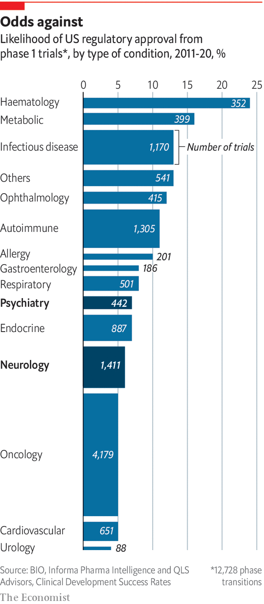

###### More judgment, less luck

# Science needs to move beyond luck if it is to design better drugs for the brain 

##### Neuroscience is complex and confusing, but it is no longer Bedlam 

 

> Sep 21st 2022 

There are two of them: life-size statues of reclining men carved out of white Portland stone. On the right, the statue’s face is contorted in distress and rage, his body restrained by chains. He is called “Raving”. On the left is a limp figure, unbound, with a vacant expression. He is called “Melancholy”. In 1676 they were installed above the entrance gates of Bethlem, the London hospital known infamously as “Bedlam”. Today they grace the entrance hall of the Bethlem Museum of the Mind in Beckenham, a London suburb, where the latest incarnation of that same psychiatric hospital is to be found.

Here patients benefit from a more detailed diagnostic approach than the distinction between mania and torpor. Almost 300 mental-health disorders are recognised by the American Psychiatric Association’s Diagnostic and Statistical Manual of Mental Disorders, the authoritative guide on such matters. Add in neurological disorders such as epilepsy, brain tumours, stroke, migraines, wasting diseases like amyotrophic lateral sclerosis (als) and so on and you have another 600 problems seated in the brain. You could fill the turbine hall of the Tate Modern with all the relevant statues.

But there are growing concerns that this book-keeping is still flawed. Disorders such as depression and Alzheimer’s may consist of many more distinct disorders than science currently recognises. And the overlap in symptoms between disorders such as depression and anxiety calls into question whether top-down categorisations are making useful distinctions. 

In some cases, similar clusters of symptoms could be down to different underlying biological mechanisms. In others, symptoms common to disorders treated as distinct might be accounted for, in large part, by closely related underlying mechanisms. Notable past failures in drug development, for example in Alzheimer’s and other dementias, have come thanks to inadequate understanding of the links between what goes wrong in the mind and what is happening in the brain. That in turn is one of the reasons why corporate interest in neuroscience by pharma firms has been stuttering. There are signs, though, that change is afoot. 

To understand how things came to be this way a short journey into the history of drug development is useful. The number of people in hospitals like Bethlem rose relentlessly for centuries. Then, in the 1950s, research into antihistamines by Rhône-Poulenc, a French drug company, produced chlorpromazine, a compound which appeared to cool the body and was judged to have some potential in anaesthesiology. Cold baths had been used as a treatment for mania in Bethlem and elsewhere since the 17th century, and so an enterprising researcher suggested that chlorpromazine might be a good alternative. It proved remarkably successful, though for reasons that had no direct connection with body temperature. Under the trade names Largactil, and later Thorazine, it became the first widely used antipsychotic drug, its use in psychiatry quickly taking off in Europe and North America. 


The discovery of what Thorazine could do is one of many lucky finds that revolutionised psychiatry in the post-war years. Lithium for mood disorders was found during experimental tinkering with guinea pigs, while looking for signs of a toxic substance in their urine that was the cause of mania. Chance also led to the development of benzodiazepines such as Valium for the treatment of anxiety. The compound that would become the first such drug (Librium) was literally left on a laboratory shelf for three years. It was about to be thrown away when it was tested on mice, on the off-chance that it might work. Iproniazid, the first of a family of antidepressants called monoamine-oxidase inhibitors, was found as part of a search for tuberculosis treatments when it was noticed that it made some patients euphoric. 

This marvellous serendipity delivered drugs that worked much better than anything psychiatry had previously had to offer. By doing so it made it possible for conditions that had previously seen people hospitalised to be treated in the community. But it also had a long-term side-effect. The good fortune meant that drugs came about without a clear account of the deficit or problem they were addressing. When luck ran out, there was not enough by way of understanding to replace it. 

Science was not entirely stymied. The post hoc discovery of the targets in the body which the drugs addressed allowed some theorising about what was going wrong. Tweaks to the molecular structure of drugs that worked produced others that worked in similar ways. Drugs that helped some people in one condition were tried out on others, sometimes successfully. Today, selective serotonin-reuptake inhibitors developed to treat depression are available to those with anxiety, bulimia, obsessive-compulsive disorder or post-traumatic stress disorder. 

 


But the lack of compelling, detailed accounts of the ways the brain goes wrong is one of the reasons why the development of novel and functional drugs has been so challenging. Between 2011 and 2020 the likelihood of a drug in psychiatry being approved by the Food and Drug Administration was 7.3%. In neurology it was 5.9%. (The industry average is 7.9%.) As well as being less likely to succeed in trials (see chart), neurology drugs also take much longer, on average, to develop, further decreasing their appeal.

High failure rates are one of the reasons why, from 2010 on, a lot of pharma firms largely left neuroscience or radically pruned their work in it. They included gsk, AstraZeneca, Bristol-Myers Squibb, Pfizer and Amgen. Other big firms cut back. And if the withdrawal was quite broad, and the reasons multiple, the single most important factor behind this can be traced to the fortunes of those seeking therapies for one disease in particular: Alzheimer’s. 

It is an attractive misfortune for firms to tackle, with a large number of sufferers that looks set to grow as societies age around the world. But trials that take years to run, and require lots of patients, make tackling it expensive. The $43bn or so invested in developing 146 new Alzheimer’s drugs between 1998 and 2017 to little effect did a lot to dampen big pharma’s appetite for neuroscience, says Kate Bingham, a managing partner at sv Health Investors, a venture-capital firm. 

As is normal in diseases of the brain, the money was spent without a clear account of what the underlying problem was. The most obvious damage seen in the disease is the build-up of plaques of a protein called beta amyloid. The majority of the failed treatments were aimed at amyloid. 

The most recent great hope based on these ideas, an antibody drug called aducanumab made by Biogen, an American drug company, was approved last year by America’s Food and Drug Administration (fda). But striking inconsistencies in the trial data made the move highly controversial. Ten of the 11 experts on an advisory panel looking at the drug’s trials recommended against its approval, but were overruled by the fda. Biogen withdrew its application for approval in Europe in April, and in America neither the government nor commercial insurers will pay for it. Antonella Santuccione Chadha, head of the Women’s Brain Project, had spent eight years working on the drug. She describes the result as “one of the most painful experiences”. Despite all the years of toil, patients still have no disease-modifying treatment to turn to. 

Robust and diverse

Now neuroscience has to learn the right lessons. Although genetic data suggests amyloid is part of the story, it remains unclear, even after all this time, whether this protein is a cause or consequence of Alzheimer’s. Many now feel it is time to move on. Ms Bingham says there was a single-minded focus on the amyloid pathway. “The lion’s share of both public and industrial funding has been on that,” she says, “to the exclusion of really exploring the rest of other mechanisms that are likely to cause Alzheimer’s disease.”

There is now a lot of fresh thinking in the field. One possibility is that Alzheimer’s might start in the mitochondria, structures inside cells that generate the chemical energy that drives both body and brain. Another idea is that it might derive from the brain’s failure to clear up, and throw out, the waste it generates over time. Many mechanisms that mess up the workings of neurons—or kill them—could lead to dysfunction with age. The synapses might not be firing well, tags that mark out particular genes for use could fall off, blood vessels could become faulty or parts of the brain could become inflamed (perhaps, but not necessarily, as the result of an infection). That last factor, inflammation, is of particular interest; many lines of evidence suggest ties between neurodegenerative conditions, inflammation and the brain’s immune system. This system is driven by cells known as microglia that eliminate pathogens, unwanted molecules and debris from cells. 

Shifting ideas about what might go wrong are already apparent in the clinical-trial landscape. In 2021 the Alzheimer’s Drug Discovery Foundation reported that, of 118 potential treatments for Alzheimer’s in trials, four out of five drugs in phase 1 are focused on novel targets. So is the majority of those in phase 3 trials. These are testing drugs to reduce inflammation, improve blood flow, protect neurons and improve how the brain metabolises energy. The foundation says the pipeline of drugs is now “more robust and diverse”. 

A lot of the new energy, ideas and, most importantly, funding now flowing into the field is coming via smaller biotech firms. The same is true in other diseases of the brain, including depression and Parkinson’s, where new tools for, and approaches to, drug development are emerging. Firms are chasing new treatments for als, depression, Duchenne’s muscular dystrophy, frontotemporal dementia, Huntington’s, post-traumatic stress disorder (ptsd) and many others. It would only take a few successes for the retreat of big pharma from the area to reverse itself. There are already signs of an uptick in interest in neuroscience among big firms such as AbbVie, gsk, j&amp;j, Lilly and Novartis. If big pharma does return, though, it will not be to the world it left. Instead, a more complex future beckons. 

One reason for optimism is that the failures of the past are now driving an exploration of many more fundamental ideas about what could go wrong in the brain. The excitement about the potential of new ideas regarding the mechanisms of disease to produce new “druggable” targets, as the industry calls them, has to be understood in the context of the possibility that what once seemed like simple diseases are a lot more complex. Some drugs may only work in some patients exhibiting a particular form, or subtype, of their diagnosed disease. In other cases the best option may be using a number of drugs concurrently, and possibly combining them with other sorts of treatment. A white paper from Informa, a consultancy, predicts that meaningful outcomes for patients with als will require combinations of compounds, working together, to deliver meaningful outcomes to patients. If the field is looking more promising than it did a decade or so ago, it is also demanding new kinds of precision when it comes to the underlying biology of the brain. ■

