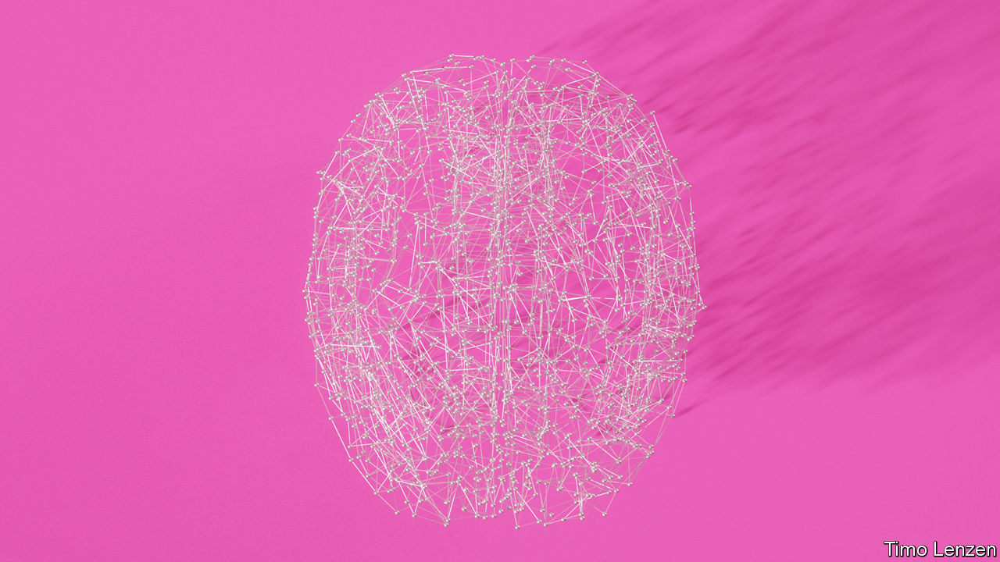

###### Mind over matter

# What does a brain-computer interface feel like? 

##### Talking to Philip O’Keefe about the implant in his head 

 

> Sep 21st 2022 

Philip o’keefe, a 62-year-old logistics worker and passionate fan of the Brisbane Lions, a local football team, also suffers from als, which has paralysed him. In 2020 a “stentrode” was inserted into a blood vessel in his brain from where it monitors activity in part of his cortex. The following year he used signals passed through that probe to send his first tweet: “hello, world! Short tweet. Monumental progress.”  talked to him about the experience.

 What was your first reaction to the idea?

 I wasn’t too sure about the idea initially. I sought the advice of some friends in the medical field and they came back and said ‘Yes, definitely be involved’. My initial thought was I would be able to think words or sentences that would be transcribed onto the computer. Once I understood what was involved I was very keen to be part of this. 

 Did you have to spend some time making it work? Or did it work fairly instantly?

 The first day there was a signal it was like waking up Christmas morning to find all the presents under the tree are yours. It was unbelievable. 

 What has been the most surprising thing about the experience? 

 It’s been remarkably unobtrusive. Because of my condition, we have a house with smart switches. So,

if I am in front of the control screen, I can turn the lights on or off anywhere in the house if I want to. I have done that to the kids a couple of times. It gets their attention. 

 How is this helping you in your day-to-day life, work and relationship with the others?

 Well, to be fair, my device is a first-generation device put in as part of the initial clinical trial. I was the second person in the world to receive it. The device is still obviously going through development stages. It enables me to use emails, to use apps like WhatsApp to scroll through various sites and do online banking. The ability to live a normal computer life is there. So, whatever you can do on a computer I can do. At this stage, I am a bit slower than you would be, but there is the ability to do almost anything if I want to.

When the device was implanted, I was still working part-time. I could do some of my online work with the device. I could go onto my company’s portal and update information and produce reports. 

 What would you say is the best thing about the implant? 

 From a physical perspective, the best thing is you don’t know it’s there. There is no irritation. For me the device has become a part of my life. It’s quite a seamless process. In fact, it gives you back the ability to be independent. There is no doubt from my perspective being involved in this gave me a reason to live. It gave me back a lot more enjoyment about life and gave me things to do, it gave me the ability to stay in touch with what’s going on.

 What would you like to tell the readers about brain-computer interfaces? 

 This is a new horizon. It really is. The human brain is an amazingly complex thing. Having a direct link between your brain and your computer, it’s just another step down the path of human evolution. I mean, 120 years ago we couldn’t fly and now we are talking about sending people to Mars. It’s another step in technology. Yes, we need to be careful about what we do but we are human beings, we need to understand, we need to learn. 

 Do you feel enhanced in any way? 

 Do I feel enhanced? Do I feel like Superman? No, I don’t. I do feel very fortunate through misfortune to be able to do this. I get a sense of pride when I talk to people and see their eyes open up in amazement. I’m very happy that what I’ve done has been successful. I’m grateful for the attention they give to me. But I don’t see myself as some super being. I’m just a bloke who got involved in a process and who was able, with some very smart people, to prove a concept and prove it worked. And it will get bigger and better.

