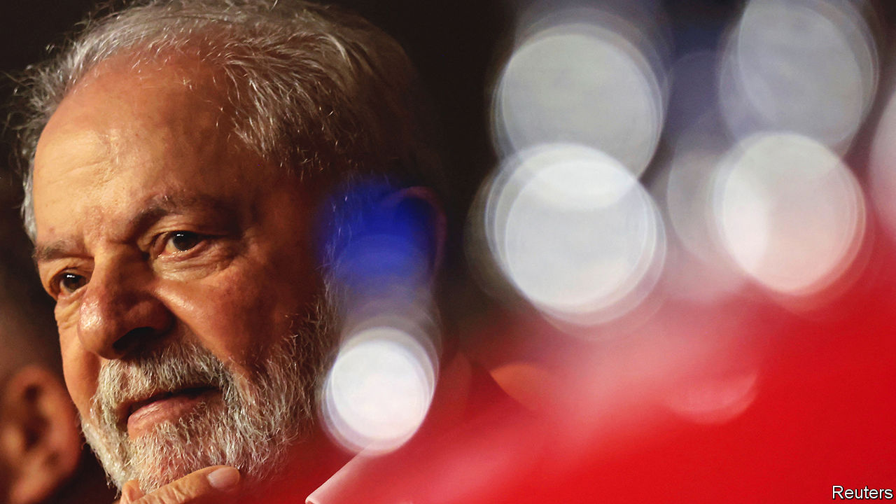
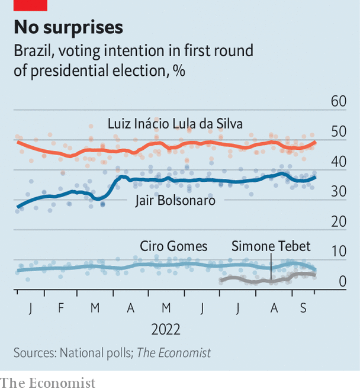
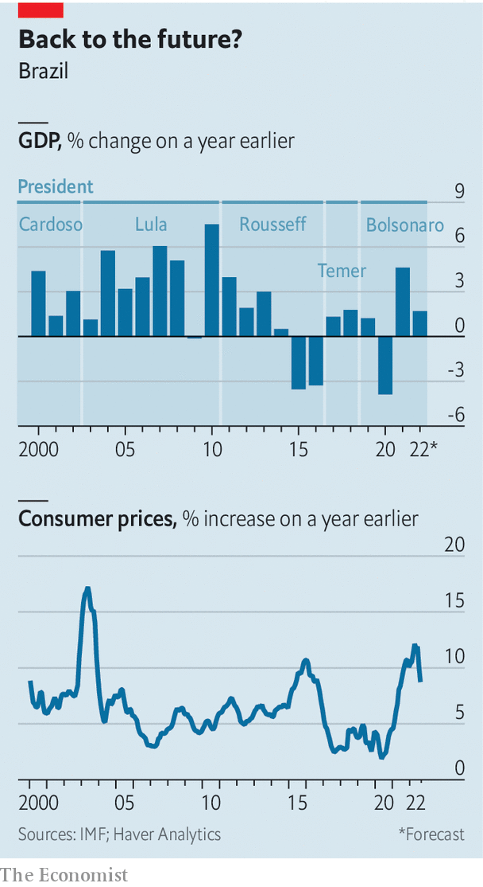
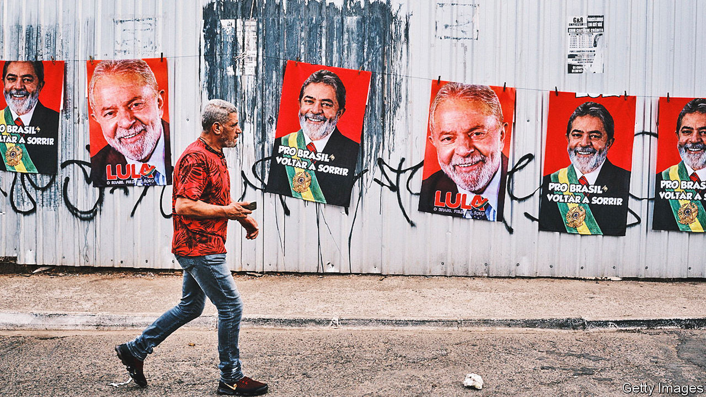

###### The unknown known

# How left-wing on economics is Luiz Inácio Lula da Silva? 

##### An interview on spending and growth with the front-runner to be Brazil’s next president 

 

> Sep 19th 2022 

Two decades ago, when Luiz Inácio Lula da Silva was running for president, “it was as if a meteor was going to hit Brazil,” recalls Pérsio Arida, a Brazilian economist. Markets “demonised” Lula, as the leftist former president is known. The currency, the real, lost 35% of its value and Lula had to write a letter to the Brazilian people promising that, if elected, he would not do anything rash. After he won, “the meteor disappeared,” says Mr Arida. Lula was fiscally prudent during his first four-year term, between 2003 and 2006. After being re-elected to a second, his Workers’ Party (pt) government used a commodities boom to help the poor. Lula’s policies were sometimes inefficient, and he expanded Brazil’s bureaucracy. But he was neither rash nor radical. 

Now he is running again. On October 2nd Lula faces Jair Bolsonaro, the populist incumbent, in the first round of a  Mr Bolsonaro is trying to revive old fears about Lula, and then some. The former president is a “devil who wants to impose communism on Brazil”, he has said. Most Brazilians seem unconvinced. Lula leads by 48% to 37% according to ’s poll tracker (see chart). The real is stable. “Businessmen know [what to expect from] a pt government,” Lula tells , rattling off his achievements: 4.5% annual growth, on average, during his two terms; reduction of public debt from roughly 60% to 40% of gdp; slowing of inflation from more than 12% in 2002 to just under 6% in 2010; an increase in the minimum wage; and 20m Brazilians who escaped from poverty. 

 


Yet if Lula wins a third term, his job will be much harder than it was when he took office in 2003. Brazil’s fiscal situation is worse: public debt is 78% of gdp and 93% of the budget is consumed by mandatory spending on things such as salaries and pensions. The global outlook is fraught. Though high commodities prices have helped the economy, inflation is hurting the poor. Political conditions are tougher, too. Brazil’s Congress is more avaricious and less co-operative. 

Lula likes to remind Brazilians of how “happy” they were when he was first in charge. But he does not acknowledge that Brazil’s current woes started with his protégée and successor, Dilma Rousseff, also of the pt. When growth slowed, her government tried to stimulate the economy and shore up political support by borrowing to spend more. This led to a fiscal crisis and Brazil’s worst-ever recession, from 2014 to 2016. 

Third time a charm?

Lula has tried to convince markets that he would not go on an uncontrolled spending spree. He chose as his running-mate Geraldo Alckmin, a business-friendly, centre-right former governor of São Paulo state. Lula has criticised a few of Ms Rousseff’s policies, such as keeping fuel prices artificially low and offering tax breaks worth more than 450bn reais ($86bn) to businesses (which amounted to 7.5% of gdp). 

 


But many economists are uneasy about the return of a leader who believes that the state should be the motor of economic growth. “If the government doesn’t stimulate development, if the government doesn’t take the initiative, if the government doesn’t make credit available, things don’t get done,” Lula says. 

Many ordinary Brazilians are frustrated by Lula’s refusal to accept responsibility for policies that led to the recession, or to apologise for the pt’s role in the corruption scandal known as  (“Car Wash”). “The pt is tired of apologising,” Lula says, though the party has never actually done so. Lula spent a year and a half in jail after being found guilty of accepting bribes, though his convictions were later overturned by the Supreme Court. He maintains his innocence and says that the real “irregularities” were the conduct of prosecutors and judges.


From meteor to moderate

If Lula is elected, his priority will be helping the 33m Brazilians who live on less than 289 reais ($55) per month, the highest number since 2012. He says he would increase cash transfers, expand a social-housing scheme and introduce a debt-forgiveness programme. He calls this “putting the poor back in the budget” and bets that it will boost consumption and growth. 


The imf forecasts that the economy will grow by 1.7% this year, because of stimulus spending in the run-up to the election, but by only 0.7% in 2023. In August Mr Bolsonaro sent a budget proposal to Congress that did not include 143bn reais’ worth of promised social spending, including the current monthly transfer of 600 reais to 2.2m of Brazil’s poorest families and a promised pay increase for public workers, whose salaries have been frozen since 2017. 

Since 2016 Brazil’s budget has been restricted by a constitutional spending cap that limits the growth of spending to the rate of inflation. But recently Congress has suspended the cap to fund covid-19 spending and stimulus measures to benefit Mr Bolsonaro’s campaign. As a result, it has lost its power as a fiscal anchor. Even Mr Bolsonaro’s pro-business government announced that if he were to be re-elected, he plans to replace it with a “more flexible” fiscal rule. Lula also wants a new fiscal framework that allows for more short-term borrowing while assuring markets that the debt-to-gdp ratio will come down in the medium term.

Lula’s advisers say they would also move quickly on a reform that would increase taxes on the very rich while simplifying the labyrinth of levies on consumption, which are a drag on growth. Both pt economists and orthodox ones stress the need for such a move. Some pt types also seek to increase government revenues by taxing dividends or even wealth; Lula has not ruled this out. Other economists want a fiscally neutral reform that pairs higher income taxes on high earners with lower payroll taxes for firms to incentivise formal employment. Either way, these changes seems unlikely. Tax reform has eluded every government since 1965, as it involves difficult negotiations with states and interest groups. 

Lula’s long-term strategy for growth relies on expanding big public banks to fund infrastructure projects, with investment from both the public and private sector. Lula and his economists often cite President Joe Biden’s infrastructure law in the United States as a model. But while Brazil may need investment, “the idea that the state knows where to invest is an error,” says Bernard Appy, an economist who left Lula’s government in 2009 as it became more interventionist. The key question, he says, is whether Lula and his team understand that in order for Brazil to grow faster, it needs reforms to improve the quality of spending and the business environment, or whether they think spending by itself will be enough.

 


Lula’s campaign manifesto suggests the latter. In addition to a classic leftist vision for the economy, it advocates a heavy dose of intervention, describing a “national food reserves policy”, the exchange rate as “an instrument to reduce volatility”, and the need to “Brazilianise” petrol prices. “The [Brazilian] worker earns in reais. So why do you have to dollarise petrol prices?” says Lula. In other words, he wants prices at the pump in Brazil to be divorced from world prices. He suggests this could be done by building more refineries; in practice it would surely require price controls and subsidies. 


According to Monica de Bolle of the Peterson Institute for International Economics, “that programme is a repetition of every pt programme going back to 1989, [but] what you see on paper and what the president does are two different things.” She and her colleagues have compared scores of manifestos with actual policies, and found that in office the pt tends to be more moderate than its campaign proposals. 

Wrestling with red tape

Lula has made it clear that his government would not privatise Petrobras, the state oil firm, or Banco do Brasil, the largest public bank. But he has also suggested that he would not reverse the recent privatisation of Eletrobras, the state power company, or a pro-business labour reform passed in 2017. Several months ago Lula called the labour reform a product of “slaveholder mentality”; he has since adopted a less combative tone and talks about “updating” it by adding protections for gig workers.

Guilherme Mello, who runs the economic-policy team at the pt’s official think-tank, says that public banks in a third Lula government would be careful when selecting projects to support. “The reality now is not one of national champions,” he says, referring to Ms Rousseff’s disastrous policy of showering a few companies with cheap credit in the hope of turning them into global giants, as most other Brazilian firms floundered. 

Instead there will be a focus on credit for small businesses, incentives for clean energy and stronger guarantees for private investors to protect them against losses owing to red tape. Mr Mello also wants Brazil’s new fiscal rules to create a “culture for evaluating public policy”. 

Much will depend on Lula’s economic team. He says he wants a politician as finance minister rather than an economist, possibly because he will need to convince Congress to support reforms and loosen its grip on the budget. Since Lula left office in 2010, discretionary spending by the president has shrunk from 18% to 7% of the budget, and much of that is diverted to individual lawmakers’ pet projects in their home districts. In the past, the government would pay for pork in exchange for support for the president’s agenda. But a new kind of amendment created by Mr Bolsonaro made transfers practically automatic, ceding decision-making power to the speaker of the house and providing little oversight. Whoever wins the election “will be a prisoner to this system”, says Marcos Lisboa of Insper, a business school. Lula wants to get rid of Mr Bolsonaro’s rule. Convincing Congress will not be easy. 

Lula was pragmatic in the past, and tries to sound so today. Giving a speech to the São Paulo Federation of Industries in August he talked about the need for “reindustrialisation”, lamenting the drop in car production and Brazil’s dependence on commodity sales to China. He proposed solutions such as investments in technology and the green-energy transition. 


But not all are convinced. Lula does not talk much about reducing trade barriers or making public spending more efficient. His government is unlikely to pass a much-needed administrative reform that would link public servants’ pay to performance and break the ratchet that means a high share of spending grows automatically with inflation. Businessfolk are concerned. Salo Davi Seibel, a billionaire who attended Lula’s speech in August, says that the risk facing Brazil is not a meteor but a “chicken flight”—an economy that flaps its wings, lifts off the ground and flops. ■

