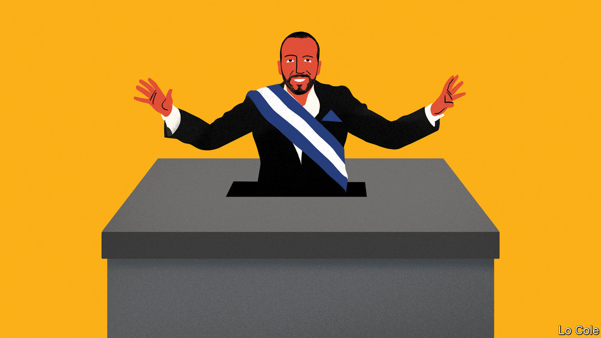

###### Bello

# Nayib Bukele wants to abolish term limits in El Salvador 

##### The millennial caudillo is continuing down the road to tyranny 

 

> Sep 22nd 2022 

“The people should have the right to reject or continue down the road on which they are travelling,” said Nayib Bukele on September 15th as he announced, to cheering officials, his intention to seek re-election as El Salvador’s president in 2024. Consecutive terms are banned by the constitution, and he warned that there would be criticism from abroad. But, he went on, this would be “hypocritical” since “nearly all developed countries” allow for re-election and it is banned only “in the third world”. His plan represents a big step towards another elected dictatorship in Latin America.

His statement contained a whopping fib. Of 35 countries considered developed by the imf, the names of which he read out, all but the United States and South Korea have parliamentary systems. Their heads of government are not directly elected. Unlike Latin American presidents, these prime ministers are accountable to parliaments and can fall at any time, as has happened recently in Britain, Sweden and Italy. Many academics think Latin America would benefit from adopting parliamentary government. But the region shows no sign of doing so and this is not the issue that interests Mr Bukele.

Strip away that lie and is Mr Bukele’s intent so damaging? After all, a maximum of two terms is the rule in the United States, and two consecutive ones in Argentina and Brazil, for example (though in these cases the term is four years rather than El Salvador’s five). And Mr Bukele is surely right in thinking that Salvadoreans would like to keep him. For most of the period since a peace agreement in 1992 ended a civil war between the army and left-wing guerrillas, the country has suffered sluggish economic growth, rising criminal violence and persistent corruption. 

Mr Bukele, aged just 41, can claim to mark a decisive break with the past. His handling of the pandemic was effective if heavy-handed, mixing harsh lockdowns with generous handouts. He has cut the murder rate sharply, first with a reported truce with gangs and then, when this broke down, through a draconian crackdown. Under a state of emergency imposed in March he has jailed more than 50,000 supposed gang members. El Salvador has more prisoners relative to its population than any other country.

He has accompanied all this with national populist rhetoric, attacking “oligarchies”, the two-party system that ruled before he took office and, above all, “foreign powers”. “They gave us 200 years of their recipes and they all failed,” he said in his speech, delivered on his country’s independence day. “Now for the first time we are applying our own recipe.” 

The recipe has worked for him, at least. His approval rating stands at 86%, according to cid-Gallup, a pollster. In a legislative election last year his New Ideas party won a two-thirds majority in the national assembly. He used that to retire a third of the judges and appoint a Supreme Court to his liking. The constitution, reformed as part of the peace agreement, states that alternation in power is “indispensable”. But the court’s newly appointed constitutional chamber duly ruled that the bar on re-election violated the people’s right to choose whom they want. On paper this ruling applies only to a second term. But it doesn’t take a shaman to foresee that the same argument would apply in 2029.

For practical purposes El Salvador has thus joined Bolivia, Nicaragua and Venezuela in abolishing term limits. To achieve this in Venezuela, Hugo Chávez went to the trouble of organising a new constitution and a referendum. Mr Bukele has aped the newer fashion of getting pliant courts to do the job, as in Bolivia and Nicaragua. It is no coincidence that most if not all checks and balances on the executive have withered in these countries.

The problem for Salvadoreans is that if and when they tire of Mr Bukele it may be too late for them to get rid of him. Already, his bullying of the media means he has escaped scrutiny for his use of the country’s money to speculate in cryptocurrencies. So far that has cost $57m, reckons Moody’s, a credit-rating agency. Some analysts believe El Salvador is heading towards a debt default. 

The countries that have abolished term limits are among the poorest in Latin America. Those that allow a second term but only with a gap are the richest (Chile, Costa Rica and Uruguay) or among the fastest-growing (Panama and Peru). It is permanent re-election which is correlated with the “third world”.


