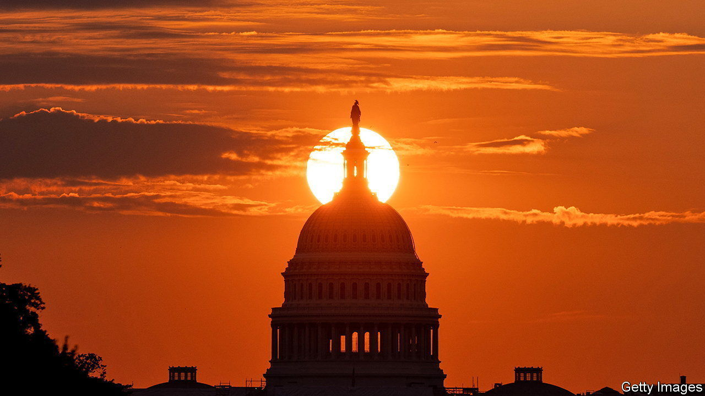

###### The Economist explains

# Why is the electoral cycle of America’s Congress so short? 

##### No other developed democracy gives its legislators such little time 

 

> Sep 20th 2022 

In December 2021, less than a year after his inauguration, President Joe Biden told a meeting of Democratic National Committee officials: “We’re going to win in 2022.” Voters weary from the bruising presidential election may have inwardly groaned at the prospect of . But for Americans, biennial elections are the norm. Article I of the constitution mandates that members of the House of Representatives and a third of the Senate be “chosen every second Year.” Senators stay in office for six years, but members of the House get only two. America is the only developed democracy to require such short legislative terms. Why is  so short and how does that affect the country’s government?

The framers of America’s constitution fretted over whom to trust with power: voters or their elected representatives. Despite the revolution over self-rule, many of the founding fathers were sceptical of mass-voting. During the constitutional convention in Philadelphia in 1787, Elbridge Gerry, a delegate from Massachusetts, complained that many of the problems facing the young country were caused by an “excess of democracy”. One-year terms were common in the early state legislatures and, Gerry claimed, voters had been “misled” into supporting short-termist policies. Others worried that longer congressional terms—such as the three years proposed by James Madison—would lead to tyranny. A compromise was found in the bicameral legislature: senators would be experienced, thoughtful politicians who served longer terms, whereas House members could respond to the public mood, and so serve shorter terms. The Federalist Papers, a series of arguments for the new constitution written by Alexander Hamilton, John Jay and James Madison, sold the constitution to voters, saying it was “essential” that the House should have “an immediate dependence on, and an intimate sympathy with, the people”.

But biennial elections make it harder to govern. Congress starts afresh after each election: bills die and committee work is suspended (though when a party retains control of the House, it usually picks up where it left off). Time becomes a precious resource. This can be galvanising—Democrats’ fear that they would soon lose control of Congress led to a flurry of legislative action this summer. But it can also be demotivating. Researchers looking at Argentina’s Congress, where term lengths were randomly assigned after governance changes in 1983 and 2001, found that legislators with shorter terms worked less hard; members of the Chamber of Deputies who were in office for longer submitted more bills and attended more debates and committees. Another study of state legislatures in Arkansas, Illinois and Texas, where term lengths vary because of redistricting, came to similar conclusions. Both papers’ authors posited that politicians who lacked job security had less incentive to see policy through. America’s Congress is a slightly different case: the rise of uncompetitive states and districts–a consequence of growing polarisation–means that most House and Senate members are virtually guaranteed re-election. However, the closeness of America’s political contest ensures that there is nonetheless a strong possibility of the chambers switching from one party to the other at every biennial election. And this may have a similarly de-motivating effect. “In an era where partisan control looks to be up for grabs in almost every election,” explains Richard Pildes, a constitutional-law professor at New York University, a two-year term makes it “more difficult for governments to develop policies with a more long-term focus.” Each party is instead concerned about positioning itself for the next election.

The elections are also distracting. Some House members say that fundraising can take up 20-30 hours a week, and primary elections extend the time spent campaigning. At least twice in the past decade, individual congressmen have suggested constitutional amendments to change the length of terms. In 1966, as president, Lyndon Johnson (who spent 25 years in Congress) proposed a move to four-year terms. “The competitive pressures imposed by the two-year term”, Johnson said, reduced a legislator’s “capacity to do either task—campaigning or legislating—with the complete attention his conscience and the public interest demand.”

 supported the idea at the time, calling it “obvious” that under the current schedule congressmen “suffer grievously”. But constitutional amendments need the support of a two-thirds majority in each chamber of Congress and three-quarters of the states. Neither Johnson’s attempt nor the more recent ones gained any traction. House members must suffer on. ■


