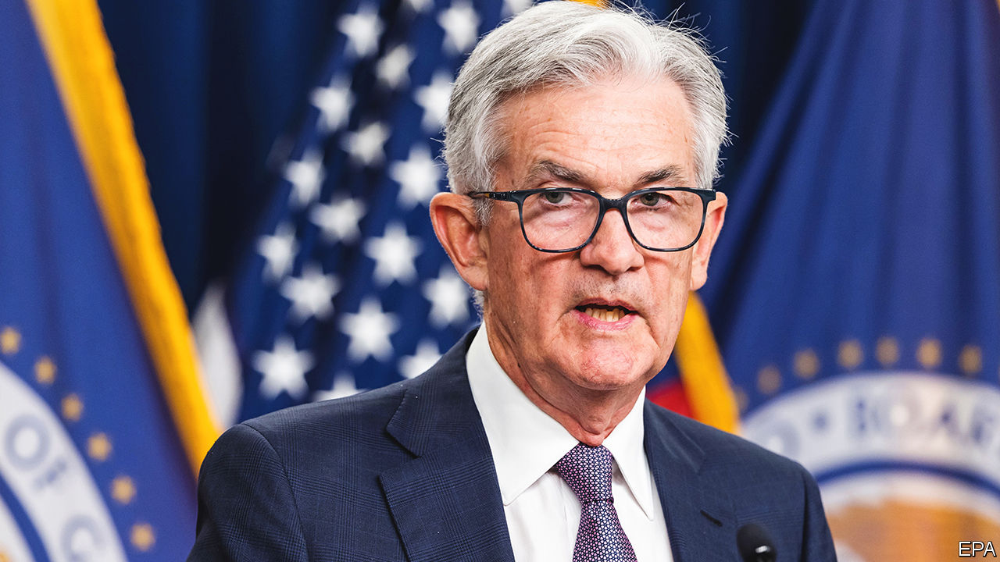

###### The world this week

# Business 

#####  

 

> Sep 22nd 2022 

The  raised its benchmark interest rate by another three-quarters of a percentage point, to a range of between 3% and 3.25%. It was the third consecutive such increase and came after figures showed that inflationary pressures are moving extensively beyond food, energy and goods to services prices, such as rent. The Fed now projects the rate to rise to at least 4.25% by the end of the year. Jerome Powell, the central bank’s chairman, said “We have to get inflation behind us”, and that there was no painless way to do so. 

Other central banks also tightened monetary policy at an aggressive pace to battle inflation. The  lifted its benchmark rate by half a percentage point, to 2.25%, the highest it has been since 2008 (three members of the nine-person Monetary Policy Committee voted for a rise of three-quarters of a percentage point).  raised its key rate to 0.5% from -0.25%, ending seven years of negative rates.  Riksbank, a laggard compared with most of its contemporaries, lifted its main policy rate by one percentage point, to 1.75%, the biggest increase in three decades. 

Bucking the trend the  maintained its ultralow rate. That caused the yen to slide further against the dollar, prompting Japan to intervene in foreign-exchange markets to shore up the currency for the first time since 1998. Before the intervention the yen had fallen by 20% against the dollar this year. 

The German government nationalised , Germany’s biggest gas importer, to prevent it from collapsing. Uniper had been forced to turn to the more expensive spot market when Russia curtailed its gas supplies, leading to huge losses. The German government also took control of three refineries operated by , Russia’s biggest oil company, to secure Germany’s energy supply ahead of an eu embargo on Russian oil. 

In Britain the government introduced a scheme that will cut  for businesses by around half over the winter by capping the wholesale price of electricity and gas, an extension of the huge financial support it had earlier promised for households. Many firms risk going bankrupt because of soaring energy costs. 

In the driving seat

Volkswagen announced that shares in  will debut on the Frankfurt stock exchange on September 29th. Only a small portion of the shares being offered by vw, Porsche’s owner, will be available to the public. vw and the Porsche and Piëch families, the controlling shareholders in vw, will own most of the stock. Still, the ipo could value Porsche at up to €75bn ($74bn). 

Ahead of a plan to split its auditing and management-consulting businesses,  revealed that revenues grew by 16.4% in the year to June 30th, the best growth rate in 20 years. Sales from its consulting services grew at a faster pace than those from accounting, although accounting still brought it more money. ey thinks a break-up will allow the consultancy side to thrive, freeing it from conflict-of-interest rules that stop it working with firms that ey also audits. Its 13,000 partners will start voting on the spin-off in November. 

 said that Lapsus$, a hacking group thought to operate from Brazil and Britain, was behind an extensive cyber-attack that forced it to shut down some internal systems briefly. 

 share price struggled to recover from the hammering it received after it announced that it would take over, an online service used by digital designers to develop apps and websites, for $20bn. Adobe says the deal will spur growth prospects, but investors are not sure about the combination of legacy software tools with a nimble web-based application. Competition authorities, too, may have a problem with Adobe taking over an innovative rival. 

The share price of  also floundered after it issued a profit warning. Considered a bellwether of the interconnected economy, the package-delivery company is facing waning demand and “service challenges in Europe”. It announced cost-cutting measures, such as reducing flights by its planes and temporarily parking some of them. 

tf1 and m6, two of the biggest , abandoned their proposed merger in the face of antitrust concerns. The channels had hoped that by combining they would be a potent force in streaming. The competition authority was worried that the merger would limit competition in advertising. 

Hoovering up your particulars

America’s Federal Trade Commission is examining  proposed takeover of , which makes the Roomba autonomous vacuum cleaner. Earlier this month two dozen groups, including the Electronic Frontier Foundation, wrote to the ftc claiming that Amazon’s purchase would endanger competition in the market for smart devices in the home while “leveraging vast troves” of consumer information. The Roomba collects household data as well as dust as it busily trundles around. 

