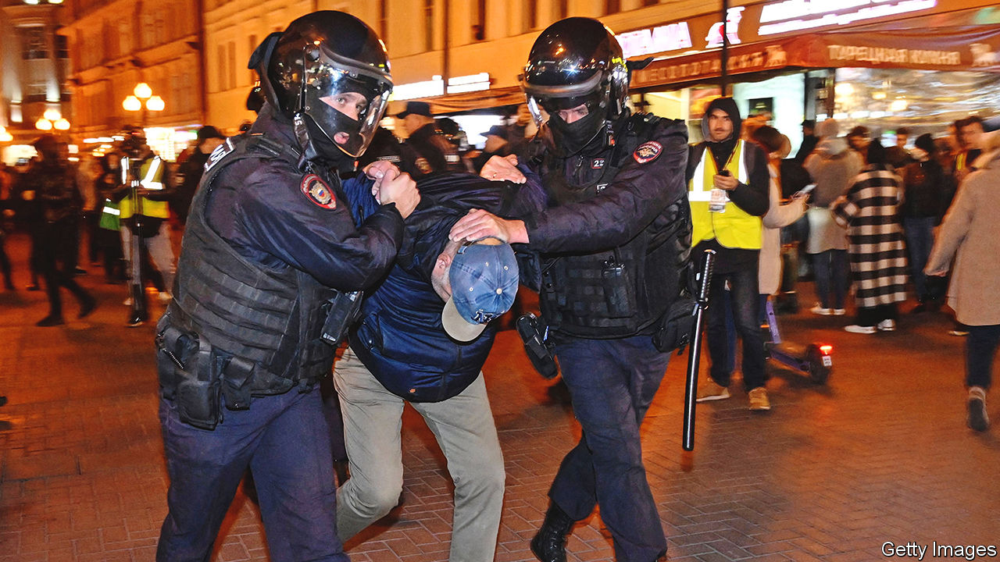
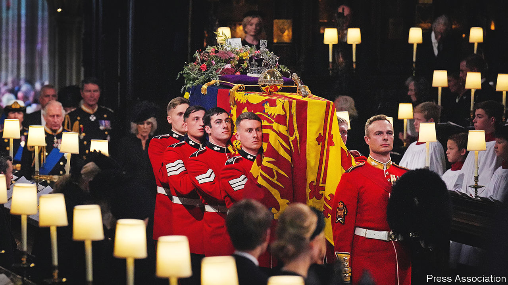

###### The world this week

# Politics 

#####  

 

> Sep 22nd 2022 

In a televised address,  announced what he called a . Though the Kremlin claims that very few Russians have been killed in Ukraine, it nonetheless plans to call up another 300,000 reservists and force them to fight. Anti-war protests erupted in cities all over Russia, and flights out of the country quickly sold out. Hundreds of people were arrested; some officials suggested that protesters be sent to the front line. Analysts said it would take months for the new recruits to be ready for action. Many of the officers who might have trained them are either in Ukraine or dead. 

Elections at gunpoint

Mr Putin also said he would support  in occupied parts of Ukraine, where puppet administrations say they want to be formally annexed by Russia. The referendums were to be held at three days’ notice and at gunpoint. Their results are not in doubt. The aim appears to be to give Mr Putin a rhetorical justification for describing Ukraine’s efforts to recapture its own territory as attacks on Russia itself. He made a lightly veiled threat to use nuclear weapons. 

At the un, Joe Biden called Mr Putin’s  irresponsible. The Dutch prime minister, Mark Rutte, suggested that Mr Putin was panicking and advised everyone to keep calm. Ukraine’s president, Volodymyr Zelensky, demanded the return of all Ukrainian land, a tribunal for war crimes and reparations for all the Ukrainians Mr Putin’s men have murdered.

 and  agreed to a ceasefire, following the worst outbreak of fighting between the two countries since 2020. America has been involved in efforts to sue for peace in a conflict taking place in Russia’s backyard. Antony Blinken, the secretary of state, held talks with the Armenian and Azeri foreign ministers in New York. Nancy Pelosi, the Speaker of the House of Representatives, visited Armenia, the most senior American politician to do so since Armenia gained independence from the Soviet Union in 1991. 

Nine people were killed in  during the biggest protests against the government in years. They were sparked by the death in custody of a young woman three days after being arrested by the morality police for being improperly dressed. She was wearing a loose head covering. 

 security forces clashed with militants and protesters, after arresting members of Hamas who are wanted by Israel. About 90 people have been killed this year in the West Bank, mostly by Israeli police and soldiers. Israel has repeatedly raided the area after a wave of terrorist attacks by Palestinians and Israeli Arabs.

Large numbers of  troops have invaded Tigray, a northern region of  that has been battling Ethiopian government forces since late 2020. Eritrea had previously intervened to help Abiy Ahmed, Ethiopia’s prime minister, but withdrew its forces last year because of international pressure and battlefield setbacks. Separately, un investigators said Ethiopia’s blockade of Tigray was a crime against humanity.

Unrest in  escalated after protests over the removal of fuel subsidies turned into more generalised anger over poverty and violence. The Caribbean country has endured instability and gang mayhem since the assassination of its president last year. American officials say businessmen abroad may be helping to stir up the unrest, which threatens to topple the current prime minister, Ariel Henry.

 barrelled a destructive path across the Caribbean. The storm caused the power to go out in Puerto Rico, reviving memories of Hurricane Maria in 2017. Although the American territory has restructured its huge debt, the electricity company is still battling its creditors. 

The number of arrests of illegal migrants along  with Mexico has passed 2.1m for the fiscal year starting October 1st 2021, a record. Many of the migrants are now coming from Cuba, Nicaragua and Venezuela. 

New York state’s attorney-general brought a lawsuit against  and three of his children, Donald junior, Eric and Ivanka, accusing them of fraud by inflating the value of assets to obtain loans. The suit involves the Trump Organisation. The state also referred the findings to the federal Justice Department as a criminal matter.

Goodbye, your majesty

 


 was laid to rest in Windsor Castle following a state funeral at Westminster Abbey. At least 26m people watched the service and procession on television in Britain (the figure excludes digital audiences). Before the event London’s transport authority said it expected 1m people to line the streets. A quarter of a million people filed past the queen’s coffin as it lay in state, according to a government minister. The queue’s maximum length was ten miles (16km). 

Weeks of tension between Hindus and Muslims in the British city of  erupted into violent disorder following an unauthorised protest by hundreds of people. Police struggled to restore calm; officers from other forces had to be drafted in. Rumours and disinformation about the trouble quickly spread on social media.

A massive typhoon battered , killing at least four people and injuring over 110 others. With wind gusts of up to 234km per hour, it left more than 300,000 households without electricity.

 announced early presidential elections to be held on November 20th. The country faced violent unrest and an attempted putsch in January, which was suppressed with the help of Russian troops. Kassym-Zhomart Tokayev, the president, has since consolidated his power and sidelined his predecessor, the strongman Nursultan Nazarbayev. 

 called a ceasefire, after border skirmishes left at least 100 people dead and displaced tens of thousands. A hotch-potch of exclaves in the region have long provoked border disputes, but the latest clashes are the worst to have afflicted any of the post-Soviet Central Asian states since independence. 

In  a bus taking people to a covid-19 quarantine facility crashed, killing 27 passengers. The accident sparked a large online protest against the government’s strict covid controls. Angry netizens also criticised a senior health official for advising locals to avoid touching foreigners after China recorded its first case of monkeypox, found in a person who had arrived from abroad. 

