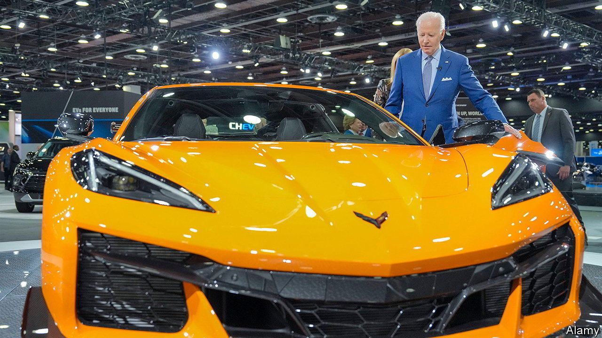

###### Revving up

# Detroit is once again betting on the car industry to rescue it 

##### But the Motor City’s health will depend on more than motor cars 

 

> Sep 19th 2022 

Journalists visiting Detroit on September 14th and 15th were given two quite different views of its future. On the 14th, the opening day of the first North American International Auto Show to be hosted in Detroit since 2019, they watched through a window as Joe Biden clambered into a new bright-orange petrol-powered Chevrolet Corvette, and later drove an electric Cadillac suv across the floor. In a speech that followed, the president, a self-professed “car guy”, drew a direct link between cars and prosperity. “American manufacturing is back. Detroit is back. America’s back,” he declared.

On the 15th, however, some who stuck around saw Pete Buttigieg, Mr Biden’s transportation secretary, visit an exit ramp of the Chrysler freeway, just east of downtown Detroit. Together with Gretchen Whitmer, Michigan’s governor, and Mike Duggan, Detroit’s mayor, he announced a huge chunk of federal funding to remove a section of the motorway that in the 1950s was built at the expense of residents (most of them black) of what had been a thriving district. “This stretch of i-375 cuts like a gash through the neighbourhood,” he said. By the end of the decade, instead of what Mr Duggan called a car-filled “ditch” separating downtown from the east of the city, Detroit will have a “boulevard”, open to cyclists and public transport as well as cars.

For over a century Detroit and the car industry have been practically synonymous in America. The success of the Ford Model t helped a modest port town grow into America’s fourth-biggest city. But the industry’s influence on the city is mixed. From the 1960s middle-class white flight—enabled by mass car ownership and roadbuilding—hollowed it out. By 2013 its population was one-third of its peak in the 1950s. That year Detroit became the first large American city to go bankrupt. 

Now the city leadership is once again banking on the car industry to drive its economic recovery, even as it tries to tear down some of the car-related infrastructure of the past. Will it work?

Detroit has made remarkable strides since the bankruptcy. Cranes dot the downtown skyline, building new condominiums and restoring old ones. New restaurants and bars hum with tourists. A new tram system, the QLine, runs along Woodward Avenue, carrying visitors between downtown and the Detroit Institute of Arts, with its magnificent Diego Rivera murals. A decade ago some homes could be bought for almost nothing; in June the median sales price hit $100,000—low compared with most American cities, but the highest it has ever been in Detroit. The city’s finances are in surplus.

The pandemic could have upended this resurgence. Before 2020 much of Detroit’s success came from growing office employment. But most of those jobs are held by suburbanites, who drive in each day, rather than residents of the city proper. Roughly one-quarter are probably still working from home, depriving the city not only of spending but also of the income tax that the city levies on non-resident employees working there.

Yet Detroit has recovered better than might have been hoped, says Gabriel Ehrlich, of the University of Michigan, largely thanks to the creation of blue-collar jobs. Many are in construction; a new bridge is being built. But car factories are also opening. Near Hamtramck, an independent enclave surrounded by Detroit, General Motors has converted an old plant into an assembly centre for electric vehicles named “Factory Zero”. Stellantis, the firm once known as Fiat-Chrysler, has opened a new factory, Detroit’s first in 30 years, which will employ 5,000 workers—mostly residents of the city, under an agreement struck with the mayor—to build Jeep suvs.

How sustainable is this recovery? Mr Duggan, who was elected in 2014, claims credit for the blue-collar jobs growth. “This was the result of an intentional strategy to reposition Detroit,” he says. He sees a future in which the car industry invests heavily not only in manufacturing but also in designing new technology, such as autonomous vehicles, and even flying ones. “We’re staying very close to our friends in the auto industry,” he says. That the city is starting to undo some of its auto-centricity, by dotting streets with bike lanes and tearing down a freeway, is perfectly consistent with this, he says. He notes that Ford is rebuilding Michigan Central Station, a long-derelict Beaux Arts pile, as a walkable “campus” for its design teams.

Not everyone is convinced. The car industry is hiring because it is transforming, suggests Mr Ehrlich—it needs to produce new electric cars and keep its internal-combustion-engine production going, too. But electric cars are easier to assemble than petrol ones, which might eventually mean fewer jobs making them.

A different road ahead

Over the past 60 years the car industry’s share of Detroit’s economy has almost consistently declined. Part of this is because of rising imports and production shifting elsewhere. But part is simply that it takes fewer people to build cars. Even if Detroit captures a bigger share of new output than it has in the past, it may not suffice to keep a large share of the population employed.

And Detroit needs a lot more jobs. According to the Census Bureau, although the number of white and Hispanic residents grew in the decade to 2020, a shift of the black middle class to the suburbs still meant that Detroit lost 11% of its population overall. Mr Duggan disputes those figures, arguing that amid the pandemic, census workers failed to count residents properly, and that data from the postal service and utility companies show homes being reoccupied, not abandoned. But few non-political observers are as boosterish. “I don’t know if we can yet characterise it as a vibrant and booming city,” says Esmat Ishag-Osman of the Citizens Research Council of Michigan, a think-tank. The unemployment rate is still over 10%. And with interest rates rising, the rude health of car manufacturing is far from assured.

In the long run, the only way to fully reverse Detroit’s decline is to diversify its economy. The growth of office employment and of the downtown may have slowed for now, but it is probably more sustainable than the car industry. There are good political reasons to chase manufacturing jobs—well-paid, they help lift people with limited qualifications into the middle class. It is no wonder that people like Mr Biden and Mr Duggan are so keen on them. But the car industry has disappointed Detroit plenty of times before. ■

