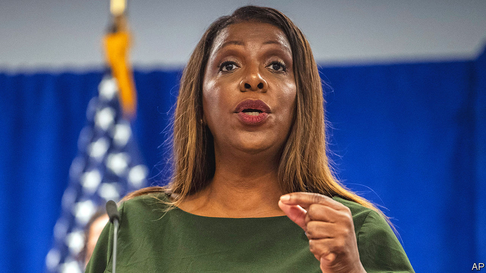

###### Et tu, New York

# Donald Trump faces a sweeping new lawsuit 

##### The former president’s legal troubles pile up 

 

> Sep 22nd 2022 

Many americans who harbour nearly religious reverence for Donald Trump—especially those steeped in qAnon mythology—speak of the former president as a sort of Messiah. Of late he has resembled more the beleaguered biblical character of Job, beset by one legal woe after the next. The latest blow came on September 21st when Letitia James, the attorney-general for the state of New York, filed a lawsuit against Mr Trump, three of his children and his real-estate business alleging a “staggering” level of fraud extending over a decade. Ms James is seeking to permanently bar the Trump family from operating a business in New York and to recover $250m in ill-gotten gains. She has also referred the findings of her investigation, which has taken three years, to federal prosecutors for possible criminal charges.

A lesser man with Mr Trump’s  might have already been bowled over. A criminal investigation into —which led to the spectacle of fbi agents dropping by unannounced to Mr Trump’s estate of Mar-a-Lago in Florida—is likely to stretch for months. The January 6th committee in the House of Representatives has already unearthed many  of the president’s actions the day his supporters stormed the Capitol, and may seek to release more before the end of the current congressional term. The Department of Justice appears to be following its work closely. In Georgia, Fani Willis, the district attorney for Fulton County, has empanelled a grand jury to investigate the efforts of Mr Trump and his allies to overturn the election results in that state. Even someone as famously litigious and avowedly rich as Mr Trump is reportedly struggling to find enough attorneys.

Ms James’s inquiry concerns more mundane matters than election tampering and sedition. The 214-page complaint alleges that Mr Trump and his businesses flagrantly misrepresented and inflated his net worth and the value of his properties in order to mislead prospective lenders and secure preferential financing. In the 11 annual statements put out by Mr Trump’s company between 2011 and 2021, the ample team of investigating government lawyers have compiled 200 specific instances in which the assets were presented with fraudulently inflated values.

Some of the specifics are risible in their audacity. In 2015 Mr Trump’s personal flat was allegedly valued as though it were 30,000 square feet (2,787 square metres) when it was actually 10,996 square feet. The complaint also alleges that Mar-a-Lago was valued at $739m on the premise that the land could be sold and developed for residential use, when Mr Trump had in fact signed away these rights (and sought an income-tax deduction for doing so). An honest evaluation of the property’s value would have been little more than one-tenth the amount claimed, the attorney-general writes. 

One of the central actors identified, Allen Weisselberg, the chief financial officer for the Trump Organisation, pleaded guilty last month to unrelated charges of tax fraud. He has agreed to testify in a separate criminal trial against the company. That trial begins in October.

But dismissing damning facts and specific allegations—whether they concern insurance fraud or mishandled nuclear secrets—has never been hard for Mr Trump. In the Trumpian alternative universe, which friendly media outlets help to create, all legal investigations against him, including Ms James’s, are simply part of a great political “witch hunt”. Before an expected presidential run in 2024, the president’s legal team is seeking to delay the inquiries until at least the election year, at which point their political motives would look even more suspicious. 

Mr Trump takes his supporters’ loyalty for granted, and is not scared to invoke it to shield himself from legal scrutiny. When he was asked on September 17th by a conservative radio host what would follow after an indictment, he answered: “You’d have problems in this country the likes of which perhaps we’ve never seen before. I don’t think the people of the United States would stand for it.”

Despite years of legal jeopardy, no one can credibly challenge Mr Trump’s  Enough of his supporters see him as a latter-day Job—a good and prophetic man put upon for no reason other than his own virtue. And they hope that their hero has the same happy ending: after a long despondency, restoration to a glory even greater than before. ■


