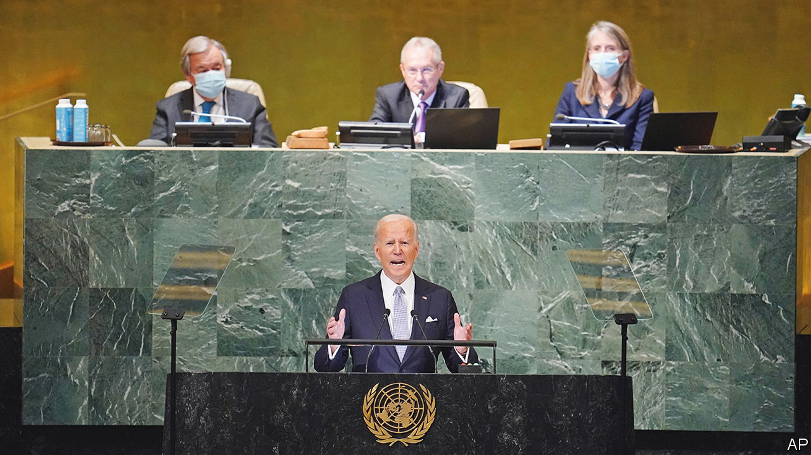

###### America and the world

# Joe Biden warns of global disorder if Russia is not stopped 

##### A strengthened president seeks to rally the world around Ukraine. But many countries want to stay out of geopolitical rivalries 

 

> Sep 21st 2022 

With vladimir putin’s latest nuclear threats ringing around the hall, President Joe Biden came to the un’s headquarters on September 21st to warn the world’s leaders that all of them had a vital stake in defending Ukraine against Russia’s invasion. “This war is about extinguishing Ukraine’s right to exist as a state, plain and simple, and Ukraine’s right to exist as a people,” he declared. “Whoever you are, wherever you live, whatever you believe—that should make your blood run cold.”

Mr Biden gave little detail of how America would respond to Russia’s moves to annex parts of Ukraine, or to any use of nuclear weapons. The speech did not attempt to set out American policy in Ukraine, but to win over the world’s doubters by casting Russia as an imperialist land-grabber.

For an American president the annual gathering of the un General Assembly ought to be akin to playing a home match. The un was America’s brainchild. Its headquarters are in New York. America benefits from an unrivalled network of friends and allies. In Mr Biden, it also has a leader who believes in “relentless diplomacy”.

What is more, Mr Biden is enjoying a winning streak. Abroad he has helped Ukrainian forces push back Russian troops from some areas. At home he has scored big legislative wins, his ratings have risen and his Democratic Party’s prospects in the midterm elections have improved.

Yet he faced an uphill task in New York. Many leaders are reluctant to take sides in the West’s proxy war with Russia, or to be caught in the contest for supremacy between America and China. “I have come to say that Africa has suffered enough of the burden of history; that it does not want to be the breeding ground of a new cold war,” said Macky Sall, the president of Senegal and current chairman of the African Union. Like others, he managed to bemoan the impact of the Ukraine war without mentioning Russia. He urged de-escalation, a ceasefire and a negotiated solution. 

Ukraine won a procedural victory when, despite objections from Russia, the General Assembly agreed to allow its president, Volodymyr Zelensky, to address leaders by pre-recorded video. Nevertheless, Western countries worry that support for Ukraine is weakening. Richard Gowan of the International Crisis Group, a think-tank, notes that America and its European allies have not tabled a substantive General Assembly resolution on Ukraine since overwhelmingly winning a series of votes in March and April. “Ukraine fatigue”, he explains, could lead to narrower votes and so give succour to Russia.

Some countries, particularly in Africa, have a lingering sympathy for Russia from when the Soviet Union was a strong advocate of dismantling other countries’ empires. Some feel they are suffering the effects of a war that does not concern them. Others have more pressing problems. 

“Our world is in peril—and paralysed,” warned António Guterres, the un secretary-general, setting out a list of menaces, including the risk of human annihilation from nuclear weapons or climate change, that the world was failing to deal with because of geopolitical rivalry. Rather than a “g-2” world dominated by America and China, he said, “now we risk ending up with g-nothing. No co-operation. No dialogue. No collective problem-solving.” 

Western leaders seemed to have a four-part game plan at the un. First, Mr Biden softened his long-standing division of the world into rival camps of democracies against autocracies. He made no apology for upholding democracy as “humanity’s greatest instrument”. But he said all countries, regardless of their form of government, had signed up to the un charter, which proclaims “the sovereign equality of all its members” and forbids “the threat or use of force against the territorial integrity or political independence of any state”. It was the duty of all states to defend it, or suffer the collapse of world order. President Emmanuel Macron of France, often seen as soft on Mr Putin, was notably blunt: “Those who keep silent today serve—despite themselves, or perhaps secretly with a certain complicity—the cause of a new imperialism.” 

The second part of the West’s strategy is to mitigate the repercussions of the war. A summit on food security, jointly hosted by Antony Blinken, America’s secretary of state, set out a plan to respond “at scale and in concert” to growing hunger around the world. Mr Biden promised $2.9bn in additional aid to deal with the food crisis, on top of $6.9bn committed earlier this year.

Third, America wants to be seen to respond to broader concerns. On global health, Mr Biden pledged help to ensure the world is better prepared to confront the next pandemic, and to support the fight against aids, tuberculosis and malaria. He said he was ready to talk to rivals about arms control. But Russia was making “irresponsible nuclear threats” and China was pursuing a “nuclear build-up without any transparency”. America’s offer of nuclear talks with North Korea had met with no response; those with Iran had stalled. On climate change, too, Mr Biden had a stronger hand given the passage of the Inflation Reduction Act, which includes $369bn in measures to curb greenhouse-gas emissions, “the biggest, most important climate commitment we have ever made”.

Fourth, America re-embraced the seemingly hopeless cause of reforming the un Security Council. The five permanent members (America, Britain, China, France and Russia) should wield their veto only in “rare, extraordinary situations”, Mr Biden said; and the council should increase the number of permanent and non-permanent members. He gave few details. But given that the most obvious candidates include Japan, Germany and India—friends of America’s whose elevation is opposed by either China or Russia—he may simply be trying to put his rivals on the spot.

How much these efforts will shift waverers remains to be seen. At the least, Mr Gowan notes, Mr Biden no longer comes across as weak: “You hear less talk about the inevitable return of Donald Trump. That improves America’s ability to do stuff in the un system.”

Beyond the debating chamber, the global balance of power is changing. “Every day the war goes on, Russia’s military is degraded,” argues Richard Fontaine of the Centre for a New American Security, a think-tank in Washington, dc. “Russia is militarily weaker and diplomatically more isolated. That is a significant win.”

Just as recent successes have given Mr Biden a boost, however, future setbacks could weaken him again. European allies face a winter of fuel shortages. Asian friends are dismayed by Mr Biden’s protectionism. And American democracy remains dangerously polarised. That greatly complicates the task of handling the country’s many foreign challenges—from Ukraine to Iran and Taiwan. ■


