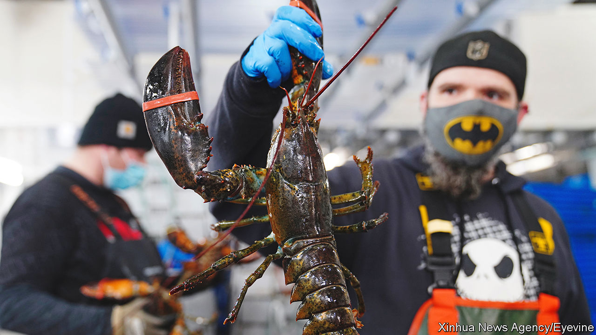

###### Claws out

# Maine’s lobster industry is feeling the pinch 

##### Moves to reduce risks to whales add to pressure on fishermen 

 

> Sep 22nd 2022 

“We have to go where the lobsters want to go…the rockier, the craggier, that’s where we want to be putting our traps,” says Ali Desjardin, as she pulls up a lobster trap from the ocean floor. She grabs a gauge to measure the area from the rear of the eye socket down the length of the back. Any lobsters kept must have backs between 3¼ inches and five inches (12.7cm) long. Everything else is returned to the sea. Females carrying eggs are also tossed back, a regulation Maine lobstermen put in place in 1872. Lobstermen notch females with a v to indicate to other fishermen that they are needed breeders. A purple rope, known as a line, attaches the trap to a floating buoy. Allegations about this line are rocking the entire lobster industry in Maine.

Earlier this month Monterey Bay Aquarium’s Seafood Watch, a California programme which advises consumers and businesses on what marine life to eat, placed the Atlantic lobster on its “avoid” list. According to Seafood Watch, the lines used in lobster fishing can entangle the endangered North Atlantic right whale. Outraged Maine lobstermen say they have not had an entanglement with a right whale in nearly two decades. Most say they have never even seen one. “It’s been extraordinarily frustrating,” says Patrice McCarron of the Maine Lobstermen’s Association, an advocacy group. “We pride ourselves on being stewards of the resource.”

Since 1997 lobstermen have removed 30,000 miles (48,000km) of rope from the water, weakened remaining lines so that whales can break free, incorporated “weak leaks” and “weak inserts” in and below the buoys, and added distinct markings to trace any entangling gear to the specific fishery responsible for it. They have also cut the number of lobster traps. Curt Brown, a lobsterman and marine biologist, said at a recent press conference that: “Maine lobstermen have probably put in more effort, more time and more money than any group in this country to protect right whales.”

Seafood Watch believes these measures “do not go far enough”. The right whale (supposedly so named for being the “right” whales to hunt because they floated when they were killed) is in danger of extinction. Fewer than 350 North Atlantic right whales survive. According to one study, over 80% of them have been entangled in fishing gear at least once. They bear the scars. 

Maine’s lobstermen say that the damage is not caused by them. There have been no documented deaths associated with Maine gear. Seafood Watch should be celebrating a proactive industry, says Luke Holden, a lobsterman and owner of Luke’s Lobster, a restaurant on Portland pier. He also owns a processing plant and sells to Whole Foods, a supermarket chain. “What else can we do to reduce risk?” he asks. “How can we work together to continue to protect what’s important?” 

The National Oceanic and Atmospheric Administration (noaa), the federal agency which oversees the country’s fisheries, has long been working with Maine to support sustainable lobster fishing and protect endangered species. “We fully recognise that Maine lobstermen have done a ton over the years,” says Allison Ferreira of noaa, “but more needs to be done.” Last year noaa set a goal of reducing risk to whales by 90%. Its plan for doing this includes ropeless traps, which could be costly. “We are all going to have to make big changes to this industry,” says Annie Tselikis of the Maine Lobster Dealers’ Association. “Fishermen will have to make major adjustments on the water. And we don’t know what that’s going to do to impact the supply.”

“One thing in this business, if you can hold on long enough, the wind will stop blowing,” says Mr Holden’s father, Jeff, who was the first licensed lobster processor. “The losses will stall when the market straightens itself.” 

But this time is different. Many fear the industry is being eliminated. A study conducted in 2016 shows that the lobster supply chain in Maine contributes $1bn to the state’s economy each year. As many as 12,000 people work in it. And the loss of the lobster industry would go beyond the lobstermen, dealers and processors. Restaurants and lobster shacks, which rely on holiday-goers lured by quaint coastal fishing towns, could be hurt, too. If the lobster business vanishes, many coastal towns could struggle to survive. Thousands of families and small businesses that rely on the catch would suffer.

Lobster is synonymous with Maine, so integral to its brand that the state offers a licence plate depicting the crustacean. Your correspondent lost count of how many people she saw wearing belts with pictures of lobsters. The lobster industry is more than a job for most. “It’s part of our identity,” Ms McCarron says. “It’s part of our heritage.” ■

