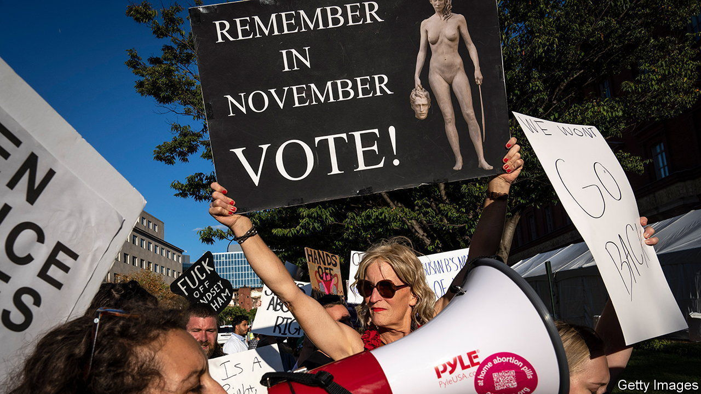
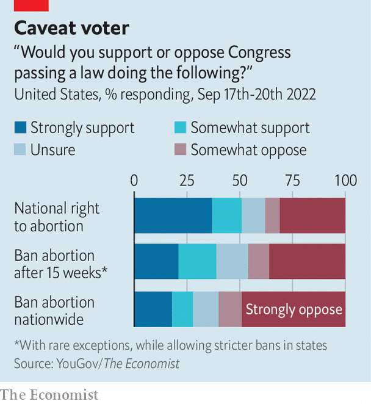

###### Midterm maths: The politics of abortion

# Republicans’ abortion proposal could backfire 

##### Polls suggest Americans are wary of a federal ban 

 

> Sep 22nd 2022 


State lawmakers in West Virginia on September 13th passed a bill that will ban nearly all abortions except to save a pregnant woman’s life or in cases of rape or incest. The law will punish any person who performs an abortion on a woman after eight weeks of pregnancy (excluding those exceptions). Voters in the Mountain State are among the most conservative in America, yet a 2018 referendum on an amendment to the state’s constitution affirming that nothing in it “secures or protects a right to abortion or requires the funding of abortion” got just 52% of the vote. So few expect that a similar bill would be popular in many other states. Few, apparently, except federal Republican lawmakers.

Lindsey Graham, a Republican senator from South Carolina, announced on September 13th a plan to push for a federal ban on abortion after 15 weeks if the Republican Party wins both chambers of Congress in November. The law would allow for exceptions in cases of rape and incest and to save the life of the mother. Many supporters, citing public-opinion polls, say they are confident the bill would be popular. They are mistaken.

True, polls show that most Americans do support some restrictions on abortion after the first trimester. A survey carried out between September 3rd and 6th by YouGov, an online pollster that conducts weekly surveys with , found that 30% of Americans favour legal abortion in all cases, 30% favour some restrictions (such as for minors or “late-term abortions”) and 30% favour restrictions on all abortions except in “special circumstances” such as rape, incest or when a mother’s life is endangered. Only 11% support abortion being banned in all cases.

 


On the surface such findings seem to suggest backing for Mr Graham’s bill. It would allow some exceptions for rape, incest and health-threatening pregnancies. Those exceptions are popular, and late-term abortions are unpopular. 

Yet just because Americans favour a certain policy outcome in abstract does not mean they support it being implemented in reality. This is especially so when it comes to banning certain actions. Witness the failure of a recent abortion referendum in Kansas (which would have amended the constitution to allow the state legislature to ban the procedure in subsequent legislation). According to a separate /YouGov poll, conducted from September 17th to 20th, a broad majority (60%) of Americans oppose Congress enacting a blanket federal ban on abortion. 

Asked if they favoured “banning abortion after 15 weeks of pregnancy with rare exceptions, while allowing states to enact stricter bans”, a plurality of 46% answered that they did, and 39% were opposed (the rest said they were unsure). But even this fair reading of Mr Graham’s proposal is less popular than more progressive alternatives. A majority of 51% of Americans, according to our poll, favour Congress “establishing a national right to an abortion” (the details of which were not specified), while 38% do not. 

It was perhaps bad politics for Mr Graham and his Republican colleagues to propose such a ban with the midterm elections around the corner. The us House and Senate are both reasonably competitive, our forecast model shows. It currently gives the Democrats a one-in-three chance of holding the House and a four-in-five chance of retaining the Senate.

The Democrats’ chances have been improving ever since the Supreme Court overturned , its landmark decision protecting abortion federally. According to a poll by /YouGov in early July (the last time the question was asked), 59% of Democrats say they would vote for a candidate for office based solely on that candidate’s position on abortion, whereas only 41% of Republicans say the same. And our mid-September poll shows that Democrats are more strongly opposed to the proposed ban than Republicans are strongly in favour of it. Making the midterms a referendum on a national abortion ban is probably not the electoral hit that Mr Graham may have hoped. ■

