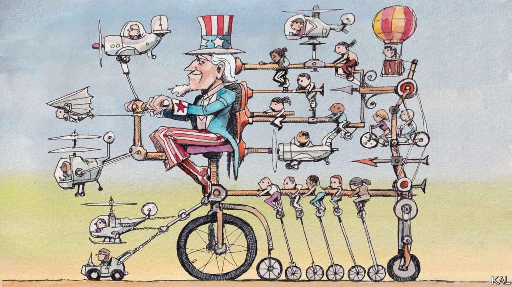

###### Lexington

# There is plenty of good news about American government 

##### In praise of the deep state 

 

> Sep 22nd 2022 

One of donald trump’s finest acts as president was to blow off the White House Correspondents’ Dinner. Of the annual rubber-chicken events that mark Washington’s calendar, it is the most decadent, a pageant of self-importance that illuminates the distance of the federal city from the people it is supposed to serve. At the other end of the spectrum of semi-official functions is the event honouring the winners of the “Service to America” medals, the so-called Sammies. It might not sound dazzling: the medals go to bureaucrats who made the bureaucracy better. Yet it is a reliably inspiring affair. It has heart where the White House Correspondents’ Dinner, in its flashes of authenticity, musters only spleen.

“I always knew I wanted to serve a cause greater than myself,” says Barbara Morton, who won the management-excellence medal at the ceremony on September 20th for her work at the Department of Veterans Affairs (va). Sammie-winners talk like that; there is no irony anywhere near their notion of public service. In their acceptance speeches they tend to deflect credit to others. 

And, rather than dwell on what they have achieved, they almost invariably wind up envisioning the future of their work, be it a spacecraft headed to Mars, the immunisation of Americans against monkeypox or the complete digitisation, at last, of the procurement forms at the Department of Labour. “We are looking forward now,” said Hilary Ingraham, one of three women from the State Department honoured for resettling more that 72,000 Afghan refugees, quickly finding homes for them in 331 cities across 49 states. She appealed to the audience for help in “exponentially increasing the number of refugees who are settled to the us”, people “who seek freedom and safety for themselves and their families and who in turn contribute so much to our country”. 

Administrations come and go. The bureaucracy abides. There are about 1.9m federal civil servants, atop of whom each incoming president gets to sprinkle roughly 4,000 political appointees, to set priorities and, in theory, to run the show. But the bureaucracy does not await a new president like an orchestra tuning up for a new conductor, nor is it a tanker that slowly shifts direction when new hands take the helm. It defies metaphor or analogy—it is too vast and complicated—and in any case it is too important to be so lacking in continuity. Federal workers build rockets, deliver mail, chase bad guys, clean bathrooms, inspect meat, buy jets, maintain hiking trails. The bureaucracy cannot really be run like a business, and politicians who make that claim do not understand how the government works. It is impervious to market forces; it can have no singular bottom line. When government agencies serve people well, they do so because the bureaucrats believe in their work.

Cindy Newberg has worked for almost 30 years at the Environmental Protection Agency. She was honoured for her success combating hydrofluorocarbons as the director of the stratospheric protection division (a title that might seem reward enough). She spoke of the determination and ingenuity required to tackle climate change, “to not look at something and say, ‘Climate, it’s too big, we can’t fix it,’ but to say, ‘Let’s take a small piece of this, let’s tackle a few chemicals, then let’s tackle a few more.’” If you move too fast, she said, “you turn industry off,” but if you move too slowly, “you don’t meet the needs of humanity.” Only in government, she said, can one hope to take on such a big problem.

In 2014 the va was engulfed in scandal after it emerged that some veterans were waiting more than 100 days to be seen by a doctor. Hundreds of thousands were struggling to get their benefits. In response, the va created a “Veterans Experience Office”, and Ms Morton, a lawyer who had been with the department for ten years, became its deputy chief. To understand where matters stood, the office surveyed thousands of veterans. Only 55% said they trusted the department to fulfil its commitments. 

After conducting hundreds of interviews with veterans, Ms Morton and her team created a clear “welcome kit” explaining all benefits and services available to veterans across their lifetimes. Also in consultation with veterans, they launched a new version of the va website that replaced news about the department with clear navigation for people looking to gain access to their benefits, and also made it easy for veterans to update their information. As secretaries of the va came and went (four, so far, in the life of the Veterans Experience Office), Ms Morton and her colleagues kept surveying veterans every quarter, treating the resulting trust number as their north star. By the last sounding it had climbed to 76%—far from perfect, but much improved. “We have such creative spirits in government,” Ms Morton says. “People think government is so static or stale or limiting, and it’s quite the contrary.”

Sammies time next year

The Sammies are run by the Partnership for Public Service, a non-profit group (the medals are named after its founder, Samuel Heyman). This year some 30 finalists, drawn from 400 nominations, gathered for a reception in the spring. “I can tell you I was blown away by the great work going on in government,” recalled Gregory Robinson, as he accepted the medal for federal employee of the year. The son of sharecroppers, Mr Robinson took over management of the James Webb Space Telescope programme in 2018, when it was 11 years behind schedule and $9bn over budget. nasa credits him with turning things around and achieving the telescope’s flawless deployment. “I know the political rhetoric makes a lot of people not appreciate government,” Mr Robinson continued. “But I tell you, I think we’re in really, really great hands.”

Spreading that message might help recruit the next generation of Sammie-winners to a government in which less than 7% of the workforce is under 30. President Joe Biden resurrected a presidential tradition by showing up at the White House Correspondents’ Dinner this spring. He would do well to start a new one by attending the Sammies next year. ■


