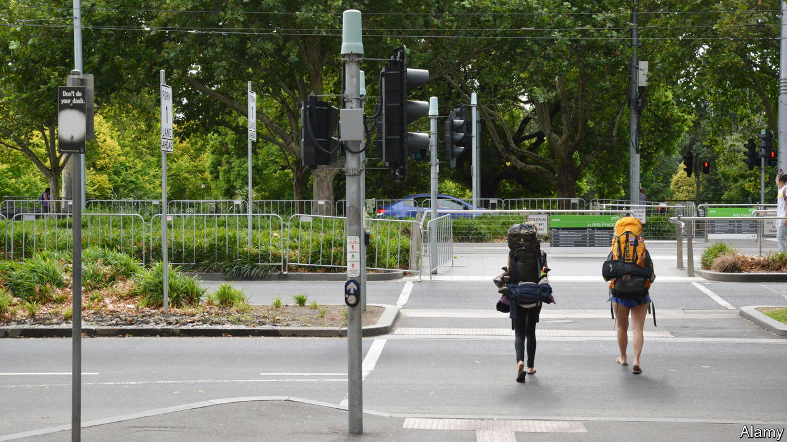
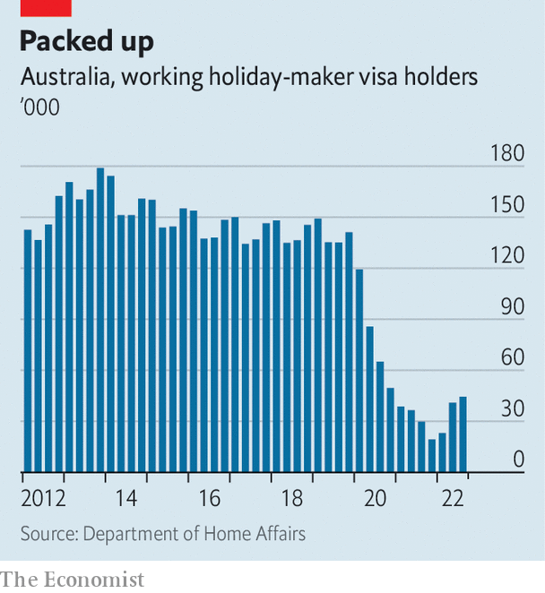

###### Hostel to fortune

# Australia needs foreign backpackers to return 

##### It is facing some of the rich world’s worst labour shortages 

 

> Sep 29th 2022 

AsiAN countries blessed with natural beauty, sunshine and copious local beer sometimes consider backpackers a curse—unwashed, promiscuous cheapskates who party too hard and spend too little. Not Australia. Backpackers spend time enjoying its white sands and oceans of booze, true. But they also work to fund their travel, providing the country with a steady supply of cheap, low-skilled labour. 

Before Australia sealed itself off at the start of the covid-19 pandemic in 2020, tens of thousands of backpackers flocked to the country every year. They came mainly from Britain, Ireland and mainland Europe. Australia’s borders reopened in February, but the backpackers are nowhere to be seen. That is causing problems across the country. The number of temporarily resident “working holiday-makers”, as visa-holders allowed to do both are known, plunged from 141,000 at the end of 2019 to 44,000 in July (see chart). 

 


As a result, not only do pubs, restaurants and hotels have fewer patrons; they are running short of staff, too. Bars struggle to serve customers. Hotels have closed rooms for lack of cleaners. “We don’t get Australians applying for this work,” says Liam Ganley, a publican in Melbourne who has been so desperate for staff that he offered to pay for people to migrate from Britain and Ireland. Two of his group’s four venues have cut their opening hours because he cannot fill his roster.

Nor is the labour shortage restricted to big, sexy cities. It hits remote corners of the country, too. Backpackers normally fill jobs in sparsely populated resort towns as they follow the tourist trail along the Great Barrier Reef. They are allowed to extend their stay if they spend time picking fruit and vegetables on farms (though some work in poor conditions, for less than the minimum wage). Before the pandemic, backpackers supplied Australia with 80% of its seasonal farm labour. When they left it created a shortfall of 26,000 harvesters. Some farmers have had to leave crops rotting in their fields. 

Australia is struggling to find skilled workers, too. Covid restrictions are not the only reason for that. The government pumped up the economy with fiscal stimulus during the pandemic. Its unemployment rate has plunged by almost two percentage points since covid emerged, to 3.5%, the lowest in nearly half a century. Some half a million positions are sitting unfilled—more than the number of out-of-work Australians. Among members of the OECD, a club of mostly rich countries, only Canada is suffering worse labour shortages. But the border closure also means that Australia has emerged from the pandemic with 500,000 fewer migrant workers than it would otherwise have had, reckons cEDA, a think-tank in Melbourne. 

The new Labor government, , wants immigrants of all stripes to return. On September 2nd Anthony Albanese, the prime minister, said that he would increase the intake of skilled migrants, including nurses and engineers, by more than a fifth, to 195,000 a year. Yet visa-processing has been held up by administrative backlogs. Nearly 1m applications are awaiting approval. To speed up the process Mr Albanese has promised A$36m ($24m) to the home affairs department, which handles visas, so that it can recruit some 500 more staff. 

Plans of this sort would cause a backlash in many rich countries. But Australia has had  for years without much grumbling. Nevertheless, Mr Albanese’s efforts will do little to plug the shortage of less-skilled temporary migrants such as backpackers. (Foreign students, another big source of casual labour, have also yet to return in their old numbers.) There is no cap on how many such workers are allowed in, so employers can only sit and wait. 

They worry that Australia no longer looks as appealing to youngsters. Backpackers still fear being caught out by abruptly closed borders or cast into lockdown, they argue. “We are talking about lasting damage that will take years to repair,” says Nick Lester of Captain Cook Cruises, which gives tours of Sydney’s harbour, and is scraping by with about a third of its normal staff. It will take until 2024 for net overseas migration to claw its way back to pre-pandemic levels, CEDA predicts. For Australia’s stricken businesses, that is an awfully long time. ■

