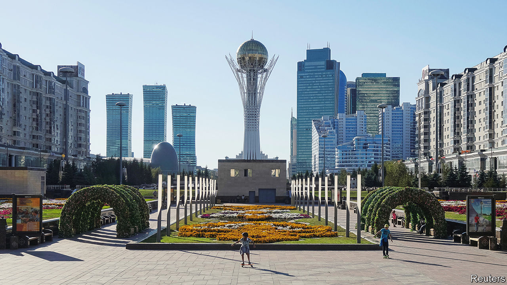

###### Capital punishment

# Guess which city holds the record for the most name changes? 

##### It just rechristened itself for the fifth time in six decades 

 

> Sep 29th 2022 

THE CAPITAL of Kazakhstan has had many names over the years. It started life as Akmolinsk, at its founding as a Russian military outpost in 1830. Then, from 1961, it was Tselinograd, Russian for “virgin lands city”, to mark its place at the centre of Soviet expansion to the steppe. At the country’s independence from the Soviet Union in 1991, it was renamed Akmola, or “white tomb”. And in 1998, soon after it became the capital, it got : Astana, or “capital”. 

Until 2019, that is, when it became Nur-Sultan. This was in honour of Nursultan Nazarbayev, who served as the country’s president from independence until that year, when he . And now the city, already the Guinness World Record holder for having the most name-changes, has renamed itself yet again. On September 17th it reverted to Astana. “Capital” is in, Nur-Sultan is out. 

In more ways than one. The city was renamed Nur-Sultan by Kassym-Zhomart Tokayev, Mr Nazarbayev’s chosen successor, in deference to his patron. They ruled as a duo until January, when violent unrest triggered by fuel-price rises rocked the country, leading to some 230 deaths and forcing Mr Tokayev to  for help in restoring order. Mr Nazarbayev emerged with his reputation in tatters amid suspicions that his cronies were involved in fomenting the violence. Mr Tokayev says the turmoil was an attempt to topple him, though he has named no names.

The removal of Mr Nazarbayev’s name from the capital is the most tangible sign yet that the cult of personality he built up is being dismantled. In June a referendum on a  stripped him of his remaining privileges. In September the government abolished the celebration of “First President’s Day” as a public holiday in his honour. His relatives have taken blows to their political and economic muscle, too. 

Mr Tokayev has pledged “a radical reset of the entire political system” to restore the public’s faith in the government. Reforms approved at the referendum in June will allow political opposition to thrive, he insists—although there is still no sign of any. At the start of September he announced another huge reform, cutting the number of terms a president can serve from two to one, while extending that term from five years to seven. Parliament immediately rubber-stamped the change.

On September 21st Mr Tokayev called a presidential election for November 20th, more than 18 months early. He will win in a landslide. Critics have accused Mr Tokayev of a power grab via his presidential term extension. But his new single seven-year term will end in 2029, just five months after he would have left office had he served two five-year terms. Mr Tokayev has vowed not to seek more time in office than he is permitted under the new constitution. He has refrained, however, from promising not to change the name of the capital again. 

