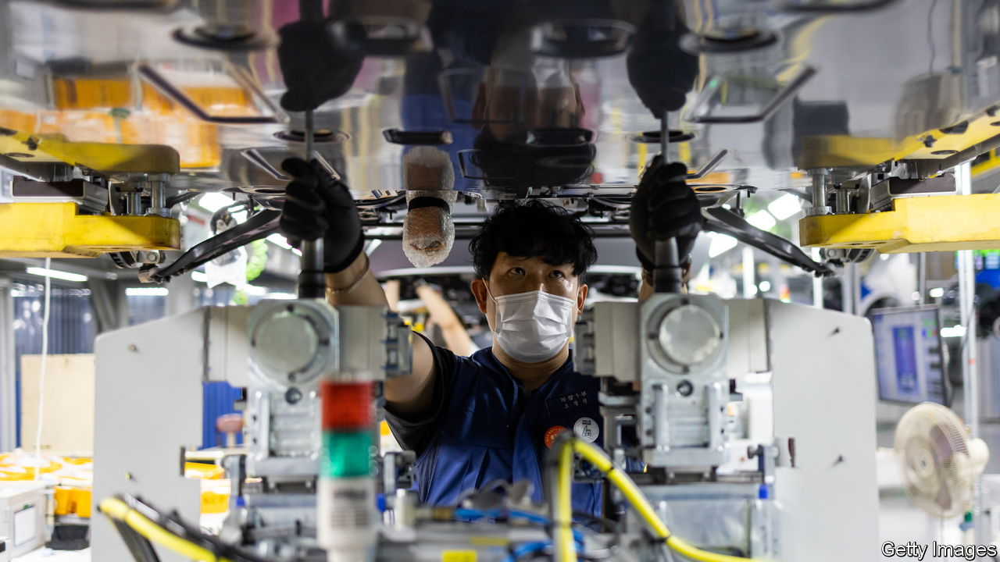

###### Charged atmosphere

# South Korea’s makers of electric vehicles receive a nasty shock 

##### A failure of diplomacy and planning sparks anger at the government 

 

> Sep 29th 2022 

CHUNG EUI-SUN could be forgiven for feeling betrayed. In May the chairman of the Hyundai Motor Group, a South Korean carmaker, promised President Joe Biden that his firm would invest $10.5bn in America, including $5.5bn for a big new plant in Georgia, which would start producing electric vehicles in 2025. America’s president thanked him, saying “we will not let you down.”

Yet let him down he did. In August Mr Biden approved the  (IRA), a landmark climate and health-care law. Among other things, it included new standards that electric vehicles (EVs) must meet to earn their buyer a . The change is meant to encourage Americans to buy electric, and to give carmakers more reason to bring their factories and supply chains into America’s orbit. No South Korean cars will qualify. 

To get the rebate, EVs must henceforth be assembled in Canada, Mexico or the United States. And from January they must meet two additional criteria, each worth half of the $7,500. Battery components totalling 50% of the value of the bits and pieces that are used to make these cars’ lithium-ion cells must also be manufactured or assembled in those places. And 40% of the critical minerals used in the battery must be sourced either from those countries or from one with which the United States has a free-trade agreement. Both requirements will get stricter over time. Moreover, EVs using any components from a “foreign entity of concern” such as China or Russia will be ineligible from 2024. Those using critical minerals from such countries will lose out the following year. 

Hyundai and its affiliate Kia account for 9% of the American EV market, the biggest share of any automaker not called Tesla, which commands a whopping 71%. Ford, an American carmaker, is next with 6%. Mr Chung is reportedly speeding up plans to build his automobiles on American soil. But until the cars start rolling out of factories, local rivals eligible for big subsidies will have an advantage. 

The battery requirements are the bigger problem. China produces three-quarters of the world’s lithium-ion batteries and is involved in the mining, processing or refining of half the cobalt, graphite and lithium crucial to battery production. It is likely to continue making the lion’s share of the world’s lithium-ion batteries until at least 2030, reckons the International Energy Agency, a forecaster. 

Countries friendly with America, such as Australia, Chile and South Korea itself, do have respectable capacity to produce some of the minerals used in batteries. They could stand to profit. Not only have some South Korean battery-makers announced an accelerated shift to North America, where the IRA would provide them with subsidies, they can also woo business that would otherwise have gone to Chinese manufacturers. But all of that will take time. Targets should be ambitious, but the ones set by the IRA are “way beyond the reality the industry is facing”, complains Yeo Han-koo, a former trade minister of South Korea. 

Despite months of wrangling over the bill in America, South Korea was caught off guard by its passage. Pundits and politicians chided their government for being ill-prepared, as well as America for potentially violating both WTO rules and the two countries’ free-trade agreement. South Korean officials have launched a flurry of lobbying. Yoon Suk-yeol, the president, raised the issue with Mr Biden three times in two days while in America and Britain. 

Even if Mr Biden’s administration is willing to help, the IRA is hardly about to be amended. Neither the president nor congressional Democrats have any desire to fiddle with their signature achievement right before the midterm elections in November. Mr Yeo reckons it is possible to find “creative solutions”. That would suit South Korea better than asking the WTO to weigh in. Mr Yoon has staked much of his credibility on his . The last thing he needs is a trade dispute with his country’s closest ally. ■

