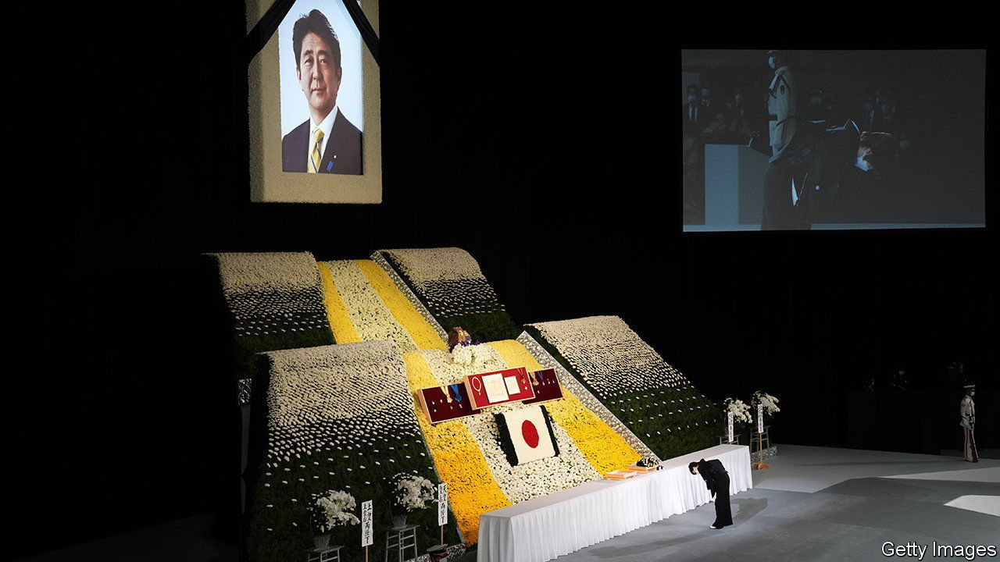
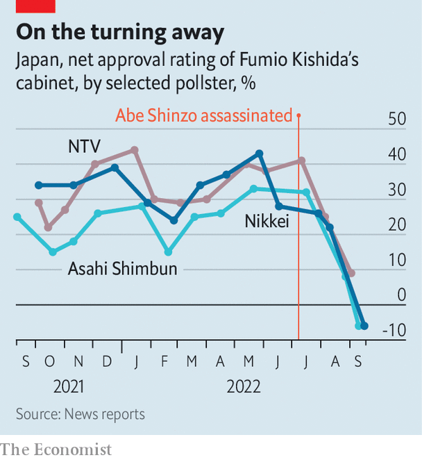

###### Funeral furore

# The fallout from Abe Shinzo’s murder could unseat his successor 

##### Japan’s prime minister has seen his popularity plummet in the past two months 

 

> Sep 26th 2022 

ABE AKIE emerged from a black car on September 27th clad in a black kimono, carrying her husband’s ashes in a box. She paused before Kishida Fumio, Japan’s prime minister, and the two bowed deeply to each other, before leading a procession past a military honour guard and into Tokyo’s Budokan arena. Inside, Japanese elites and foreign dignitaries had gathered to pay their final respects to Abe Shinzo, the former prime minister who was  on July 8th. 

Mr Kishida offered the first of several moving eulogies, in which he celebrated Abe’s legacy and recalled their close friendship. “I will forever remember you fondly as a man of wholehearted sincerity and exquisite compassion who took the utmost care of his friends, and as a husband who loved his wife Akie profoundly,” he said. 

Abe’s murder was a deep personal loss for Mr Kishida. But it is causing the prime minister political grief, too. In the two months since it happened, poll after poll has brought him bad news. Nikkei, a Japanese media giant, found approval of Mr Kishida’s government plunging from 57% last month to 43% in September (see chart). , a daily, put his approval below 30%. These are alarming numbers for the head of a party that tends to eject leaders who appear unpopular. 

 


It had all seemed to be going so well, too. A few days after the assassination Mr Kishida led his Liberal Democratic Party (LDP) to a thumping victory in upper-house elections, marking his second straight electoral triumph. His approval ratings were well above 50%, as they had been since he took office last October. He appeared poised to enjoy what observers called a “golden” period, with his position in the party secure and the next parliamentary elections three years away.

But the public balked at the LDP’s plans for a state funeral for Abe. This might strike foreigners as innocuous—all American presidents are entitled to such a commemoration. Yet most Japanese were opposed to the government’s decision to honour Abe in this way. 

Mr Kishida said he intended the state funeral to be a sign of Japan’s intent to “defend democracy”. But to many it looked more like an attempt to stifle criticism of Abe’s legacy. “They’re trying to create an atmosphere where it’s hard to express dissent—they make you feel bad for speaking ill of the dead,” said Miyaguchi Takae, who was among thousands of people protesting about the plan in front of Japan’s parliament on August 31st. Moreover, the cost—some ¥1.66bn ($11.5m)—struck many Japanese as exorbitant. Others have been taken aback by the historical echoes. State funerals for high-ranking officials were common during Japan’s imperial era as a means to unite the public around the emperor. It is rare for post-war leaders to be honoured in the same way. 

The public mood shifted soon after the assassination. Once the initial shock to this peaceful country had worn off, attention turned to the killer, , who said he murdered the former prime minister because of his links to the Unification Church, a cult-like religious group that Mr Yamagami’s mother had joined. The killing shed light on the LDP’s murky ties to the outfit, which run deeper than many Japanese had known. It reinforced the sense that too much in Japanese politics happens behind the curtain, away from the public eye. The result was rising anger with the government.

Rather than announcing a swift break with the church, as some close to him advised, the prime minister hemmed and hawed, hoping to avoid internal party feuds and waiting for attention to fade. Frustration grew. Japanese media latched on to the Unification Church. Television talk shows paraded people who said it had wronged them. 

Founded in South Korea and popularly known as the “Moonies”, after the founder, Moon Sun-myung, the church made common cause with Japanese anti-communists, including Abe’s grandfather, in the 1960s. It then spread widely in Japan. It is best known for arranging marriages between its followers and staging mass weddings. It has faced criticism for its practice of extracting exorbitant fees for spiritual goods: Mr Yamagami’s mother is said to have donated ¥100m to the group. 

Mr Kishida’s belated attempts to draw a line under the scandal only made matters worse. In August he reshuffled his cabinet, in part to distance himself from figures linked to the Unification Church. Yet more than 20 ministers and vice-ministers turned out to have ties to it. The LDP later conducted an internal survey which found that nearly half of its 379 lawmakers had links to the church, from receiving campaign support to attending its events. 

Many Japanese would like to see a more complete accounting of party ties to the church. What they got instead was the LDP’s attempt to lionise Abe who, for all his international acclaim, was a divisive figure at home. He “may have been the longest-serving prime minister, but he was not the most popular,” notes Hirakawa Eri, a political commentator.

Mr Kishida’s backers hope that the spectacle of foreign leaders paying respect to Abe will prove why the event was necessary. On the day of the funeral, more Tokyoites came out to lay flowers for Abe than to protest. “I am filled with gratitude,” said Seki Yukie, one of the mourners. If those feelings fail to improve Mr Kishida’s standing, he could turn to one of Abe’s favoured tools for re-establishing control: snap elections. Yet while the LDP would probably win—none of Japan’s  has managed to capitalise on the frustration with the government—Mr Kishida might not emerge looking any shinier. 

Rising prices, though less acute than elsewhere in the rich world, have riled voters; that may be one reason for the government’s decision, on September 22nd, to  for the first time in 24 years. And despite having been in office for a year, the prime minister has no big policy achievements to point to. He has failed to flesh out his signature “” agenda. Nearly a year after he took power, observers still wonder what it might mean. 

The coming Diet session, which opens on October 3rd, offers the prime minister an opportunity to buff up his image. He has signalled a desire to change Japan’s energy policy by backing a return to nuclear power, and to bolster its defence by spending more on it. He now has less political capital to take on such thorny issues, but also more need to make a mark. Mr Kishida prides himself on being a good listener. But to survive, he will need to speak up. ■

