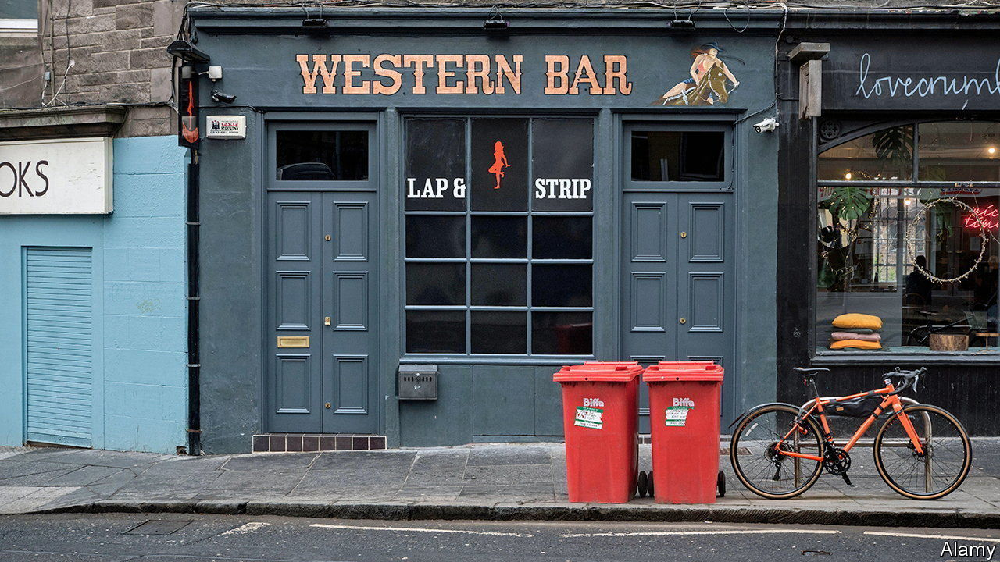

###### Poles apart

# Edinburgh closes its strip joints while Glasgow keeps its clubs open. Why? 

##### The closures provoke a backlash from strippers and their unions 

 

> Sep 29th 2022 

Steve macdonald has owned and run strip clubs in Edinburgh and Glasgow for more than two decades. Next year “Baby Dolls”, a bar in an area of Scotland’s capital dubbed the “Pubic Triangle”, will close, a development he describes as “tragic”. “Diamond Dolls”, his Glasgow establishment, will stay open. 

The clubs’ different fates result from a new licensing regime. Until recently strip joints in Scotland were licensed like any other bars or clubs. But in 2019 the country introduced legislation that reclassified them as sexual-entertainment venues, just as England and Wales had done a decade earlier. This has allowed councils to vote for a cap on such places and, if desired, to eradicate them. The process was delayed by the pandemic, but in March Edinburgh City Council voted for a “nil-cap”; this month Glasgow awarded its three existing clubs new licences.

Councils’ new powers to close strip clubs have accelerated a process already under way as a result of changing attitudes to the public consumption of sexual entertainment. Across Britain the number of clubs is thought to have fallen from around 350 a decade ago to 150 today. But the crackdowns have sparked an angry backlash from some strippers and their unions. 

In 2016 Marvin Rees, the Labour mayor of Bristol, pledged to close such clubs during his election campaign. In July, following a campaign by United Sex Workers (USW), part of the United Voices of the World, a union, the council voted to keep the city’s venues open. USW has been active in Edinburgh, too. On September 21st a judge ruled that strippers could take part in a judicial review of the council’s decision (due to begin on December 1st). 

At the heart of such rows are clashing claims about the nature of sex work. One side holds that it is exploitative even if it does not involve touching (which most strip clubs claim to prohibit). The Equally Safe Edinburgh Committee, a group of government and non-profit agencies, says the clubs’ existence “conveys a message that the objectification of women is culturally acceptable”. In Iceland, that position led to the first nationwide ban on strip clubs in Europe. Those on the other side of the debate argue that to prevent women from taking their clothes off for cash is anti-feminist. The USW says that shuttering strip bars is a violation of the Equality Act because most strippers are women. 

Most of the arguments in favour of clubs are practical. Tess Herrmann, an organiser with USW, says it is not feasible for strippers to move from Edinburgh to Glasgow. The 100-odd women who currently work in Edinburgh’s three clubs seem likely to find work through agencies in informal settings, like stag parties at private houses. “That can be good; it can also be really dangerous,” says Ms Herrmann. Sarah (not her real name), who works full-time as a stripper in Edinburgh, says that when she has worked at private parties she has felt exceptionally vulnerable. 

She says the opinion, expressed by one Edinburgh councillor, that women like her should find different work is “condescending”. It may also be unrealistic. The stigma of stripping, which the council will perpetuate by banning it, means that after five years stripping full time Sarah has nothing to put on her CV. She doesn’t want to anyway. Nightly earnings vary, but it is not unusual to make several hundred pounds from a shift of a few hours. “No other job is as flexible while allowing me to pay the bills and save money,” she says. ■

