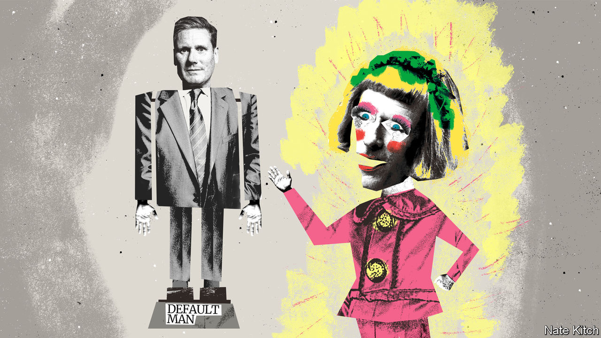

###### Bagehot

# Keir Starmer: the rise of Default Man 

##### How Labour became the default option 

 

> Sep 29th 2022 

The sharpest criticism of Sir Keir Starmer, the Labour leader, comes from a Turner-prize winning artist and self-described “bloke in a dress”. In the “Descent of Man”, Grayson Perry, a transvestite sculptor, examined the tribe of straight, white, middle-class men who tend to end up in charge of things. They appear at the top of business, the media and in politics, but unthinkingly rather than by choice. Mr Perry dubbed this character “Default Man”. Mr Perry may not have had the Labour leader in mind when he wrote the book in 2016. But Sir Keir certainly fits the bill. 

Sir Keir’s rhetoric does not soar. (He opened his main speech at this year’s party conference with a joke about Arsenal football club, the default sport of Default Man.) He does not fizz with ideas, or possess subtle or complex politics. (He spoke in front of a picture of a giant union flag.) He does not enjoy a unique ability to channel the id of the British voter. Yet there he is, leader of the Labour Party, close to the summit of British politics and now the odds-on favourite to become the next prime minister. Under Default Man, Labour have become the default option. 

Default economics reigns in the party. Margaret Thatcher was once asked for her greatest achievement. She reportedly replied: “Tony Blair and New Labour”. Under Sir Tony, Labour ingested Thatcherism, accepting the market’s role in society. If George Osborne, the Conservative chancellor in the government of David Cameron, were asked the same question today he might reply: “Rachel Reeves”. Ms Reeves, Labour’s shadow chancellor, unveiled tepid pledges this week, such as a vague commitment to a higher living wage and a promise to reform business rates. But the main message was one of fiscal conservatism. “Labour is the party of economic responsibility and the party of social justice,” Ms Reeves told a packed conference hall. A standing ovation ensued. Given the past week, Mr Osborne would have probably joined in.

Sir Keir’s party is not brimming with ideas. It starts with the leader. Others in the party speak of Sir Keir as if he were an empty vessel into which ideas (“slaughter the left”) or policies (“launch a nationalised energy company”) are poured from different wings of Labour. “The distinct thing about Default Man is that in many ways he is the background,” writes Mr Perry. Sir Keir sits atop the party but he appears not to shape it. At this week’s party conference he fell back on the most vacuous slogan of the Blair era, when Sir Tony labelled his party “the political wing of the British people”. Default Man does not think deeply. He has reached the top of politics without having to bother. Why start now?

Default Man has changed the party in appearance if not content. “If you are Default Man, you look like power,” writes Mr Perry. “The very aesthetic of seriousness has been monopolised by Default Man.” Under Jeremy Corbyn, Labour’s former far-left leader, party conferences were eclectic. It was a safari of cranks, Trotskyists, Blairites, lobbyists and journalists, who all regarded each other with fear and loathing. After a purge of the hard-left by Sir Keir and friends, the party is a more homogenous beast. In the hall, someone changed their mobile-hotspot address to “We Hate Corbyn”. T-shirts with slogans are out; machine-washable, navy Marks &amp; Spencer suits are in. Default Men are back on top. 

Perhaps a Default Man leading a Default Party will appeal to a Default Voter. When an election is closely contested, it is worth drilling down into voter types. Will liberal Conservative voters in the south-east flock to the Liberal Democrats? Can Labour win back older, socially conservative voters in northern towns? An election in which Labour scores in the mid-40s and the Conservatives in the high-20s, as current polling suggests, is one in which such differences—old, young, Remain or Leave—disappear beneath a Labour landslide. Even in Scotland, where constitutional questions add complexity, things become simple. If Labour is on course for a resounding victory, the party will scoop up votes across the central belt, constitutional questions be damned. 

Default Men have thrived elsewhere. In Australia a similarly cautious approach handed Anthony Albanese, the Labor prime minister, victory in elections earlier this year. Joe Biden, who looms large in the America-addled brains of British politicos, won with a platform of inoffensive centrism against Donald Trump. (In office Mr Biden discovered a radical streak, launching an enormous fiscal stimulus and a big plan to tackle climate change; sometimes Default Men have hidden depths.) 

Some in the party fear becoming the default option. Labour are campaigning in turgid prose but will, they promise, govern in poetry. A publicly owned energy company and an £8bn ($8.5bn) wealth fund for green-energy investments are just the start of a radicalism that will emerge only once in office. In the meantime, with an election still two years away, the plan is to offer voters dull competence. “Things Can Only Get Better” was the theme tune of Labour’s landslide 1997 election. In the current circumstances “Things Can Stop Getting Worse” is a compelling pitch.

Nobody ever got fired for buying IBM

In Mr Perry’s telling, Default Man is on the way down. At the time that was an accurate prognosis for right-wing politics in Britain. Not one Default Man made it into the final four of the Conservative Party’s recent leadership election. Liz Truss, the third female prime minister, and Kwasi Kwarteng, the fourth ethnic-minority chancellor, are ready to rule (or screw up) as well as any Default Man did in the past. 

In Labour, however, Default Man is ascendant. Losing four elections in a row has left the party with a form of political post-traumatic stress disorder. Labour wallahs opted for something uncontroversial, conservative and easy in the form of Sir Keir, the platonic ideal of Default Man. So may voters, after a week in which the Conservatives trashed their reputation for economic competence. Being the default option is not so bad after all. ■


