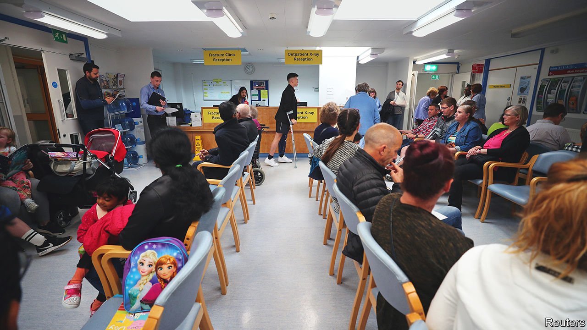
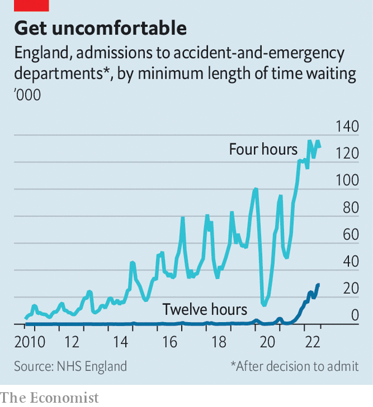

###### Cold, hard truths

# The National Health Service faces a terrible winter 

##### The government has yet to formulate a plan to cope 

 

> Sep 29th 2022 

As Britain’s economy and political elite lurch from one crisis to another, the parlous state of the National Health Service (nhs) gets less attention. Much was made of the quarter of a million people who “queued to see the queen” when the late monarch was lying in state, but those waiting to start treatment on the nhs are 27 times that number. 

In August a person in England who suffered a stroke or a serious burn waited an average of 43 minutes for an ambulance. That is almost two-and-a-half times the government target of 18 minutes. “Dental deserts” stretch across large swathes of the country; waiting times in accident-and-emergency (A&amp;E) departments are at record highs (see chart). In August there were 6,200 excess deaths—those above the number that would be expected on past trends—most of which cannot be explained by covid-19. 

 


Elements of this story are achingly familiar. Every year the NHS is described as being on life support; every year it pulls through. But the scale of the problems is bigger than before. And the fact that such strains are showing up in the summer, when people are less sick and the system has more capacity, is deeply disturbing. “We’ve been in a winter crisis all summer,” says Rachel Power of the Patients Association, a charity. As actual winter approaches, things will get worse; they always do. The question is by how much.

One fear is that people may get sicker than usual. In the southern hemisphere Australia is emerging from its worst flu season in years. Covid has not completely gone away. Nor has chronic obstructive pulmonary disease, a respiratory disease which accounts for one in eight emergency admissions and is worsened by cold, damp conditions. Cases are likely to rise if the old and vulnerable cannot afford to heat their homes because of high energy bills. 

Then there are the unknown numbers of people yet to be diagnosed or treated because of backlogs caused by the pandemic. Given the current waiting-list, doctors are detecting cancers later. This makes treatments more complex and prognoses gloomier. Data released in September showed that during the first few months of the pandemic, the number of deaths from prostate cancer tripled. Such figures may get worse before they get better.

All these people need to be cared for by staff who are exhausted from the pandemic and whose colleagues are quitting. One in ten NHS jobs are vacant, including 11,000 posts for doctors and 47,000 in nursing. The result is further strain on those who choose to stay, an unappealing prospect. According to a recent survey by the King’s Fund, a think-tank, around two-thirds of trainee general practitioners (GPs) say they plan to work part-time. On October 6th the Royal College of Nursing, one of the world’s largest unions, will hold a ballot to decide if 300,000 of its members should strike for better pay, just as market pressure on the government to demonstrate fiscal discipline has increased.

As the burden of care falls upon overstretched staff, the overall strategy is being set by a carousel of politicians. In August the then health secretary, Steve Barclay, said that the government was in a “sprint” to get the NHS ready for winter. He did not make it to his own finish-line. On September 22nd Thérèse Coffey, the third health secretary in three months and the fifth in five years, laid out her own NHS plan. Her headline “expectation” was that patients should be able to see a GP or practice nurse within two weeks. That managed to both irk GPs and underwhelm patients: the last Labour government’s target was for patients to be seen within two days. 

Other measures may help the NHS to weather the winter storm. A reform of doctors’ pensions could encourage senior medics to stay in the workforce and work extra hours. More money for both emergency and non-life-threatening call-handlers could reduce the strain on A&amp;E. Most important, Ms Coffey has pledged £500m ($534m) to invest in social care. In the last week of August 138,000 patients were still in hospital more than a week after they had met the criteria to be discharged, often because there was nowhere for them to go. Virtual wards, which allow patients to be monitored remotely, may also allow a few of them to be supervised from home.

But there was no mention of covid booster jabs or flu vaccines, which help to take the pressure off the health service. Instead, the government has cut the funding to promote their uptake. There was no talk from Ms Coffey of extra money for a winter plan or any serious strategy to tackle the NHS’s biggest problem, the haemorrhaging of workers. This was a “light-touch approach” to something that needs a “heavy-duty set of solutions”, says Professor Helen Stokes-Lampard, chair of the Academy of Medical Royal Colleges.

In the long term major rethinking is required to fix a frayed system; public satisfaction with the nhs is at a 25-year-low. For now, though, the plan is for the septuagenarian service to limp its way through another winter. The unspoken worry is that many others will not make it. ■

