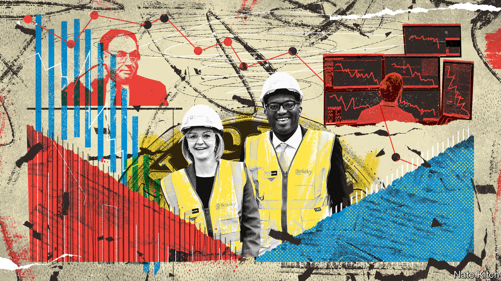
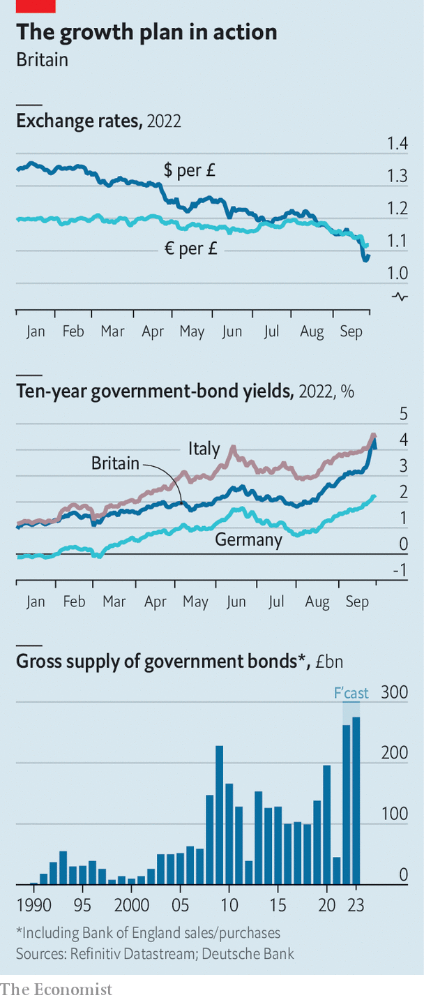

###### Pounded land

# The fallout from Kwasi Kwarteng’s mini-budget continues 

##### Neither the chancellor nor the prime minister seems particularly to care 

 

> Sep 27th 2022 

Adecade ago the Conservative government announced a budget so unpopular that it was dubbed an “omnishambles”. Humbled by weeks of bad headlines, it ultimately scrapped plans to introduce a tax on some hot foods. The reaction to Kwasi Kwarteng’s  on September 23rd made the omnishambles budget look like a triumph for the ages. 

After the chancellor announced the biggest tax cuts in half a century, sterling cratered: in the early hours of September 26th the value of the pound fell to a  of $1.035 (it subsequently recovered a bit). That same day ten-year gilt yields reached 4.3%, over one percentage point higher than a week before. 

The gyrations were so extreme that Andrew Bailey, the Bank of England’s governor, published a statement confirming that policymakers were “monitoring developments in financial markets very closely”. The IMF weighed in with some unusually blunt criticism: “We do not recommend large and untargeted fiscal packages at this juncture”, it said.

The negative reaction came even though most of the budget’s contents had been widely trailed. Liz Truss promised both to scrap a planned increase in corporation tax and to cut payroll taxes while campaigning to become prime minister; she had announced measures to help households and businesses with high energy bills on September 8th. The unexpected elements of the package, which included tax cuts for high earners and higher thresholds for stamp duty, a tax on property transactions, accounted for less than a quarter of its long-run cost.

Investors’ anxiety reflected scepticism that the government’s reforms would turbocharge growth, as it claimed, and generate enough revenue by themselves to put the public finances on a sustainable path. Suggestions that the government had yet more tax cuts in the works did nothing to help its credibility. Mr Kwarteng has tried to restore calm by promising to outline new fiscal rules on November 23rd; the Office for Budget Responsibility (obr), a watchdog, will publish its independent forecasts for the public finances on the same day. That has not helped much yet. If Britain’s assets look riskier, then foreigners will decline to hold them unless they are cheaper. Britain’s gaping current-account deficit is hardly a sign of rude economic health either. 

It is unclear how the pound’s slide could spiral into a balance-of-payments crisis. As Britons tend to borrow in sterling but have assets denominated in foreign currencies, sterling depreciation tends to improve the country’s net international investment position. But sharp rises in gilt yields—which amount to dramatic falls in their price—have already created havoc in at least one corner of the financial markets. 

In the long term, higher yields on government bonds are good news for pension funds because their future liabilities are discounted at higher rates. But as yields rose many funds that had used derivatives to protect themselves against market movements found themselves under pressure to raise cash to meet collateral requirements. They raised that money by selling long-dated gilts, setting in train a vicious dynamic whereby higher yields created pressure to sell, which pushed up yields further, and so on. On September 28th the Bank of England said it would purchase long-dated government bonds over the next couple of weeks “to restore orderly market conditions”, and delay until the end of October a plan to start selling gilts. 

Even if financial order is restored, Mr Kwarteng’s budget will hurt the economy. A weaker pound means that imports are more expensive. Samuel Tombs of Pantheon Macroeconomics, a consultancy, calculates that the decline in the value of sterling since July points to a 1.7% increase in the price level in the long term and a 0.5-percentage-point increase in consumer-price inflation in 2024. Although in theory a weaker pound could provide a fillip to British exporters, in practice this effect has been disappointing in the past.

Higher interest rates will pinch borrowers, not least the government itself. Applying the OBR’s rule of thumb, the increase in short-term rates that the market now expects by next spring could raise official debt-servicing costs by 1.6% of GDP as soon as 2023-24. And if that extra spending is also financed through higher borrowing, the Bank of England may react further. According to the National Institute of Economic and Social Research, a think-tank, extra borrowing worth 1% of gdp would prompt the Bank of England to raise rates by around 0.25 percentage points, further increasing the government’s interest costs. These debt dynamics are not explosive, but they are expensive.

Homeowners will suffer, too. In response to the turmoil some lenders have suspended certain of their mortgage products. Mr Tombs estimates that if interest rates rise by as much as investors expect, households refinancing an average two-year fixed-rate mortgage in the first half of next year could see their monthly repayments jump from £863 ($940) to an eye-watering £1,490. Even homeowners without outstanding mortgage debts will feel poorer as house prices drop: Andrew Wishart of Capital Economics, a consultancy, is expecting to see falls of 10-15%.

 


Firms will also be affected. The Bank of England estimated in August that, after taking into account the effects of higher energy prices, funding costs would have to rise to around 7.75% for pressure on corporate balance-sheets to be as widespread as it was at the previous peak in 2001, when 62% of companies were vulnerable to repayment difficulties. According to the S&amp;P UK investment-grade corporate-bond index, yields on September 26th were 6.4%. 

All this puts the Bank of England in a nasty bind. Investors are now expecting it to raise interest rates by at least 1.5 percentage points at its next meeting in November, and then to increase them to 6% by spring 2023 (from 2.25% now). If rate-setters do not raise interest rates as aggressively as expected, then the pound could dip further, worsening the problem of imported inflation. But if they do act so forcefully, a deep recession is likely. According to Mr Tombs the bank’s latest forecasts suggest that a one-percentage-point increase in its interest rates raises the unemployment rate by 0.6 percentage points and cuts GDP growth by 0.8 percentage points. 

On September 27th Huw Pill, the bank’s chief economist, said that recent market developments had made it harder for monetary policymakers to pursue their inflation target. He added that it was hard not to draw the conclusion that “all this will require a significant monetary-policy response”. Still, it is difficult to believe that rate-setters will go quite as far as investors expect, given the dramatic impact that would have on the real economy. Mr Wishart points out that over the past 50 years the Bank of England has never continued raising interest rates after real house prices have started to fall. 

This ugly outlook would improve if the government cancelled some of its tax cuts. That seems highly unlikely. On a call with Tory MPs on September 27th Mr Kwarteng said that he thought the volatility was a product of the City feeling surprised by the statement, and that this had now settled down. When asked about the effects of higher interest rates on constituents’ mortgages, he replied that this was for the Bank of England to deal with. “He doesn’t seem very focused on or politically very sensitised to the impact of interest rates going up on mortgages,” says one MP.

Others in his party are more worried. The Tories’ annual conference starts in Birmingham on October 2nd. It was meant to be a moment of triumph for Ms Truss, who became prime minister on September 6th. Instead, the talk in the bars will be only of how brutal the coming verdict of the electorate will be, and what can be salvaged of a premiership not yet a month old. 

Lose with Liz

That is because the public’s reaction to the mini-budget has been as ugly as the one from the markets: some 57% of voters thought it “unfair”, according to YouGov, a pollster, the worst response to any financial statement since the Conservatives took power in 2010. Just 15% said it would improve growth. The same pollster gave Labour a 17-point lead in a , the highest since YouGov was founded in 2000.

There is little appetite among Tory MPs for yet another leadership election, but even Ms Truss’s own supporters do not rule it out before the next election. “We’ll see where we are next year,” says one. Some MPs think Mr Kwarteng should go. In the meantime the rift left by the summer’s leadership contest, which pitted Ms Truss’s faith in self-funding tax cuts against Rishi Sunak’s espousal of “sound money”, has widened dramatically. Sunakites feel both horrified and bitterly vindicated. “There will be a lot more people who now feel she has won the election on a false prospectus. It was completely implausible, and she’s gone far beyond it,” says one. 

Ms Truss is not a U-turner by temperament: in a round of radio interviews on September 29th she insisted the tax cuts were right. Her backers on the Eurosceptic right also continue to urge her on. Ministers have instead been ordered to start rustling up “efficiency savings” to make the fiscal outlook rosier. But without much detail, and given the tricky politics of making swingeing cuts to public services, investors are likely to remain sceptical of the government’s resolve to get the public finances under control. 

With the Bank of England planning to start its programme of gilt sales at the end of October, calculations by Anna Titareva and Rohan Khanna of UBS, a bank, suggest that over the next 18 months investors will be asked to soak up almost as much gilt supply as they have over the past 54. That is going to cost the government a lot more than Mr Kwarteng would have expected when he spoke a few days ago.■

