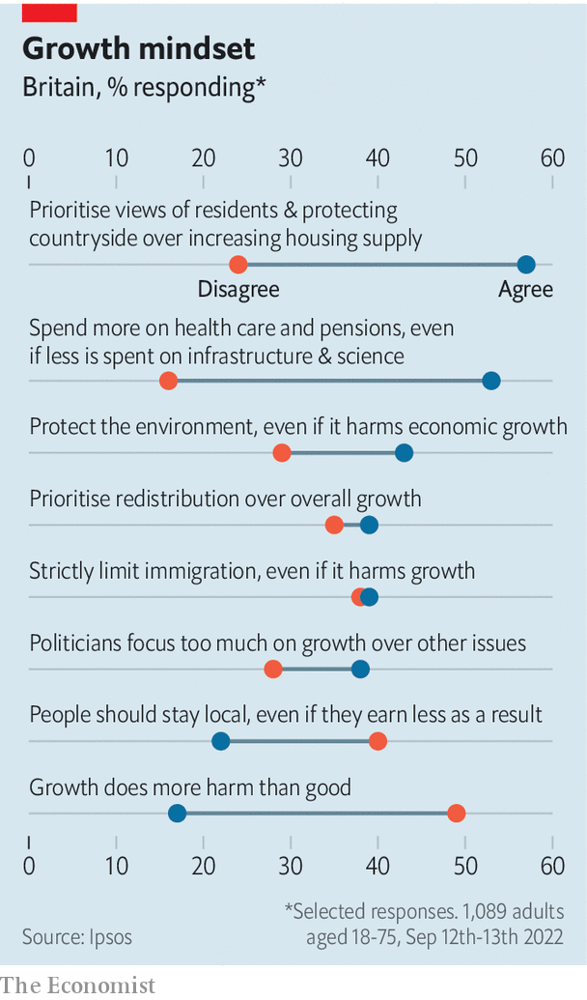
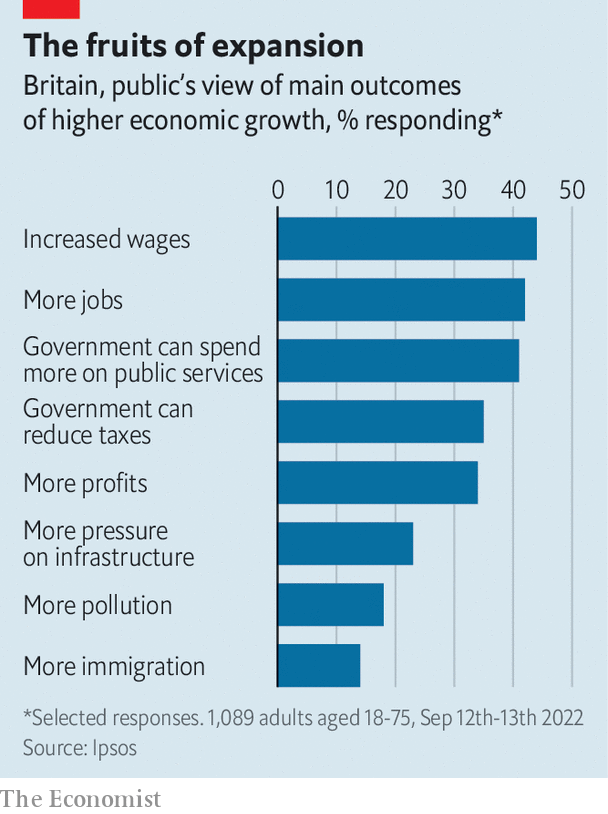

###### Polled and sleepy

# What British people think about economic growth 

##### Liz Truss has made growth her defining mission. Britons have other priorities 

 

> Sep 29th 2022 

Financial markets have given their verdict on Liz Truss’s dash for growth, and it is not pretty. But even if Trussonomics had got off to a much smoother start, it would still have carried a significant political risk. For Britons are lukewarm about economic growth, and often unwilling to make the trade-offs required to deliver it. 

Polling conducted for  by Ipsos before Kwasi Kwarteng’s mini-budget on September 23rd tested Britons’ attitudes towards growth by asking them which of a pair of contradictory statements more closely matched their view (see chart). Some 49% of voters agree with the simple proposition that economic growth “does more good than harm”, against 17% who reckon the opposite is true. 

 


Asked to list the results of higher growth, respondents tended to cite benefits—higher wages, more jobs and higher spending on public services—more than disadvantages like greater pollution. Britons are also aware how badly their country is doing compared with peers. A plurality knew that the average Briton is wealthier than their equivalent in China and Spain, but poorer than Americans, Germans, Singaporeans and the Dutch. 

So far, so fairly good. But growth means trade-offs, and Britons are chary of accepting them. Ms Truss has made boosting trend growth to 2.5% her mission. But by 38% to 28%, respondents agreed that “politicians focus too much on economic growth at the expense of other issues”. 

Ms Truss’s plan includes streamlining environmental rules to speed up infrastructure projects and construction in investment zones. Yet by 43% to 29%, respondents think more focus should be placed on environmental protection, “even if that harms economic growth”. By a margin of 57% to 24%, our respondents favour giving priority to the views of local residents and protecting the countryside, even if that results in less new housing.

Ms Truss reckons there is a trade-off between growth and redistribution. Nearly half the gains of the income- and payroll-tax cuts announced in Mr Kwarteng’s budget will accrue to the top 5% of households, according to the Resolution Foundation, a think-tank. That is not a particularly popular strategy: by a margin of 39% to 35% voters agree with the proposition that “redistributing money between people is more important than growing the economy overall.” Voters also seem unconcerned by Britain’s chronic record of underinvestment: by 53% to 16%, voters agree with the proposition that “the government should spend more on health care and pensions, even if that means spending less on infrastructure and science.” 

 


Perhaps the greatest triumph of anti-growth tendencies was the vote for Brexit of 2016. Nigel Farage, a Eurosceptic campaigner, insisted then that markedly lower growth would be a price worth paying to cut immigration, and lots of people seemed to agree. Ms Truss reportedly plans to loosen visa rules to tackle skills shortages. In our survey the idea that “there should be strict limits on immigration into Britain even if that harms growth” was backed by a margin of 39% to 38%. 

Our polling reinforces other studies. In 2019 Onward, a think-tank, detected among Britons “strong hostility to the key drivers of prosperity in the modern liberal market economy: global trade, innovation and urban agglomeration”. A paper published in 2020 by Demos, another think-tank, tested the views of two large groups of voters: one younger and Remain-leaning, the other older, pro-Brexit and pro-Conservative. Both groups agreed that their towns should have more nice shops and less litter. But a majority (52%) of the older group said they would oppose a university or college opening in their town if “the town attracts more people from elsewhere”. A plurality (40%) would oppose the creation of more high-paying jobs “if they are taken by people who have no prior connection to the town”. 

One factor behind such attitudes may be the distribution of capital within the electorate. Professor Jane Green of Nuffield College, Oxford shows that the electorate is still broadly split between the economically secure, who lean Tory, and the insecure, who vote Labour. (Nearly half of Tory voters at the last election owned their home outright.) In a paper written last year with Raluca Pahontu, she found that wealthier people were more likely to have backed Brexit, with their assets acting as a form of “insurance” that allowed them to take a punt on leaving the EU. If wealth insulates some voters from the wider economy, they may also be less likely to punish governments for a lack of growth. 

The Westminster system also plays its part in fomenting or dampening enthusiasm for growth. Overcoming an aversion to growth requires MPs to be willing to tell their constituents that they must endure localised disruption today in return for national gains tomorrow. But voters increasingly want their MP to be locally minded: between 2010 and 2019, the proportion of MPs representing a constituency in the region of their birth rose from 45% to 52%. That includes 60% of MPs newly elected in 2019, according to a paper by Philip Cowley, Robert Gandy and Scott Foster. A poll in 2019 found that, by 63% to 13%, voters thought MPs should “act according to the wishes of their constituents, even when this goes against their own judgment”. 

Attitudes such as this explain why Ms Truss was already facing an uphill political battle, even before the markets’ ugly rejection of her budget. Britain needs faster growth, but the difficult job of persuading people to accept the trade-offs it entails has got harder still. ■

