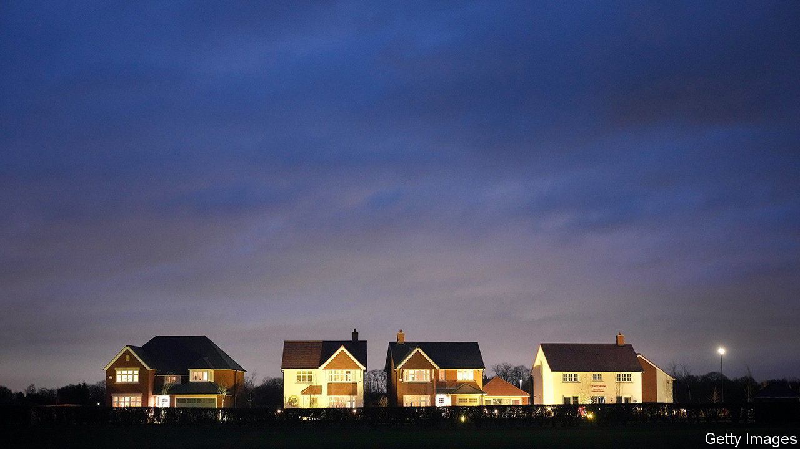
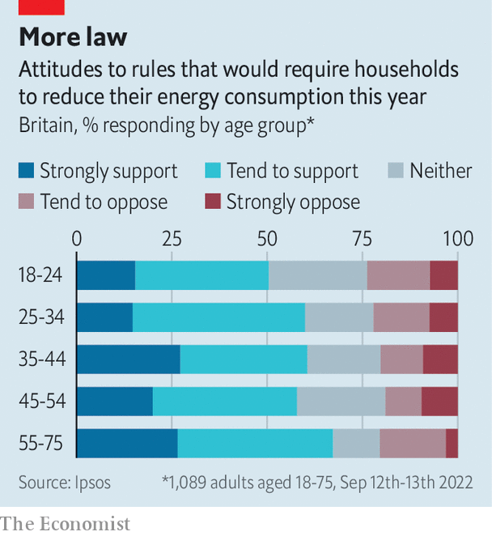

###### Energy conservation

# Why is the British government so reluctant to tell people to conserve energy? 

##### A new poll suggests it would be popular 

 

> Sep 29th 2022 

From october 1st British household energy bills will be subsidised by the government under its “energy price guarantee” scheme. At times of high gas and electricity prices, the cost to the state will be eye-watering. You might think, therefore, that the government would be keen to reduce domestic energy demand—especially given the markets’ waning confidence in its ability to balance the books. 

You would be wrong. Many governments have tried to cut demand while bailing out energy consumers. The Dutch government tells people to “turn the knob down”, by lowering their thermostats to 19°C. Germany has switched off lights and banned businesses from leaving their doors open while the heat is running. Spain has compelled firms to cut their air-conditioning use. Meanwhile the British government briefs that energy use is a matter for individuals. 

 


A new poll for  by Ipsos suggests that people would welcome being bossed around. Three-fifths say they would support rules requiring households to reduce their energy use, provided that exceptions were made for vulnerable people, compared with one-fifth who say they would oppose the rules. Older people, who form the bedrock of the Conservative Party, are most supportive (see chart). Britons are even keener on measures that would compel businesses to cut back. 

These are only hypothetical rules. People might respond less favourably to actual regulations: in the past, they have assured pollsters that they would vote for new political parties, only to shun such parties when they appear. But the poll at least suggests that the government would get a fair hearing. And the softer option, of trying to persuade people to save energy, would probably be an easier sell. 

“There is much, much more that the government could be doing,” says Sam Hall of the Conservative Environment Network, a forum for green-minded Tories. Why is it so hesitant? Mr Hall points to a fear of being seen as patronising. And Liz Truss’s government has prioritised growth. Encouraging people to cut back might look like an admission that the government had failed to secure abundant energy to power an economic surge. 

The experience of covid-19 suggests a stranger possibility. In March 2020 the government hesitated to enact stringent measures to slow the spread of coronavirus because it believed the public would not tolerate them. When it finally plumped for a lockdown, it was surprised to discover that people were keen on having their freedom restricted and believed it ought to have happened sooner. 

This terrified some Tory mps. “What on earth is happening to our country? Muzzled, acquiescent and fearful,” fretted Richard Drax in June 2021. Steve Baker worried that the country was trapped in a “doom loop” of lockdowns and anxiety. “We have got to recapture a spirit of freedom,” he said. What was true of the covid crisis might also be true of the energy crisis. mps of a libertarian bent, including Ms Truss, are reluctant to boss Britons around not because they think they will hate it, but because they fear they will love it.■

