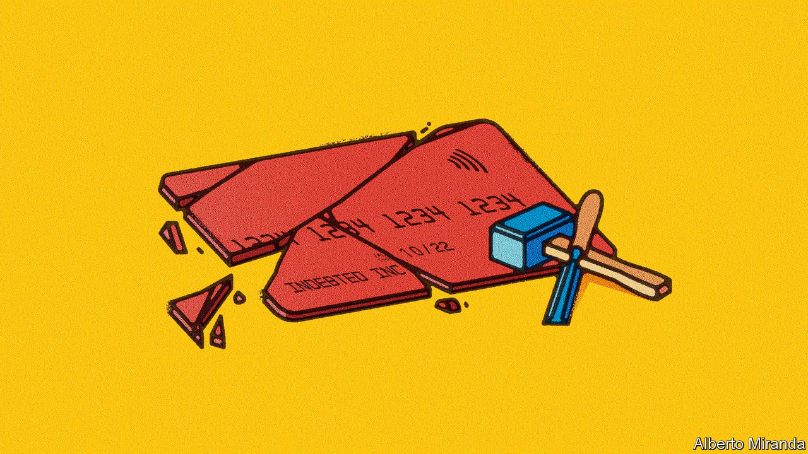
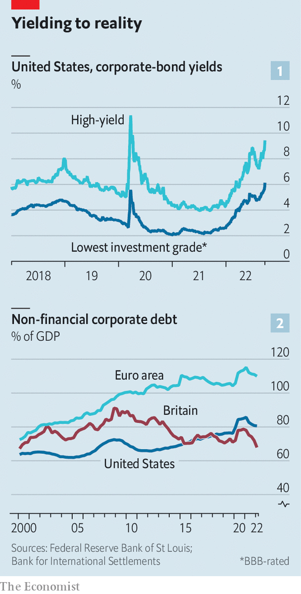
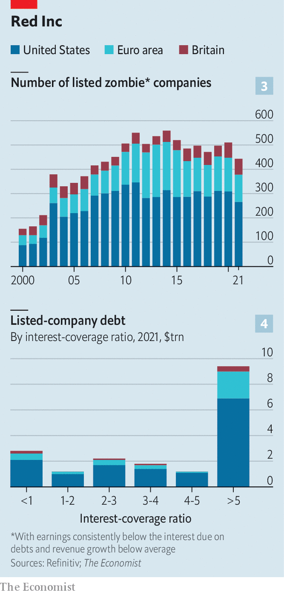

###### Debt that taxes

# A reckoning has begun for corporate debt monsters 

##### As rates rise, how messy will the squeeze on business get? 

 

> Sep 27th 2022 

When investment bankers agreed in January to underwrite the leveraged buy-out of Citrix, a software company, by a group of private-equity firms, returns on safe assets like government bonds were piffling. Yield-hungry investors were desperate to get their hands on any meaningful return, which the $16.5bn Citrix deal promised. Lenders including Credit Suisse and Goldman Sachs were happy to dole out $15bn to finance the transaction. Inflation would pass, central bankers insisted. Russia hadn’t invaded Ukraine, energy markets were placid and the world’s economies were growing. 

Nine months later the banks tried to offload the debt in a market gripped not by greed but by dread—of stubborn inflation, war and recession. Struggling to find takers, they palmed off $8.6bn of the debt at a discount, incurring a $600m loss. They are still nursing the remaining $6.4bn on their balance-sheets.

 


The Citrix fiasco is an egregious example of a broader shift in corporate-debt markets. Having rediscovered their inner inflation-busting Paul Volcker, Western central banks are pushing interest rates to levels not seen in 15 years and shrinking their balance-sheets. Those that bought corporate bonds during the pandemic in order to stave off a wave of bankruptcies have been selling them, or have already done so. All this is draining the market of liquidity as investors abandon riskier assets like corporate debt in favour of safe Treasury bonds, now that these suddenly promise a decent return, observes Torsten Slok of Apollo, a private-asset manager. The result is plummeting prices of corporate bonds, especially for less creditworthy firms: yields on junk paper have soared to 9.4% in America and 7.8% in the euro area, up from 4.4% and 2.8%, respectively, in January (see chart 1). Activity is fading in the exotic corners of the corporate-credit market, including for collateralised loan obligations.

All this raises awkward questions about what happens next with the mountain of debt that companies have amassed in the past couple of decades (see chart 2). Since 2000 non-financial corporate debt has gone up from 64% of GDP to 81% in America and from 73% to 110% in the euro area. (In Britain the share is a modest 68%, roughly what it was in 2000, a rare spot of relief for an otherwise beleaguered economy.) All told, American, British and euro-area public companies currently owe their creditors almost $19trn, with a further $17trn owed by unlisted firms. Just how wobbly is this pile?

The credit crunch will not affect all borrowers equally. Indeed, viewed in aggregate the West’s corporate debt load looks manageable. We calculate that American public companies’ earnings before interest and tax are a healthy 6.7 times the interest due on their debts, up from 3.6 times in 2000. In the euro area, this interest-coverage ratio has risen from 4.4 to 7 this century. Moreover, some riskier borrowers loaded up on debt at low rates during the pandemic. Just 16% of the euro area’s junk bonds by value mature before the end of 2024. In America the figure is 8%.

Yet the surge in borrowing costs will cause strain, in three areas. The first comprises businesses that have come to rely on less orthodox sources of credit, which are often those with the diciest prospects. The outstanding value of leveraged loans in America, typically provided by a syndicate of banks and non-bank lenders, now matches that of junk bonds, and it has been growing briskly in Europe, too. The same is true of the value of private credit, offered by private-asset managers such as Apollo and Blackstone. Such loans tend to tolerate higher leverage in return for high and, more troubling right now, floating interest rates. Borrowers are thus far more exposed to rate rises. Because this sort of debt often comes with fewer strings attached, lenders have limited ability to accelerate repayment once signs of distress emerge.

The second area of vulnerability involves so-called zombie firms: uncompetitive enterprises, kept alive by cheap debt and, during the pandemic, government bail-outs. Fortunately, according to our calculations the corporate undead are relatively rare and typically small. We define a zombie company as one that has been listed for at least ten years, with consistently below-average revenue growth and an interest-coverage ratio of one or less, stripping out fast-growing but loss-making tech firms, pre-revenue businesses in sectors like biotechnology, where products take years to get to market, and revenue-less holding companies. 

 


On that definition, using data from Refinitiv we identify 443 zombies listed in America, Britain and the euro area (see chart 3). That is up from 155 in 2000, but still just 5.6% of all listed firms, responsible for 1.9% of total debt and 1.4% of total sales. Their demise could be the economy’s gain, as mismanaged firms with low productivity that binged on bail-outs finally close, although that would be cold comfort to their employees and owners.

The third and biggest area of concern is firms that are merely unfit rather than undead. One way of capturing their prevalence is to look at firms with an interest-coverage ratio of less than two. That gets you to a fifth of the total debt of listed American and European companies—some $4trn-worth (see chart 4). Alternatively consider firms whose debts are rated just above junk status. Some 58% of the investment-grade non-financial corporate bond market is now rated bbb, according to Fitch, a ratings agency. The average yield on such bonds has more than doubled in America in the past 12 months, to 6.1%. Unlike high-yield bonds, many of them come due soon and will need to be refinanced at much higher rates.

Ever since the global financial crisis of 2007-09 plenty of mature companies with slow sales growth have taken advantage of cheap credit to pile on debt to the verge of junk status in order to fund shareholder payouts. As profits come under pressure and interest costs rise, they face a squeeze that could lead them to cut jobs and investment. And if earnings plummet, which some analysts are beginning to predict as recession fears mount, this financing strategy could push these businesses over the edge into junk territory. Asset managers whose portfolio mandates require them to favour safe assets may be forced into fire sales, triggering a crash in prices and a further surge in borrowing costs. 

Most of the firms operating just above junk status are still a long way off a downgrade, reckons Lotfi Karoui of Goldman Sachs. Many of the flakiest investment-grade borrowers were downgraded early in the pandemic, so the remaining ones are on average more robust. A nightmare scenario is not, in other words, inevitable. But it is no longer inconceivable, either. ■


